# Complete Architecture Map - Polymarket Analyzer

> **"A good diagram is worth more than a thousand words."**
> -- Visual Documentation Principle

---

## Architecture Overview

This document contains Mermaid diagrams showing the complete architecture of Polymarket Analyzer at different levels of detail.

---

## 1. High-Level Architecture

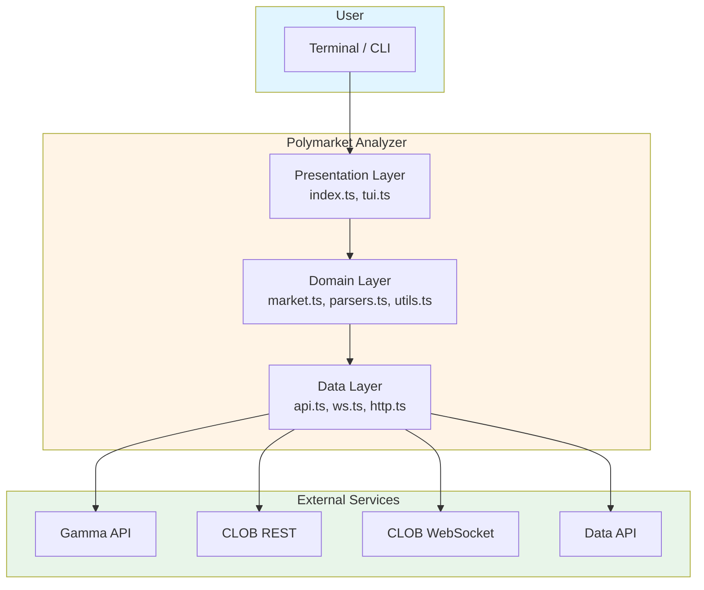

---

## 2. Complete Data Flow

```mermaid
sequenceDiagram
    participant U as User
    participant I as index.ts (CLI)
    participant M as market.ts
    participant A as api.ts
    participant W as ws.ts
    participant H as http.ts
    participant G as Gamma API
    participant C as CLOB API
    participant S as CLOB WebSocket
    participant T as tui.ts

    U->>I: bun --bun run dev --market <id>
    I->>M: resolveMarket(opts, radar)

    alt Market not in radar
        M->>A: fetchMarketByConditionId(id)
        A->>H: fetchJson(url)
        H->>C: GET /markets?condition_ids={id}
        C-->>H: 200 OK + market data
        H-->>A: parsed market
        A-->>M: normalized market
    end

    M-->>I: MarketInfo
    I->>T: runDashboard(market)

    par REST Flow
        T->>A: getOrderbook(tokenId)
        A->>H: fetchJson(url)
        H->>C: GET /book?token_id={id}
        C-->>H: order book
        H-->>A: parsed data
        A-->>T: normalized orderbook
    and

    par WebSocket Flow
        T->>W: connectMarketWs(tokenIds, handlers)
        W->>S: WebSocket connect
        S-->>W: Connected
        W->>S: Subscribe to assets
        S-->>W: Real-time updates
        W-->>T: onBook/onUpdate
    end

    T->>T: Render interface
    T-->>U: TUI Display

    loop Every 3 seconds
        T->>A: Fetch additional data
        A-->>T: Updated data
        T->>T: Re-render
    end
```

---

## 3. Component Details

### 3.1 Data Layer

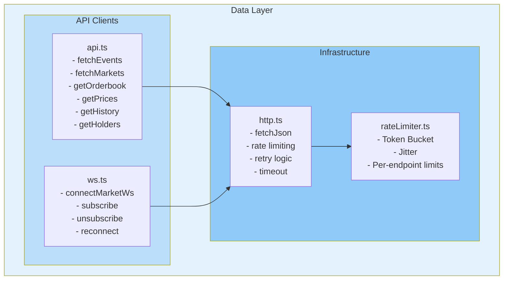

### 3.2 Domain Layer

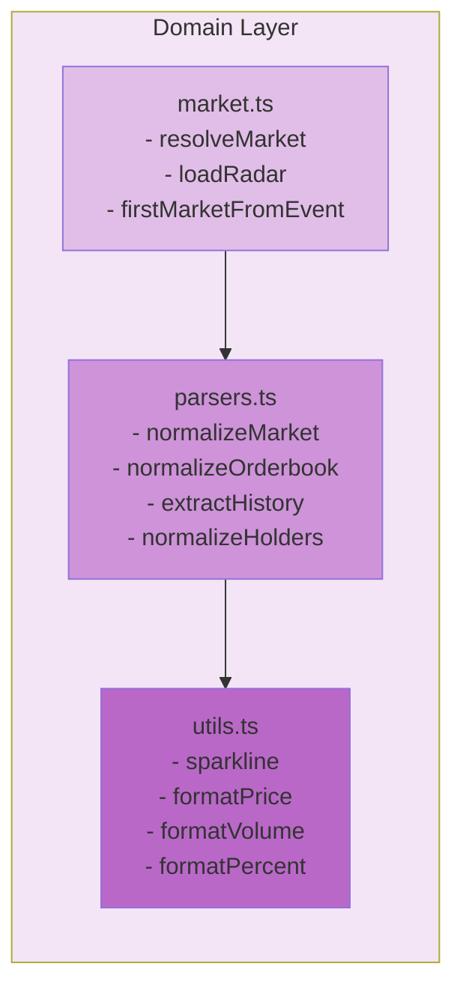

### 3.3 Presentation Layer

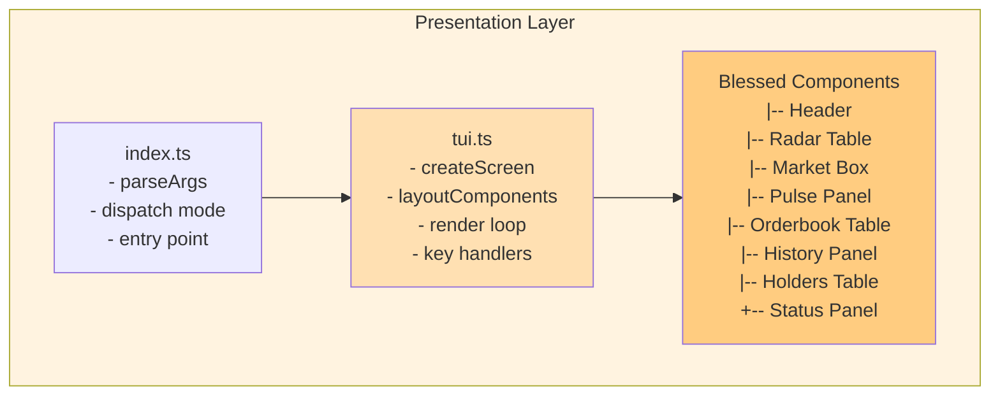

---

## 4. Polymarket API Integration

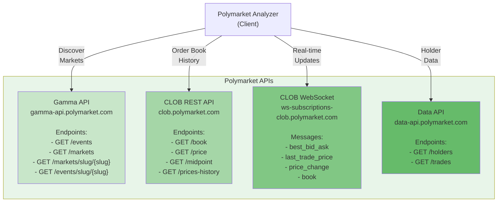

---

## 5. TypeScript Module Structure

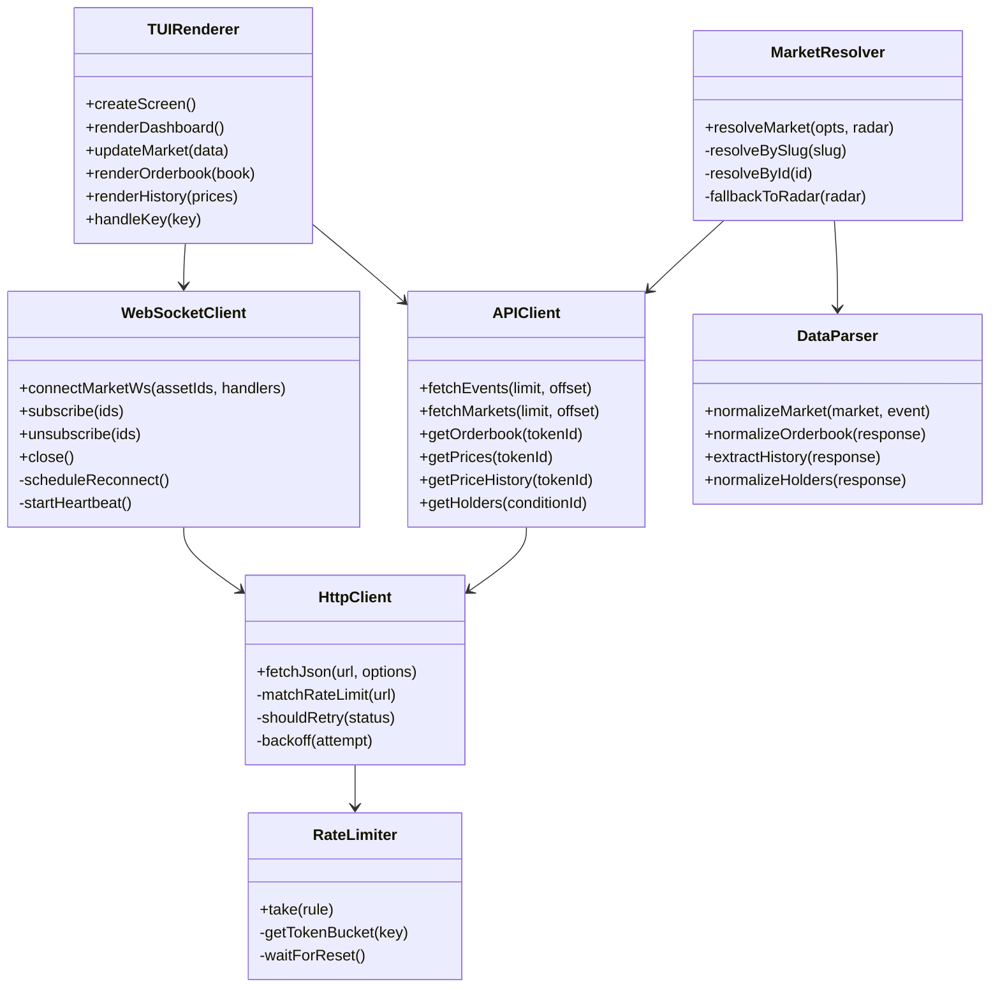

---

## 6. Application State Flow

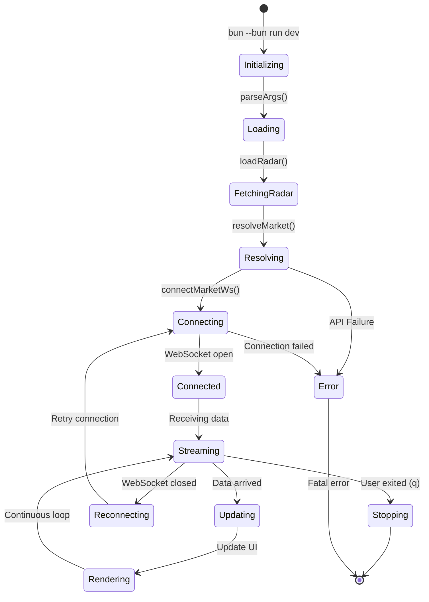

---

## 7. Rate Limiting Strategy

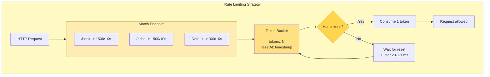

---

## 8. Data Normalization Pipeline

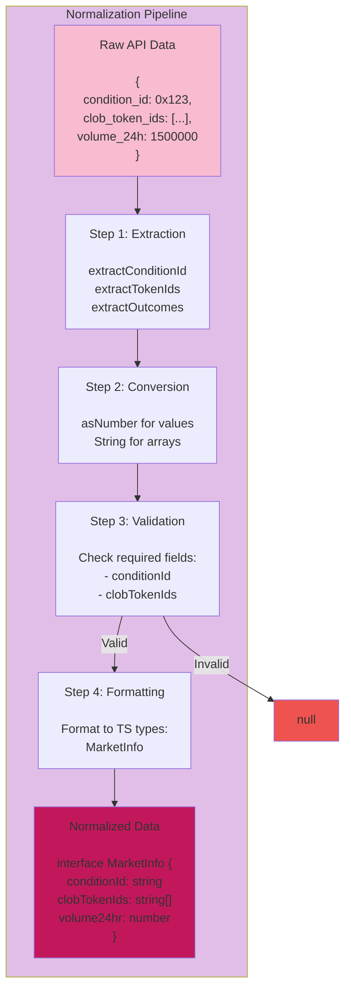

---

## 9. TUI Interface Layout

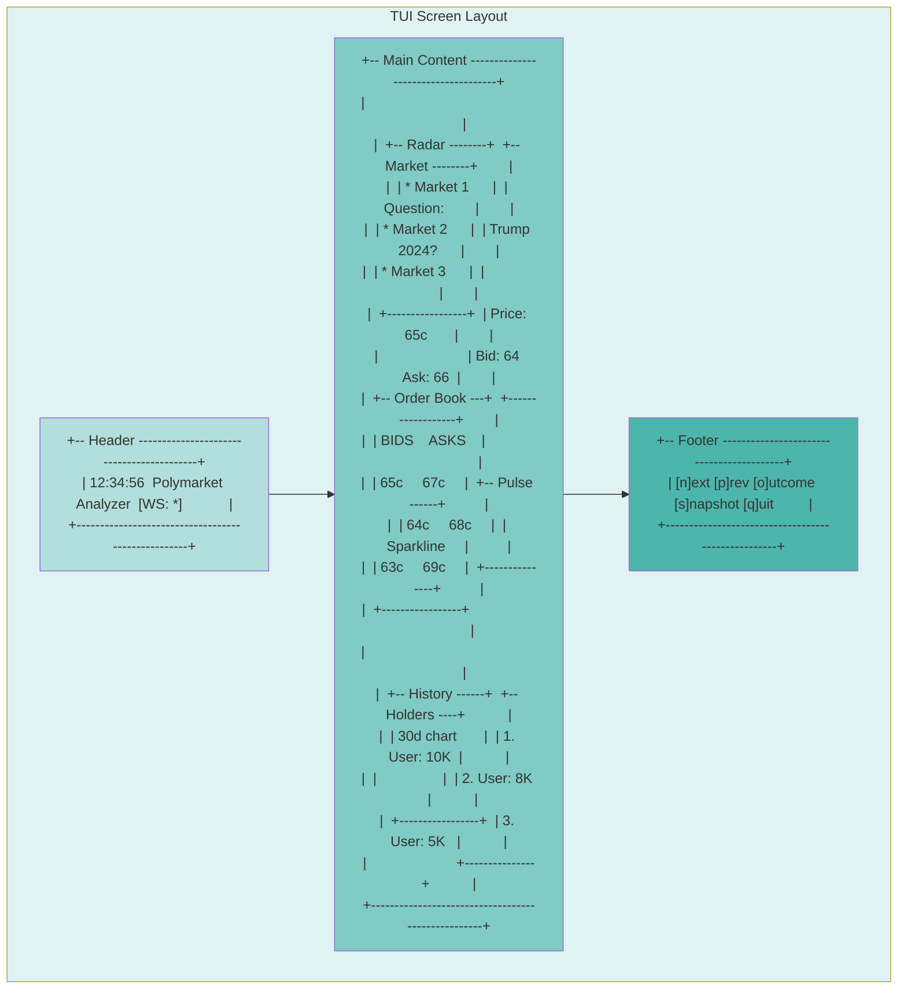

---

## 10. File Relationships

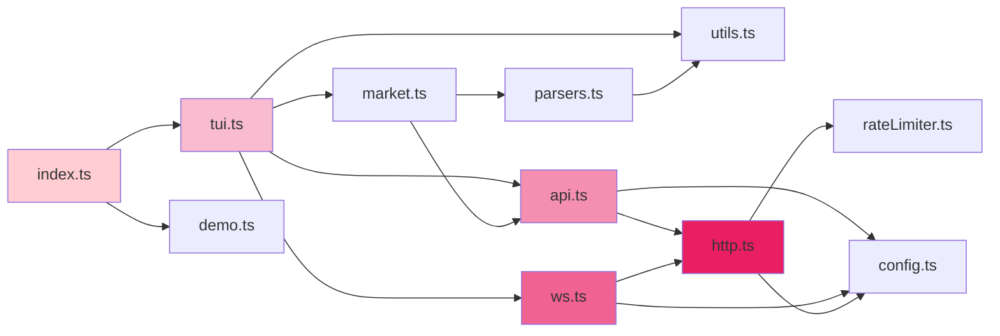

---

## How to Use This Document

1. **To understand overall architecture:** See diagram 1
2. **To understand data flow:** See diagram 2
3. **To understand components:** See diagram 3
4. **To understand integration:** See diagram 4
5. **To understand code:** See diagram 5
6. **To understand states:** See diagram 6
7. **To understand rate limiting:** See diagram 7
8. **To understand normalization:** See diagram 8
9. **To understand interface:** See diagram 9
10. **To understand dependencies:** See diagram 10

---

**Version:** 1.0.0
**Last Updated:** January 2026
