# 🏗️ Mapa de Arquitetura Completa - Polymarket Analyzer

> **"Um bom diagrama vale mais que mil palavras."**
> — Princípio de Documentação Visual

---

## 📊 Visão Geral da Arquitetura

Este documento contém diagramas Mermaid que mostram a arquitetura completa do Polymarket Analyzer em diferentes níveis de detalhe.

---

## 1. Arquitetura em Alto Nível

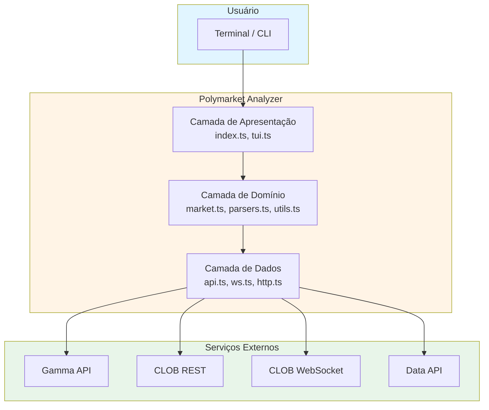

---

## 2. Fluxo de Dados Completo

```mermaid
sequenceDiagram
    participant U as Usuário
    participant I as index.ts (CLI)
    participant M as market.ts
    participant A as api.ts
    participant W as ws.ts
    participant H as http.ts
    participant G as Gamma API
    participant C as CLOB API
    participant S as CLOB WebSocket
    participant T as tui.ts

    U->>I: bun run dev --market <id>
    I->>M: resolveMarket(opts, radar)

    alt Mercado não está no radar
        M->>A: fetchMarketByConditionId(id)
        A->>H: fetchJson(url)
        H->>C: GET /markets?condition_ids={id}
        C-->>H: 200 OK + market data
        H-->>A: parsed market
        A-->>M: normalized market
    end

    M-->>I: MarketInfo
    I->>T: runDashboard(market)

    par Fluxo REST
        T->>A: getOrderbook(tokenId)
        A->>H: fetchJson(url)
        H->>C: GET /book?token_id={id}
        C-->>H: order book
        H-->>A: parsed data
        A-->>T: normalized orderbook
    and

    par Fluxo WebSocket
        T->>W: connectMarketWs(tokenIds, handlers)
        W->>S: WebSocket connect
        S-->>W: Connected
        W->>S: Subscribe to assets
        S-->>W: Real-time updates
        W-->>T: onBook/onUpdate
    end

    T->>T: Render interface
    T-->>U: TUI Display

    loop A cada 3 segundos
        T->>A: Fetch additional data
        A-->>T: Updated data
        T->>T: Re-render
    end
```

---

## 3. Detalhamento dos Componentes

### 3.1 Camada de Dados

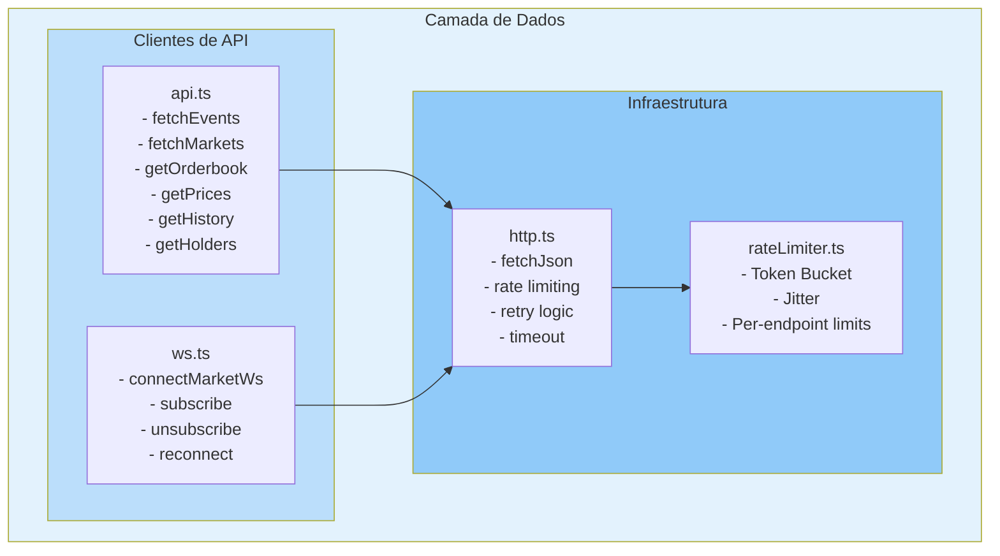

### 3.2 Camada de Domínio

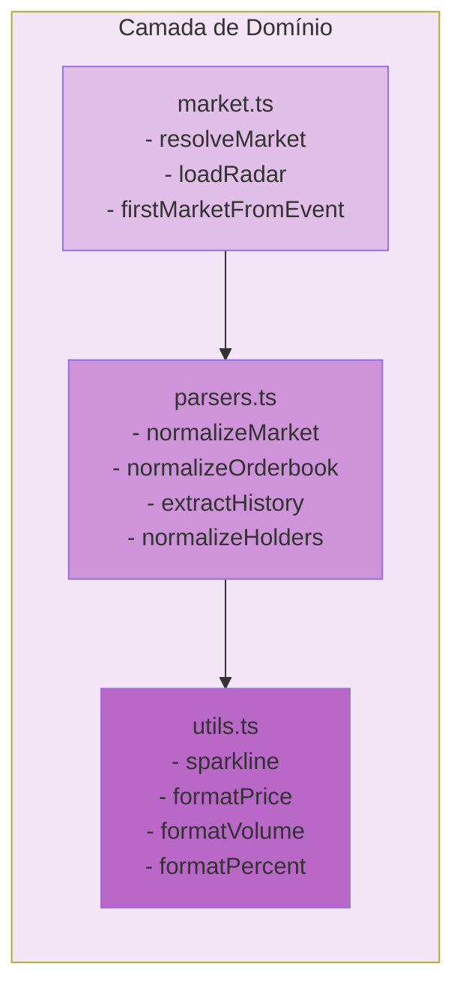

### 3.3 Camada de Apresentação

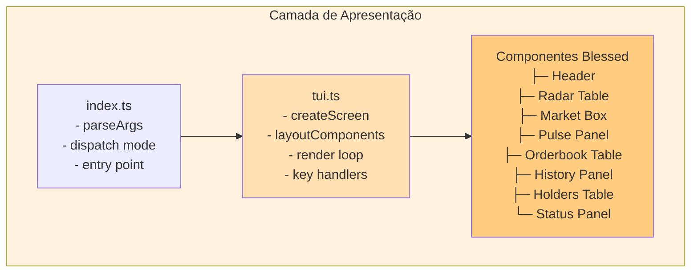

---

## 4. Integração com APIs Polymarket

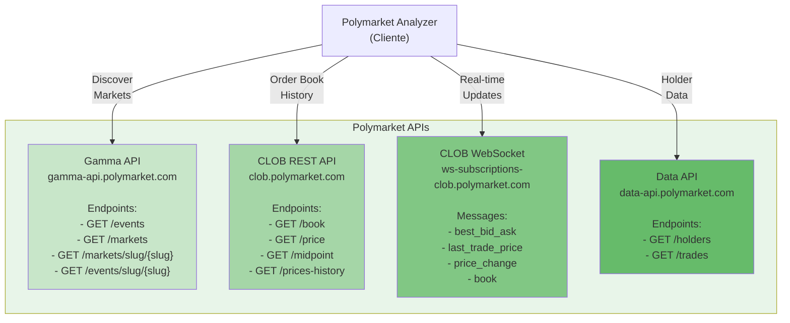

---

## 5. Estrutura de Módulos TypeScript

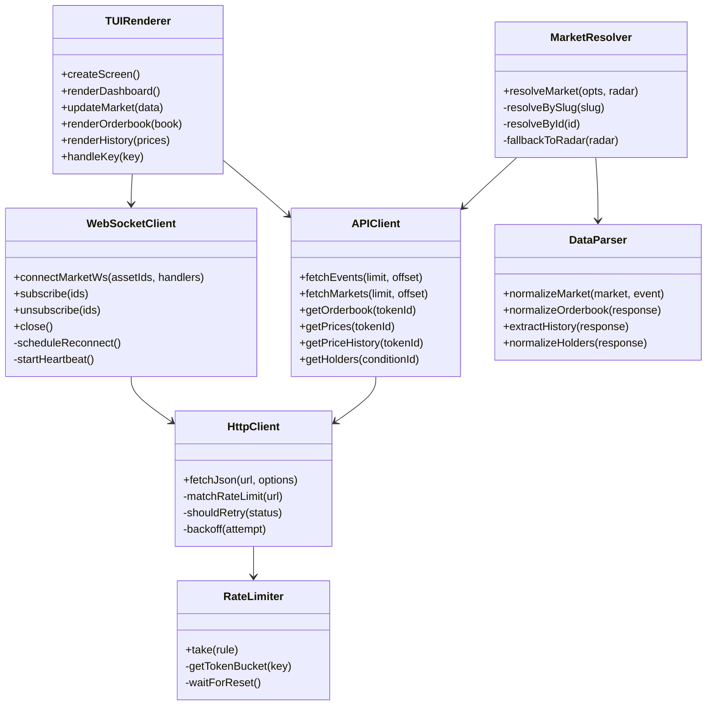

---

## 6. Fluxo de Estados da Aplicação

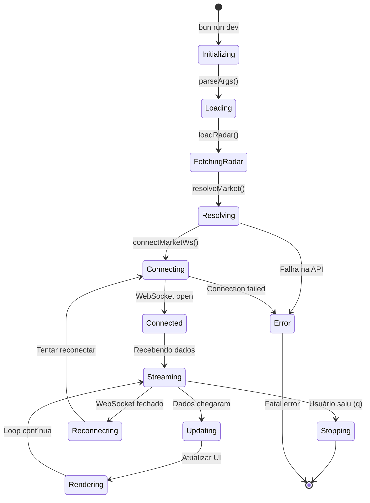

---

## 7. Estratégia de Rate Limiting

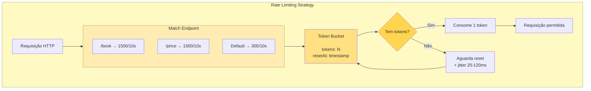

---

## 8. Pipeline de Normalização de Dados

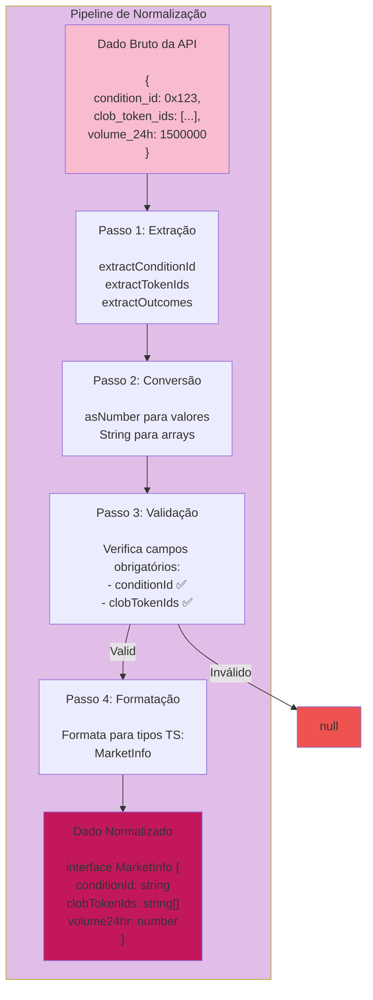

---

## 9. Layout da Interface TUI

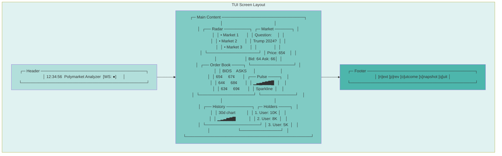

---

## 10. Relacionamentos Entre Arquivos

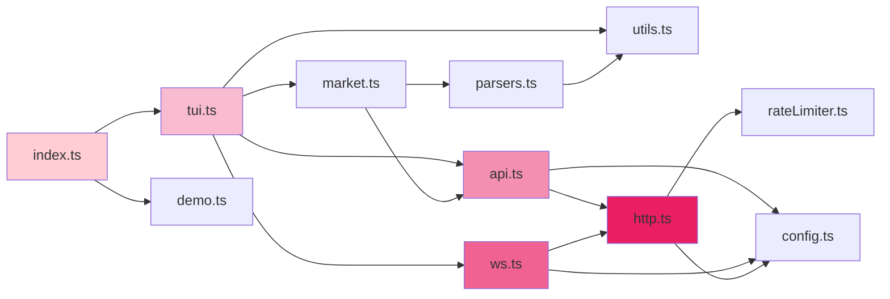

---

## 📚 Como Usar Este Documento

1. **Para entender arquitetura geral:** Veja o diagrama 1
2. **Para entender fluxo de dados:** Veja o diagrama 2
3. **Para entender componentes:** Veja o diagrama 3
4. **Para entender integração:** Veja o diagrama 4
5. **Para entender código:** Veja o diagrama 5
6. **Para entender estados:** Veja o diagrama 6
7. **Para entender rate limiting:** Veja o diagrama 7
8. **Para entender normalização:** Veja o diagrama 8
9. **Para entender interface:** Veja o diagrama 9
10. **Para entender dependências:** Veja o diagrama 10

---

**Última Atualização:** Janeiro 2026
**Versão:** 1.0
