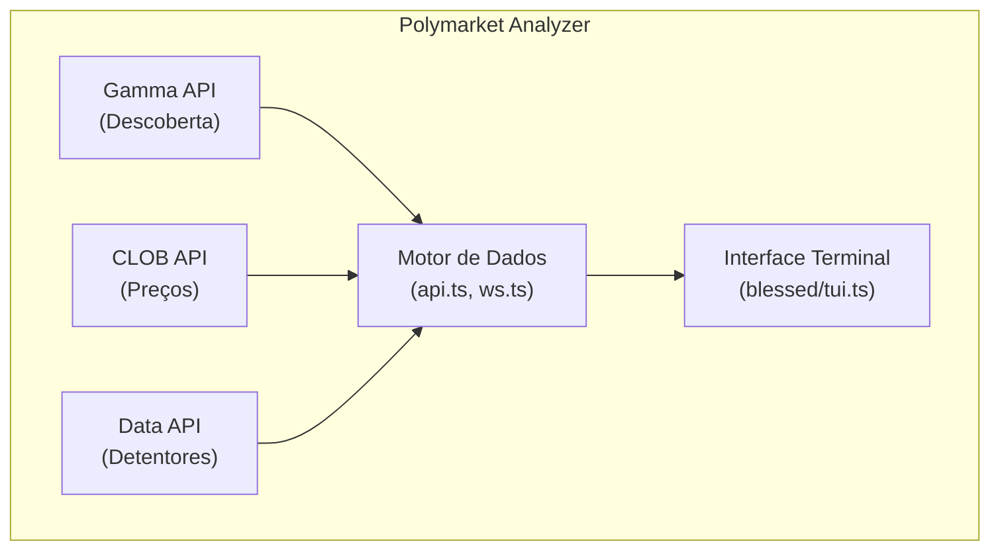
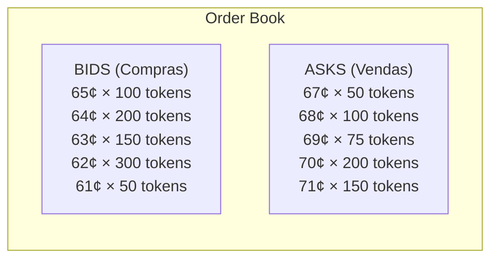
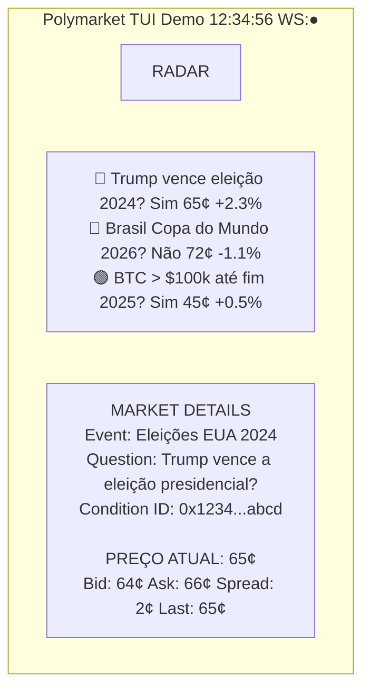

# Capítulo 00: Introdução ao Polymarket Analyzer

> **"Se você não consegue explicar algo de forma simples, você não entende bem o suficiente."**
> — Richard Feynman

---

## 1. O Que é Este Projeto? (Explicação para Minha Avó)

Imagine que você tem uma bolsa de valores, mas em vez de comprar e vender ações de empresas como Apple ou Google, você está apostando em eventos do mundo real. Por exemplo:

- "O Brasil vai ganhar a Copa do Mundo?"
- "Será que a temperatura global vai subir 2°C até 2030?"
- "Tal candidato vai vencer as eleições?"

Cada uma dessas perguntas é um **mercado de previsão**. As pessoas compram e vendem "tokens" que representam "Sim" ou "Não" para cada pergunta. O preço do token mostra o quão provável a comunidade acha que o evento vai acontecer.

**O Polymarket Analyzer** é uma ferramenta que permite monitorar esses mercados em tempo real, diretamente do seu terminal de computador. É como ter um painel de controle da sabedoria das multidões.

---

## 2. Por Que Isso Existe? (O Problema Que Resolvemos)

### O Problema

A Polymarket é uma plataforma de mercados de previsão baseada em blockchain. Ela possui APIs públicas que fornecem dados sobre:

- Mercados ativos
- Preços em tempo real
- Livro de ofertas (order book)
- Histórico de preços
- Maiores detentores de tokens

**Mas**, esses dados estão espalhados em diferentes APIs, e não existe uma interface oficial para monitorar tudo em tempo real de forma eficiente.

### A Solução

O Polymarket Analyzer:

1. **Centraliza dados de múltiplas fontes** (Gamma API, CLOB REST/WS, Data API)
2. **Fornece uma interface visual rica** no terminal (TUI - Terminal User Interface)
3. **Atualiza em tempo real** usando WebSockets
4. **Permite exportar snapshots** para análise posterior
5. **Respeita rate limits** das APIs (não derruba o servidor)

---

## 3. Como Funciona? (Visão de Helicóptero)

A aplicação segue esta arquitetura simples:



### Fluxo de Dados Simplificado

1. **Descoberta**: A aplicação descobre quais mercados estão ativos via Gamma API
2. **Conexão**: Conecta ao WebSocket da Polymarket para receber atualizações em tempo real
3. **Coleta**: Busca dados adicionais (livro de ofertas, histórico) via REST API
4. **Processamento**: Normaliza e organiza os dados
5. **Exibição**: Renderiza tudo no terminal com uma interface interativa

---

## 4. Conceitos Fundamentais

### 4.1 O Que é uma API?

**API** significa *Application Programming Interface* (Interface de Programação de Aplicações).

Pense na API como um **garçom em um restaurante**:

- Você (o cliente) não pode entrar na cozinha
- Você dá o pedido ao garçom
- O garçom leva o pedido para a cozinha
- A cozinha prepara o prato
- O garçom traz o prato para você

Da mesma forma:
- Seu código não pode acessar diretamente os dados da Polymarket
- Seu código faz uma "requisição" para a API
- A API processa a requisição
- A API retorna os dados para seu código

### 4.2 REST vs WebSocket

Existem duas formas principais de comunicação com a Polymarket:

#### REST (Representational State Transfer)

É como **enviar uma carta**:
- Você escreve uma carta (faz uma requisição HTTP)
- Envia para o destinatário (servidor)
- O destinatário lê e responde (resposta HTTP)
- A comunicação **termina aí**

**Características:**
- ✅ Simples e direto
- ✅ Funciona bem para dados que não mudam rapidamente
- ❌ Você precisa perguntar de novo (polling) para saber se algo mudou
- ❌ Gasta recursos com requisições repetidas

**Exemplo no código:** Veja `src/api.ts` nas linhas 22-36:

```typescript
export async function fetchEvents(limit = 10, offset = 0) {
  const url = withQuery(`${CONFIG.gammaBase}/events`, {
    limit,
    offset,
    closed: false,
    active: true,
    order: "id",
    ascending: false
  });
  const res = await fetchJson<unknown>(url);
  if (Array.isArray(res)) return res as GammaEvent[];
  // ...
}
```

Aqui estamos **perguntando** ao servidor: "Quais são os eventos ativos?"

#### WebSocket

É como **fazer uma chamada telefônica**:
- Você disca o número (abre a conexão)
- A linha permanece aberta
- Ambos podem falar a qualquer momento
- A conexão só fecha quando alguém desliga

**Características:**
- � Comunicação **bidirecional** em tempo real
- ✅ O servidor pode enviar dados quando quiser (push)
- ✅ Ideal para dados que mudam rapidamente (preços!)
- ❌ Mais complexo de implementar
- ❌ Precisa gerenciar reconexões

**Exemplo no código:** Veja `src/ws.ts` (será detalhado no Capítulo 4)

### 4.3 Livro de Ofertas (Order Book)

O **livro de ofertas** é como uma lista de todas as pessoas querendo comprar ou vender um token.

**Exemplo Prático:**

Imagine que você quer comprar um token "Sim" do mercado "O Brasil vai ganhar a Copa?". O livro de ofertas mostra:



- **Best Bid**: 65¢ (o maior preço que alguém quer pagar)
- **Best Ask**: 67¢ (o menor preço que alguém quer vender)
- **Spread**: 2¢ (diferença entre bid e ask)
- **Midpoint**: 66¢ (ponto médio entre bid e ask)

No código, isso é processado em `src/api.ts` na função `getOrderbook()`.

### 4.4 O Que é TUI?

**TUI** significa *Terminal User Interface* (Interface de Usuário em Terminal).

É uma interface gráfica que roda **dentro do terminal**, sem precisar de janelas, botões ou mouse. É como os programas antigos de DOS, mas modernos.

**Exemplo de TUI:**



**Vantagens do TUI:**
- ✅ Leve e rápido
- ✅ Funciona em qualquer terminal
- ✅ Pode ser controlado apenas com teclado
- ✅ Perfeito para servidores remotos (SSH)
- ✅ Aparência "hacker profissional" 😎

Este projeto usa a biblioteca **blessed** (`src/tui.ts`) para criar a interface.

---

## 5. Estrutura do Projeto

```mermaid
graph TD
    Root["polymarket-analyzer/"]
    src["src/<br/>Código fonte"]
    index["index.ts<br/>Ponto de entrada CLI"]
    config["config.ts<br/>Configurações"]
    api["api.ts<br/>Cliente REST"]
    ws["ws.ts<br/>Cliente WebSocket"]
    http["http.ts<br/>HTTP + rate limit"]
    tui["tui.ts<br/>Interface terminal"]
    market["market.ts<br/>Lógica mercados"]
    parsers["parsers.ts<br/>Parsing"]
    utils["utils.ts<br/>Utilitários"]
    logger["logger.ts<br/>Logging"]
    rate["rateLimiter.ts<br/>Rate limit"]
    tests["tests/<br/>Testes"]
    api_test["api.test.ts"]
    cli_test["cli.test.ts"]
    parsers_test["parsers.test.ts"]
    ws_test["ws.test.ts"]
    docs["docs/<br/>Documentação"]
    learn["learn/<br/>← Você está aqui!"]
    package["package.json<br/>Dependências"]
    tsconfig["tsconfig.json<br/>TypeScript"]
    readme["README.md<br/>Documentação"]

    Root --> src
    src --> index
    src --> config
    src --> api
    src --> ws
    src --> http
    src --> tui
    src --> market
    src --> parsers
    src --> utils
    src --> logger
    src --> rate

    Root --> tests
    tests --> api_test
    tests --> cli_test
    tests --> parsers_test
    tests --> ws_test

    Root --> docs
    docs --> learn

    Root --> package
    Root --> tsconfig
    Root --> readme
```



---

## 6. Tecnologias Utilizadas

### 6.1 Bun

O **Bun** é um runtime moderno para JavaScript/TypeScript, criado como uma alternativa ao Node.js.

**Por que Bun?**
- ⚡ **28x mais rápido** que npm para instalar pacotes
- ⚡ **3x mais rápido** que Node.js para executar código
- 📦 **TypeScript nativo** (não precisa transpilar)
- 🔧 **Built-in test runner**
- 📦 **Built-in bundler**

**Comparativo:**

```bash
# Node.js + npm
npm install          # Lento...
npx ts-node src.ts  # Muito lento...

# Bun
bun install          # 28x mais rápido
bun run src.ts       # 3x mais rápido, TypeScript nativo!
```

**No projeto:** Veja o shebang na linha 1 de `src/index.ts`:

```typescript
#!/usr/bin/env bun
// Isso diz ao sistema para usar Bun para executar este arquivo
```

### 6.2 TypeScript

**TypeScript** é JavaScript com tipos.

**Por que TypeScript?**

Imagine que você está escrevendo um email e o autocorrect avisa quando você erra uma palavra. TypeScript faz isso com código:

```typescript
// JavaScript (sem tipos) - Erro só aparece em runtime
function somar(a, b) {
  return a + b;
}
somar("2", 3);  // "23" - Opa! Não era isso que queríamos...

// TypeScript (com tipos) - Erro aparece no editor
function somar(a: number, b: number): number {
  return a + b;
}
somar("2", 3);  // ❌ Erro de compilação: Argumento do tipo string
                // não pode ser atribuído ao parâmetro do tipo number
```

**Configuração do projeto:** Veja `tsconfig.json`:

```json
{
  "compilerOptions": {
    "strict": true,        // Modo estrito (mais segurança)
    "target": "ES2022",    // JavaScript moderno
    "noEmit": true         // Não gera arquivos .js (Bun executa direto)
  }
}
```

### 6.3 Blessed

**Blessed** é uma biblioteca para criar interfaces de terminal ricas.

```bash
npm install blessed
```

Ela fornece:
- Caixas, tabelas, listas
- Cores e formatação
- Captura de teclado
- Layout responsivo

**Exemplo simples:**

```typescript
import blessed from "blessed";

// Cria a tela
const screen = blessed.screen();

// Cria uma caixa de texto
const box = blessed.box({
  top: "center",
  left: "center",
  width: "50%",
  height: "50%",
  content: "Hello, World!",
  border: { type: "line" }
});

screen.append(box);
screen.render();
```

No projeto, a interface completa está em `src/tui.ts` (682 linhas!).

---

## 7. Como Executar o Projeto

### Pré-requisitos

1. Instalar Bun: `curl -fsSL https://bun.sh/install | bash`
2. Clonar o projeto
3. Instalar dependências

### Comandos Disponíveis

```bash
# Instalar dependências
bun install

# Executar interface gráfica no terminal
bun run dev
# ou
bun run src/index.ts --tui

# Exportar snapshot JSON
bun run snapshot

# Listar mercados disponíveis
bun run markets

# Executar testes
bun test

# Verificar tipos TypeScript
bun typecheck
```

### Primeira Execução

```bash
# 1. Entre no diretório do projeto
cd polymarket-analyzer

# 2. Instale as dependências
bun install

# 3. Execute o dashboard
bun run dev
```

Você verá algo assim:

```
┌────────────────────────────────────────────────────────────┐
│  Polymarket TUI Demo                    [12:34:56] [WS: ●] │
├────────────────────────────────────────────────────────────┤
│  Carregando mercados...                                     │
└────────────────────────────────────────────────────────────┘
```

Após alguns segundos, a interface completa aparecerá com todos os dados.

---

## 8. Conceitos de Mercado de Previsão

### 8.1 Como Funciona um Mercado de Previsão?

Um mercado de previsão é como uma bolsa de valores, mas para eventos futuros.

**Exemplo: Mercado "Trump vence em 2024?"**

1. **Criação do Mercado**: Alguém cria a pergunta com duas opções: "Sim" e "Não"
2. **Tokens**: Cada opção é um token que pode ser comprado/vendido
3. **Preços**: O preço reflete a probabilidade percebida
   - Preço de 65¢ = 65% de probabilidade
   - Preço de 30¢ = 30% de probabilidade

### 8.2 Arbitragem

**Arbitragem** é lucrar sem risco aproveitando diferenças de preço.

**Exemplo:**

```
Mercado A: "Trump vence" = 65¢
Mercado B: "Trump perde" = 40¢

Se você comprar ambos:
- Compra "Sim" por 65¢
- Compra "Não" por 40¢
- Total: 105¢

Mas um dos dois vai valer $1.00!
Prejuízo garantido de 5¢
```

Isso **não deveria acontecer** em mercados eficientes. Se acontecer, existe oportunidade de arbitragem.

### 8.3 Liquidez

**Liquidez** é a facilidade de comprar/vender sem afetar muito o preço.

**Alta liquidez:**
- Muitos compradores e vendedores
- Você pode comprar muito sem mudar o preço

**Baixa liquidez:**
- Poucos participantes
- Uma compra grande pode explodir o preço

No Polymarket Analyzer, você pode ver a profundidade do livro de ofertas para avaliar a liquidez.

---

## 9. Casos de Uso

### 9.1 Traders

Monitorar mercados em tempo real para tomar decisões de compra/venda.

### 9.2 Pesquisadores

Coletar dados sobre sentimentos e probabilidades de eventos futuros.

### 9.3 Desenvolvedores

Aprender como integrar com as APIs da Polymarket para construir seus próprios apps.

### 9.4 Cientistas de Dados

Exportar snapshots para análise preditiva e machine learning.

---

## 10. Próximos Passos

Agora que você tem uma visão geral, vamos mergulhar nos detalhes técnicos:

- **Capítulo 1**: Ecossistema Bun e TypeScript
- **Capítulo 2**: Arquitetura e Estrutura do Projeto
- **Capítulo 3**: Integração com APIs Polymarket
- **Capítulo 4**: WebSockets e Tempo Real
- **Capítulo 5**: Interface de Terminal (TUI)
- **Capítulo 6**: Tratamento de Erros e Rate Limiting
- **Capítulo 7**: Estratégias de Teste
- **Capítulo 8**: Exercícios Práticos

---

## 11. Glossário Rápido

| Termo | Significado |
|-------|-------------|
| **API** | Interface para comunicação entre sistemas |
| **REST** | Estilo arquitetural para APIs (baseado em HTTP) |
| **WebSocket** | Protocolo de comunicação bidirecional em tempo real |
| **TUI** | Interface de Usuário em Terminal |
| **Order Book** | Livro de ofertas (compradores e vendedores) |
| **Bid** | Maior preço que alguém quer pagar |
| **Ask** | Menor preço que alguém quer vender |
| **Spread** | Diferença entre bid e ask |
| **Midpoint** | Ponto médio entre bid e ask |
| **Token** | Ativo digital negociável |
| **Liquidez** | Facilidade de comprar/vender |
| **Rate Limit** | Limite de requisições por período |
| **Snapshot** | Foto instantânea do estado dos dados |
| **Condition ID** | Identificador único de um mercado |
| **Slug** | URL amigável para identificar recursos |

---

## 12. Recursos Adicionais

- **Documentação Bun**: https://bun.sh/docs
- **Documentação TypeScript**: https://www.typescriptlang.org/docs/
- **Documentação Blessed**: https://github.com/chjj/blessed
- **Documentação Polymarket**: https://docs.polymarket.com

---

**Exercício Rápido #1: Sua Primeira Execução**

Tente executar o projeto você mesmo:

```bash
# 1. Instale as dependências (se ainda não fez)
bun install

# 2. Execute o dashboard
bun run dev

# 3. Explore a interface:
#    - Pressione 'n' para ir ao próximo mercado
#    - Pressione 'p' para voltar ao mercado anterior
#    - Pressione 'o' para trocar entre outcomes
#    - Pressione 's' para salvar um snapshot
#    - Pressione 'q' para sair
```

**Perguntas para reflexão:**
1. Quantos mercados você consegue ver na lista?
2. Qual é o mercado com maior volume de negociação?
3. Como o preço muda quando você troca entre outcomes?

---

## ✅ Check Your Understanding

Verifique seu entendimento dos conceitos deste capítulo respondendo às perguntas abaixo.

### Pergunta 1: O Que é uma API?

**Qual a analogia correta para uma API?**

<details>
<summary>A</summary>

a) Um livro de receitas
</details>

<details>
<summary>B (Correta)</summary>

b) Um garçom em um restaurante que leva pedidos entre clientes e cozinha
</details>

<details>
<summary>C</summary>

c) Um tradutor simultâneo
</details>

**Por que a analogia do garçom está correta?**
- Cliente não entra na cozinha (você não acessa o sistema diretamente)
- Garçom leva pedido (API recebe requisição)
- Cozinha prepara (sistema processa)
- Garçom traz resposta (API retorna dados)

---

### Pergunta 2: REST vs WebSocket

**Qual a diferença fundamental entre REST e WebSocket?**

<details>
<summary>Resposta</summary>

**REST (Polling):**
- Cliente pergunta "Tem dados novos?" a cada X segundos
- Servidor responde "Sim" ou "Não"
- Muitas requisições vazias

**WebSocket:**
- Conexão permanente (como chamada telefônica)
- Servidor envia dados quando tiver (push)
- Comunicação bidirecional em tempo real
</details>

**Qual é melhor para monitorar preços em tempo real?**
<details>
<summary>Resposta</summary>

WebSocket! Porque os preços mudam constantemente e você quer saber instantaneamente quando mudar, não esperar 3 segundos para a próxima pergunta.
</details>

---

### Pergunta 3: Order Book

**Dado este order book, qual o spread?**

```
BIDS              ASKS
0.65 × 1000    0.67 × 500
0.64 × 2000    0.68 × 750
```

<details>
<summary>Resposta</summary>

Spread = Ask - Bid = 0.67 - 0.65 = 0.02 (2¢)

Spread % = (0.02 / 0.67) × 100 = 2.99%
</details>

---

### Pergunta 4: Componentes da Arquitetura

**Qual API é usada para cada propósito?**

Match a coluna da esquerda com a direita:

| API | Propósito |
|-----|-----------|
| Gamma API | [?] |
| CLOB API | [?] |
| CLOB WebSocket | [?] |
| Data API | [?] |

<details>
<summary>Resposta</summary>

Gamma API → Descoberta de mercados
CLOB API → Preços e order book
CLOB WebSocket → Atualizações em tempo real
Data API → Detentores e trades
</details>

---

## ⚠️ Common Pitfalls

### Pitfall: Confundir REST com WebSocket

**Erro Comum:**
Achar que REST pode fazer tudo que WebSocket faz.

**Problema:**
REST é **unidirecional** (cliente pergunta, servidor responde).
WebSocket é **bidirecional** (qualquer lado pode enviar a qualquer momento).

**Quando usar REST:**
- Dados que mudam raramente
- Requisição única (buscar um usuário, salvar dados)
- Operações CRUD simples

**Quando usar WebSocket:**
- Dados em tempo real (preços, chat, notificações)
- Atualizações frequentes (segundos ou milissegundos)
- Comunicação bidirecional

---

### Pitfall: Ignorar Rate Limits

**Erro Comum:**
Fazer requisições sem limite até a API bloquear.

**Problema:**
A Polymarket vai bloquear seu IP por excesso de requisições.

**Solução:**
```typescript
// ❌ RUIM - Sem rate limiting
for (let i = 0; i < 1000; i++) {
  await fetch(url);  // Vai ser bloqueado!
}

// ✅ BOM - Com rate limiting
const rateLimiter = new TokenBucket(10, 10000); // 10 req por 10s
for (let i = 0; i < 1000; i++) {
  await rateLimiter.consume();  // Aguarda se necessário
  await fetch(url);
}
```

---

### Pitfall: Não Entender "Condition ID"

**Erro Comum:**
Confundir market ID, condition ID, e slug.

**Diferença:**
- **Market ID**: Identificador interno do mercado (pode mudar)
- **Condition ID**: Identificador único imutável (usado em CLOB)
- **Slug**: URL amigável para humanos ("trump-wins-2024")

**Importante:**
Sempre use **Condition ID** para operações de trading (CLOB API).
Use **Slug** para buscar mercados (Gamma API).

---

## 🔧 Troubleshooting

### Problema: "Cannot connect to Polymarket API"

**Sintoma:**
Erro de conexão ao executar `bun run dev`

**Causas Possíveis:**
1. Sem conexão com internet
2. API Polymarket fora do ar
3. Firewall bloqueando

**Solução:**
```bash
# 1. Teste conexão
curl https://gamma-api.polymarket.com/events?limit=1

# 2. Se falhar, verifique sua internet
ping google.com

# 3. Verifique se API está online
# https://status.polymarket.com (se existir)
```

---

### Problema: "WebSocket not connecting"

**Sintoma:**
Status mostra "WS: ○" (círculo vazio)

**Diagnóstico:**
```bash
# Teste WebSocket manualmente
wscat -c wss://ws-subscriptions-clob.polymarket.com/ws/

# Se wscat não estiver instalado:
bun install -g wscat
```

**Solução:**
- Se wscat conectar, problema é no código
- Se wscat falhar, problema é conexão de rede

---

## 🎯 Milestone Completado

Após completar este capítulo, você deve ser capaz de:

- [ ] Explicar o que é um mercado de previsão
- [ ] Diferenciar REST de WebSocket
- [ ] Entender o que é order book
- [ ] Identificar as APIs da Polymarket
- [ ] Executar o projeto pela primeira vez
- [ ] Navegar pela interface do terminal

**Se não conseguir completar algum item, reveja o capítulo antes de avançar.**

---

## 🎓 Design Decisions

### Decisão 1: Por que TUI (Terminal UI) em vez de GUI?

**Alternativas Consideradas:**
1. **Web App (React/Next.js)** - Interface web moderna
2. **Desktop App (Electron)** - Aplicação desktop nativa
3. **CLI Simples** - Apenas comandos sem interface visual
4. **TUI (Blessed)** - Interface no terminal ✅ **ESCOLHIDO**

**Trade-offs:**

| Critério | Web App | Desktop | CLI Simples | TUI |
|----------|---------|---------|-------------|-----|
| Velocidade de desenvolvimento | ⭐⭐⭐ | ⭐⭐ | ⭐⭐⭐⭐⭐ | ⭐⭐⭐ |
| Leveza | ❌ Pesado | ❌ Muito pesado | ✅ Leve | ✅ Muito leve |
| Acessibilidade via SSH | ❌ Não | ❌ Não | ✅ Sim | ✅ Sim |
| Interatividade | ✅ Alta | ✅ Alta | ❌ Nenhuma | ✅ Média |
| Distribuição | ⭐⭐⭐ | ⭐⭐ | ⭐⭐⭐⭐⭐ | ⭐⭐⭐⭐⭐ |
| Curva de aprendizado | Média | Alta | Baixa | Média |

**Por que TUI foi escolhido:**
- ✅ **Foco em servidores**: Muito uso em ambientes remotos via SSH
- ✅ **Leveza**: Sem overhead de navegador/Electron
- ✅ **Distribuição**: Single binary, fácil de instalar
- ✅ **Estética**: Aparência "hacker profissional"
- ✅ **Performance**: Renderização instantânea

**Quando reconsiderar:**
- Se precisar de gráficos complexos (dashboards visuais)
- Se precisar de suporte a mouse/Touch
- Se target audience não for técnica

**Referência no código:** `src/tui.ts` (682 linhas de interface)

---

### Decisão 2: Por que usar Bun em vez de Node.js?

**Alternativas Consideradas:**
1. **Node.js + npm** - Runtime JavaScript tradicional
2. **Deno** - Runtime TypeScript seguro
3. **Bun** - Runtime moderno tudo-em-um ✅ **ESCOLHIDO**

**Trade-offs:**

| Critério | Node.js | Deno | Bun |
|----------|---------|------|-----|
| Velocidade (install) | 1x | 2x | 28x |
| Velocidade (execução) | 1x | 1.2x | 3x |
| Compatibilidade npm | ⭐⭐⭐⭐⭐ | ⭐⭐ | ⭐⭐⭐⭐ |
| TypeScript nativo | ❌ | ✅ | ✅ |
| Test runner built-in | ❌ | ❌ | ✅ |
| Estabilidade | ⭐⭐⭐⭐⭐ | ⭐⭐⭐⭐ | ⭐⭐⭐ |
| Tamanho do projeto | Pequeno | Qualquer | Pequeno/Médio |

**Por que Bun foi escolhido:**
- ✅ **Velocidade**: 28x mais rápido para instalar deps
- ✅ **TypeScript nativo**: Sem build step
- ✅ **All-in-one**: Test runner, bundler embutidos
- ✅ **Compatibilidade**: Funciona com maioria dos packages npm

**Riscos mitigados:**
- ⚠️ Bun é jovem → **Mitigação**: API estável, issues respondem rápido
- ⚠️ Ecossistema menor → **Mitigação**: Usamos apenas packages populares
- ⚠️ Bugs em edge cases → **Mitigação**: Testes abrangentes

**Referência no código:** Shebang `#!/usr/bin/env bun` em `src/index.ts:1`

---

### Decisão 3: Por que múltiplas APIs Polymarket separadas?

**Alternativas Consideradas:**
1. **Usar apenas Gamma API** - Simplificação
2. **Usar apenas CLOB API** - Foco em preços
3. **Usar todas as APIs** - Completude ✅ **ESCOLHIDO**

**Trade-offs:**

| API | Dados Únicos | Complexidade | Necessidade |
|-----|--------------|--------------|-------------|
| Gamma | Descoberta de mercados | Baixa | ⭐⭐⭐⭐⭐ Essencial |
| CLOB REST | Order book completo | Média | ⭐⭐⭐⭐⭐ Essencial |
| CLOB WebSocket | Updates em tempo real | Alta | ⭐⭐⭐⭐ Muito útil |
| Data API | Detentores e trades | Baixa | ⭐⭐⭐ Nice-to-have |

**Por que todas foram escolhidas:**
- **Gamma API**: Impossível descobrir mercados sem ela
- **CLOB REST**: Necessário para order book completo
- **CLOB WebSocket**: Crucial para updates em tempo real
- **Data API**: Útil para análise de position/trading

**Arquitetura resultante:**
```
Γ (Gamma) → Descoberta
C (CLOB)   → Preços + Tempo Real
D (Data)   → Contexto adicional
```

**Referência no código:** `src/api.ts` integra todas as 3 APIs

---

### Decisão 4: Por que async/await em vez de callbacks?

**Alternativas Consideradas:**
1. **Callbacks** - Estilo Node.js tradicional
2. **Promises (then/catch)** - Estilo ES6
3. **async/await** - Estilo ES2017 ✅ **ESCOLHIDO**

**Trade-offs:**

| Estilo | Legibilidade | Error Handling | Debugging | Performance |
|--------|--------------|-----------------|------------|--------------|
| Callbacks | ❌ Pyramid of doom | Difícil | Muito difícil | Igual |
| then/catch | ⭐⭐ Média | ⭐⭐ Média | Difícil | Igual |
| async/await | ✅ Como sync | ✅ Try/catch | ✅ Fácil | Igual |

**Por que async/await foi escolhido:**
- ✅ **Legibilidade**: Código parece síncrono
- ✅ **Error handling**: try/catch funciona naturalmente
- ✅ **Composição**: Fácil de combinar múltiplas operações
- ✅ **Debugging**: Stack traces preservados

**Exemplo comparativo:**
```typescript
// ❌ CALLBACK HELL (não usado!)
fetchData((err, data) => {
  if (err) return handleError(err);
  parseData(data, (err, parsed) => {
    if (err) return handleError(err);
    renderData(parsed, (err) => {
      if (err) return handleError(err);
      // ...
    });
  });
});

// ✅ ASYNC/AWAIT (usado!)
try {
  const data = await fetchData();
  const parsed = await parseData(data);
  await renderData(parsed);
} catch (err) {
  handleError(err);
}
```

**Referência no código:** Todo `src/` usa async/await consistentemente

---

## 📚 Recursos Externos

### Aprender Mais Sobre:

**Mercados de Previsão:**
- [Prediction Markets Theory](https://en.wikipedia.org/wiki/Prediction_market) - Wikipedia
- [Efficient Market Hypothesis](https://www.investopedia.com/terms/e/efficientmarkethypothesis.asp) - Investopedia
- [Rational Expectations](https://en.wikipedia.org/wiki/Rational_expectations) - Wikipedia

**TUI (Terminal UI):**
- [Blessed Documentation](https://github.com/chjj/blessed) - GitHub
- [ncurses Programming Guide](https://tldp.org/HOWTO/NCURSES-Programming-HOWTO/) - TLDP
- [Terminal Escape Codes](https://en.wikipedia.org/wiki/ANSI_escape_code) - Wikipedia

**Bun Runtime:**
- [Bun Official Docs](https://bun.sh/docs) - Documentação oficial
- [Bun GitHub](https://github.com/oven-sh/bun) - Repositório
- [Bun vs Node Benchmarks](https://bun.sh/#benchmarks) - Comparações

**TypeScript:**
- [TypeScript Handbook](https://www.typescriptlang.org/docs/handbook/intro.html) - Oficial
- [TypeScript Deep Dive](https://basarat.gitbook.io/typescript/) - Basarat Ali Syed
- [Effective TypeScript](https://effectivetypescript.com/) - Dan Vanderkam

### Vídeos Recomendados:

- [What are Prediction Markets?](https://www.youtube.com/watch?v=PR1dGZTjFME) - YouTube (5 min)
- [Bun.js - The Future of JavaScript?](https://www.youtube.com/watch?v=U7kqeTxsQtA) - YouTube (15 min)
- [TypeScript in 100 Seconds](https://www.youtube.com/watch?v=U3IPqMdR-mM) - YouTube (2 min)

---

**Próximo Capítulo:** Ecossistema Bun e TypeScript

[Continue para o Capítulo 1](./01-ecossistema-bun-typescript.md)
