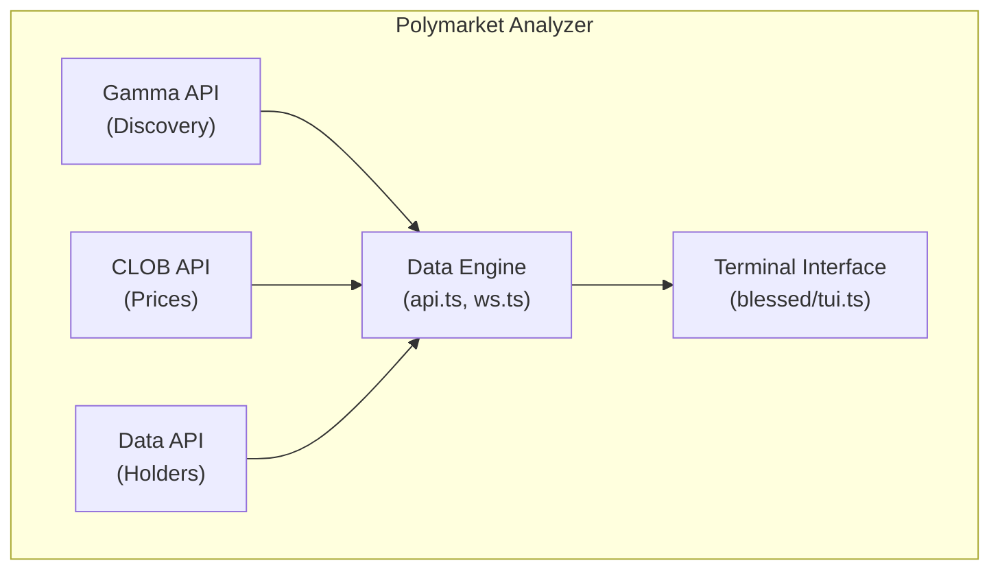
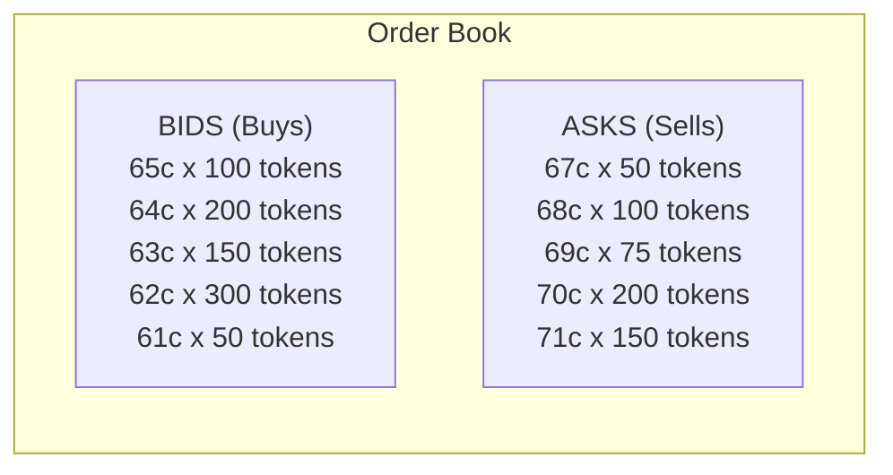
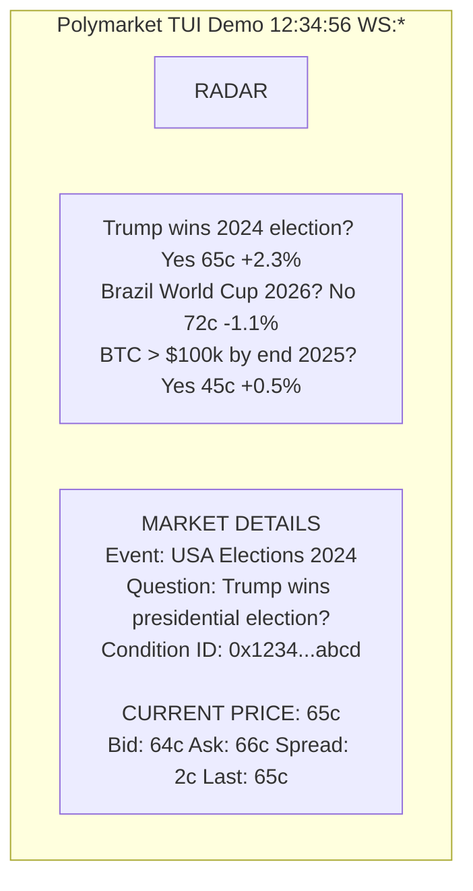

# Chapter 00: Introduction to Polymarket Analyzer

> **"If you can't explain something simply, you don't understand it well enough."**
> -- Richard Feynman

---

## 1. What is This Project? (Explanation for My Grandmother)

Imagine you have a stock exchange, but instead of buying and selling shares of companies like Apple or Google, you're betting on real-world events. For example:

- "Will Brazil win the World Cup?"
- "Will global temperature rise 2 degrees C by 2030?"
- "Will this candidate win the election?"

Each of these questions is a **prediction market**. People buy and sell "tokens" that represent "Yes" or "No" for each question. The token price shows how likely the community thinks the event will happen.

**Polymarket Analyzer** is a tool that allows you to monitor these markets in real-time, directly from your computer terminal. It's like having a control panel for the wisdom of crowds.

---

## 2. Why Does This Exist? (The Problem We Solve)

### The Problem

Polymarket is a blockchain-based prediction markets platform. It has public APIs that provide data about:

- Active markets
- Real-time prices
- Order book
- Price history
- Top token holders

**But**, this data is spread across different APIs, and there's no official interface to monitor everything in real-time efficiently.

### The Solution

Polymarket Analyzer:

1. **Centralizes data from multiple sources** (Gamma API, CLOB REST/WS, Data API)
2. **Provides a rich visual interface** in the terminal (TUI - Terminal User Interface)
3. **Updates in real-time** using WebSockets
4. **Allows exporting snapshots** for later analysis
5. **Respects rate limits** of APIs (doesn't crash the server)

---

## 3. How Does It Work? (Bird's Eye View)

The application follows this simple architecture:



### Simplified Data Flow

1. **Discovery**: The application discovers which markets are active via Gamma API
2. **Connection**: Connects to Polymarket WebSocket to receive real-time updates
3. **Collection**: Fetches additional data (order book, history) via REST API
4. **Processing**: Normalizes and organizes the data
5. **Display**: Renders everything in the terminal with an interactive interface

---

## 4. Fundamental Concepts

### 4.1 What is an API?

**API** stands for *Application Programming Interface*.

Think of the API as a **waiter in a restaurant**:

- You (the customer) can't go into the kitchen
- You give your order to the waiter
- The waiter takes the order to the kitchen
- The kitchen prepares the dish
- The waiter brings the dish to you

Similarly:
- Your code can't directly access Polymarket's data
- Your code makes a "request" to the API
- The API processes the request
- The API returns the data to your code

### 4.2 REST vs WebSocket

There are two main ways to communicate with Polymarket:

#### REST (Representational State Transfer)

It's like **sending a letter**:
- You write a letter (make an HTTP request)
- Send it to the recipient (server)
- The recipient reads and responds (HTTP response)
- The communication **ends there**

**Characteristics:**
- Simple and direct
- Works well for data that doesn't change rapidly
- You need to ask again (polling) to know if something changed
- Wastes resources with repeated requests

**Example in code:** See `src/api.ts` at lines 22-36:

```typescript
export async function fetchEvents(limit = 50, offset = 0) {
  const url = withQuery(`${CONFIG.gammaBase}/events`, {
    limit,
    offset,
    closed: false,
    active: true,
    order: "id",
    ascending: false
  });
  const res = await fetchJson<unknown>(url);
  if (Array.isArray(res)) return res as GammaEvent[];
  // ...
}
```

Here we're **asking** the server: "What are the active events?"

#### WebSocket

It's like **making a phone call**:
- You dial the number (open the connection)
- The line stays open
- Both can talk at any time
- The connection only closes when someone hangs up

**Characteristics:**
- **Bidirectional** real-time communication
- The server can send data whenever it wants (push)
- Ideal for rapidly changing data (prices!)
- More complex to implement
- Needs to manage reconnections

**Example in code:** See `src/ws.ts` (will be detailed in Chapter 4)

### 4.3 Order Book

The **order book** is like a list of all people wanting to buy or sell a token.

**Practical Example:**

Imagine you want to buy a "Yes" token from the market "Will Brazil win the Cup?". The order book shows:



- **Best Bid**: 65c (the highest price someone wants to pay)
- **Best Ask**: 67c (the lowest price someone wants to sell)
- **Spread**: 2c (difference between bid and ask)
- **Midpoint**: 66c (middle point between bid and ask)

In code, this is processed in `src/api.ts` in the `getOrderbook()` function.

### 4.4 What is TUI?

**TUI** stands for *Terminal User Interface*.

It's a graphical interface that runs **inside the terminal**, without needing windows, buttons, or mouse. It's like old DOS programs, but modern.

**TUI Example:**



**Advantages of TUI:**
- Light and fast
- Works in any terminal
- Can be controlled with keyboard only
- Perfect for remote servers (SSH)
- Professional "hacker" look

This project uses the **blessed** library (`src/tui.ts`) to create the interface.

---

## 5. Project Structure

```mermaid
graph TD
    Root["polymarket-analyzer/"]
    src["src/<br/>Source code"]
    index["index.ts<br/>CLI entry point"]
    config["config.ts<br/>Configuration"]
    api["api.ts<br/>REST client"]
    ws["ws.ts<br/>WebSocket client"]
    http["http.ts<br/>HTTP + rate limit"]
    tui["tui.ts<br/>Terminal interface"]
    market["market.ts<br/>Market logic"]
    parsers["parsers.ts<br/>Parsing"]
    utils["utils.ts<br/>Utilities"]
    logger["logger.ts<br/>Logging"]
    rate["rateLimiter.ts<br/>Rate limit"]
    tests["tests/<br/>Tests"]
    api_test["api.test.ts"]
    cli_test["cli.test.ts"]
    parsers_test["parsers.test.ts"]
    ws_test["ws.test.ts"]
    docs["docs/<br/>Documentation"]
    learn["learn/<br/>You are here!"]
    package["package.json<br/>Dependencies"]
    tsconfig["tsconfig.json<br/>TypeScript"]
    readme["README.md<br/>Documentation"]

    Root --> src
    src --> index
    src --> config
    src --> api
    src --> ws
    src --> http
    src --> tui
    src --> market
    src --> parsers
    src --> utils
    src --> logger
    src --> rate

    Root --> tests
    tests --> api_test
    tests --> cli_test
    tests --> parsers_test
    tests --> ws_test

    Root --> docs
    docs --> learn

    Root --> package
    Root --> tsconfig
    Root --> readme
```



---

## 6. Technologies Used

### 6.1 Bun

**Bun** is a modern runtime for JavaScript/TypeScript, created as an alternative to Node.js.

**Why Bun?**
- **28x faster** than npm for installing packages
- **3x faster** than Node.js for running code
- **Native TypeScript** (no need to transpile)
- **Built-in test runner**
- **Built-in bundler**

**Comparison:**

```bash
# Node.js + npm
npm install          # Slow...
npx ts-node src.ts  # Very slow...

# Bun
bun install          # 28x faster
bun --bun run src.ts       # 3x faster, native TypeScript!
```

**In the project:** See the shebang at line 1 of `src/index.ts`:

```typescript
#!/usr/bin/env bun
// This tells the system to use Bun to execute this file
```

### 6.2 TypeScript

**TypeScript** is JavaScript with types.

**Why TypeScript?**

Imagine you're writing an email and autocorrect warns you when you misspell a word. TypeScript does this with code:

```typescript
// JavaScript (no types) - Error only appears at runtime
function add(a, b) {
  return a + b;
}
add("2", 3);  // "23" - Oops! That's not what we wanted...

// TypeScript (with types) - Error appears in editor
function add(a: number, b: number): number {
  return a + b;
}
add("2", 3);  // Error: Argument of type string
              // cannot be assigned to parameter of type number
```

**Project configuration:** See `tsconfig.json`:

```json
{
  "compilerOptions": {
    "strict": true,        // Strict mode (more security)
    "target": "ES2022",    // Modern JavaScript
    "noEmit": true         // Don't generate .js files (Bun runs directly)
  }
}
```

### 6.3 Blessed

**Blessed** is a library for creating rich terminal interfaces.

```bash
npm install blessed
```

It provides:
- Boxes, tables, lists
- Colors and formatting
- Keyboard capture
- Responsive layout

**Simple example:**

```typescript
import blessed from "blessed";

// Create the screen
const screen = blessed.screen();

// Create a text box
const box = blessed.box({
  top: "center",
  left: "center",
  width: "50%",
  height: "50%",
  content: "Hello, World!",
  border: { type: "line" }
});

screen.append(box);
screen.render();
```

In the project, the complete interface is in `src/tui.ts` (682 lines!).

---

## 7. How to Run the Project

### Prerequisites

1. Install Bun: `curl -fsSL https://bun.sh/install | bash`
2. Clone the project
3. Install dependencies

### Available Commands

```bash
# Install dependencies
bun install

# Run graphical interface in terminal
bun --bun run dev
# or
bun --bun run src/index.ts --tui

# Export JSON snapshot
bun --bun run snapshot

# List available markets
bun --bun run markets

# Run tests
bun test

# Check TypeScript types
bun typecheck
```

### First Run

```bash
# 1. Enter project directory
cd polymarket-analyzer

# 2. Install dependencies
bun install

# 3. Run dashboard
bun --bun run dev
```

You'll see something like:

```
+------------------------------------------------------------+
|  Polymarket TUI Demo                    [12:34:56] [WS: *] |
+------------------------------------------------------------+
|  Loading markets...                                         |
+------------------------------------------------------------+
```

After a few seconds, the complete interface will appear with all the data.

---

## 8. Prediction Market Concepts

### 8.1 How Does a Prediction Market Work?

A prediction market is like a stock exchange, but for future events.

**Example: Market "Trump wins in 2024?"**

1. **Market Creation**: Someone creates the question with two options: "Yes" and "No"
2. **Tokens**: Each option is a token that can be bought/sold
3. **Prices**: The price reflects the perceived probability
   - Price of 65c = 65% probability
   - Price of 30c = 30% probability

### 8.2 Arbitrage

**Arbitrage** is profiting without risk by taking advantage of price differences.

**Example:**

```
Market A: "Trump wins" = 65c
Market B: "Trump loses" = 40c

If you buy both:
- Buy "Yes" for 65c
- Buy "No" for 40c
- Total: 105c

But one of them will be worth $1.00!
Guaranteed loss of 5c
```

This **shouldn't happen** in efficient markets. If it does, there's an arbitrage opportunity.

### 8.3 Liquidity

**Liquidity** is the ease of buying/selling without affecting the price much.

**High liquidity:**
- Many buyers and sellers
- You can buy a lot without changing the price

**Low liquidity:**
- Few participants
- A large purchase can spike the price

In Polymarket Analyzer, you can see the order book depth to evaluate liquidity.

---

## 9. Use Cases

### 9.1 Traders

Monitor markets in real-time to make buy/sell decisions.

### 9.2 Researchers

Collect data about sentiments and probabilities of future events.

### 9.3 Developers

Learn how to integrate with Polymarket APIs to build your own apps.

### 9.4 Data Scientists

Export snapshots for predictive analysis and machine learning.

---

## 10. Next Steps

Now that you have an overview, let's dive into the technical details:

- **Chapter 1**: Bun and TypeScript Ecosystem
- **Chapter 2**: Architecture and Project Structure
- **Chapter 3**: Integration with Polymarket APIs
- **Chapter 4**: WebSockets and Real-Time
- **Chapter 5**: Terminal Interface (TUI)
- **Chapter 6**: Error Handling and Rate Limiting
- **Chapter 7**: Testing Strategies
- **Chapter 8**: Practical Exercises

---

## 11. Quick Glossary

| Term | Meaning |
|------|---------|
| **API** | Interface for communication between systems |
| **REST** | Architectural style for APIs (based on HTTP) |
| **WebSocket** | Bidirectional real-time communication protocol |
| **TUI** | Terminal User Interface |
| **Order Book** | List of buy and sell orders |
| **Bid** | Highest price someone wants to pay |
| **Ask** | Lowest price someone wants to sell |
| **Spread** | Difference between bid and ask |
| **Midpoint** | Middle point between bid and ask |
| **Token** | Tradeable digital asset |
| **Liquidity** | Ease of buying/selling |
| **Rate Limit** | Request limit per period |
| **Snapshot** | Instant photo of data state |
| **Condition ID** | Unique market identifier |
| **Slug** | Friendly URL to identify resources |

---

## 12. Additional Resources

- **Bun Documentation**: https://bun.sh/docs
- **TypeScript Documentation**: https://www.typescriptlang.org/docs/
- **Blessed Documentation**: https://github.com/chjj/blessed
- **Polymarket (platform)**: https://polymarket.com
- **Polymarket Documentation**: https://docs.polymarket.com

---

**Quick Exercise #1: Your First Run**

Try running the project yourself:

```bash
# 1. Install dependencies (if you haven't already)
bun install

# 2. Run the dashboard
bun --bun run dev

# 3. Explore the interface:
#    - Press 'n' to go to next market
#    - Press 'p' to go to previous market
#    - Press 'o' to switch between outcomes
#    - Press 's' to save a snapshot
#    - Press 'q' to quit
```

**Questions for reflection:**
1. How many markets can you see in the list?
2. Which market has the highest trading volume?
3. How does the price change when you switch between outcomes?

---

## Check Your Understanding

Verify your understanding of this chapter's concepts by answering the questions below.

### Question 1: What is an API?

**What is the correct analogy for an API?**

<details>
<summary>A</summary>

a) A recipe book
</details>

<details>
<summary>B (Correct)</summary>

b) A waiter in a restaurant who takes orders between customers and kitchen
</details>

<details>
<summary>C</summary>

c) A simultaneous translator
</details>

**Why is the waiter analogy correct?**
- Customer doesn't enter the kitchen (you don't access the system directly)
- Waiter takes order (API receives request)
- Kitchen prepares (system processes)
- Waiter brings response (API returns data)

---

### Question 2: REST vs WebSocket

**What is the fundamental difference between REST and WebSocket?**

<details>
<summary>Answer</summary>

**REST (Polling):**
- Client asks "Is there new data?" every X seconds
- Server responds "Yes" or "No"
- Many empty requests

**WebSocket:**
- Permanent connection (like a phone call)
- Server sends data when it has any (push)
- Bidirectional real-time communication
</details>

**Which is better for monitoring prices in real-time?**
<details>
<summary>Answer</summary>

WebSocket! Because prices change constantly and you want to know instantly when they change, not wait 3 seconds for the next question.
</details>

---

### Question 3: Order Book

**Given this order book, what is the spread?**

```
BIDS              ASKS
0.65 x 1000    0.67 x 500
0.64 x 2000    0.68 x 750
```

<details>
<summary>Answer</summary>

Spread = Ask - Bid = 0.67 - 0.65 = 0.02 (2c)

Spread % = (0.02 / 0.67) x 100 = 2.99%
</details>

---

### Question 4: Architecture Components

**Which API is used for each purpose?**

Match the left column with the right:

| API | Purpose |
|-----|---------|
| Gamma API | [?] |
| CLOB API | [?] |
| CLOB WebSocket | [?] |
| Data API | [?] |

<details>
<summary>Answer</summary>

Gamma API - Market discovery
CLOB API - Prices and order book
CLOB WebSocket - Real-time updates
Data API - Holders and trades
</details>

---

## Common Pitfalls

### Pitfall: Confusing REST with WebSocket

**Common Error:**
Thinking REST can do everything WebSocket does.

**Problem:**
REST is **unidirectional** (client asks, server responds).
WebSocket is **bidirectional** (either side can send at any time).

**When to use REST:**
- Data that changes rarely
- Single request (fetch a user, save data)
- Simple CRUD operations

**When to use WebSocket:**
- Real-time data (prices, chat, notifications)
- Frequent updates (seconds or milliseconds)
- Bidirectional communication

---

### Pitfall: Ignoring Rate Limits

**Common Error:**
Making requests without limit until the API blocks you.

**Problem:**
Polymarket will block your IP for excessive requests.

**Solution:**
```typescript
// BAD - No rate limiting
for (let i = 0; i < 1000; i++) {
  await fetch(url);  // Will be blocked!
}

// GOOD - With rate limiting
const rateLimiter = new TokenBucket(10, 10000); // 10 req per 10s
for (let i = 0; i < 1000; i++) {
  await rateLimiter.consume();  // Waits if necessary
  await fetch(url);
}
```

---

### Pitfall: Not Understanding "Condition ID"

**Common Error:**
Confusing market ID, condition ID, and slug.

**Difference:**
- **Market ID**: Internal market identifier (can change)
- **Condition ID**: Unique immutable identifier (used in CLOB)
- **Slug**: Human-friendly URL ("trump-wins-2024")

**Important:**
Always use **Condition ID** for trading operations (CLOB API).
Use **Slug** to search markets (Gamma API).

---

## Troubleshooting

### Problem: "Cannot connect to Polymarket API"

**Symptom:**
Connection error when running `bun --bun run dev`

**Possible Causes:**
1. No internet connection
2. Polymarket API is down
3. Firewall blocking

**Solution:**
```bash
# 1. Test connection
curl https://gamma-api.polymarket.com/events?limit=1

# 2. If it fails, check your internet
ping google.com

# 3. Check if API is online
# https://status.polymarket.com (if exists)
```

---

### Problem: "WebSocket not connecting"

**Symptom:**
Status shows "WS: o" (empty circle)

**Diagnosis:**
```bash
# Test WebSocket manually
wscat -c wss://ws-subscriptions-clob.polymarket.com/ws/

# If wscat is not installed:
bun install -g wscat
```

**Solution:**
- If wscat connects, problem is in the code
- If wscat fails, problem is network connection

---

## Milestone Completed

After completing this chapter, you should be able to:

- [ ] Explain what a prediction market is
- [ ] Differentiate REST from WebSocket
- [ ] Understand what an order book is
- [ ] Identify Polymarket APIs
- [ ] Run the project for the first time
- [ ] Navigate the terminal interface

**If you can't complete any item, review the chapter before advancing.**

---

## Design Decisions

### Decision 1: Why TUI (Terminal UI) instead of GUI?

**Alternatives Considered:**
1. **Web App (React/Next.js)** - Modern web interface
2. **Desktop App (Electron)** - Native desktop application
3. **Simple CLI** - Only commands without visual interface
4. **TUI (Blessed)** - Terminal interface - **CHOSEN**

**Trade-offs:**

| Criterion | Web App | Desktop | Simple CLI | TUI |
|-----------|---------|---------|------------|-----|
| Development speed | Fast | Medium | Very fast | Medium |
| Lightness | Heavy | Very heavy | Light | Very light |
| SSH accessibility | No | No | Yes | Yes |
| Interactivity | High | High | None | Medium |
| Distribution | Medium | Low | Very easy | Very easy |
| Learning curve | Medium | High | Low | Medium |

**Why TUI was chosen:**
- **Server focus**: Heavy use in remote environments via SSH
- **Lightness**: No browser/Electron overhead
- **Distribution**: Single binary, easy to install
- **Aesthetics**: Professional "hacker" look
- **Performance**: Instant rendering

**When to reconsider:**
- If you need complex graphics (visual dashboards)
- If you need mouse/Touch support
- If target audience is not technical

**Code reference:** `src/tui.ts` (682 lines of interface)

---

### Decision 2: Why use Bun instead of Node.js?

**Alternatives Considered:**
1. **Node.js + npm** - Traditional JavaScript runtime
2. **Deno** - Secure TypeScript runtime
3. **Bun** - Modern all-in-one runtime - **CHOSEN**

**Trade-offs:**

| Criterion | Node.js | Deno | Bun |
|-----------|---------|------|-----|
| Speed (install) | 1x | 2x | 28x |
| Speed (execution) | 1x | 1.2x | 3x |
| npm compatibility | Excellent | Low | Good |
| Native TypeScript | No | Yes | Yes |
| Built-in test runner | No | No | Yes |
| Stability | Excellent | Good | Medium |
| Project size | Small | Any | Small/Medium |

**Why Bun was chosen:**
- **Speed**: 28x faster for installing deps
- **Native TypeScript**: No build step
- **All-in-one**: Test runner, bundler built-in
- **Compatibility**: Works with most npm packages

**Mitigated risks:**
- Bun is young - **Mitigation**: Stable API, issues get quick responses
- Smaller ecosystem - **Mitigation**: We only use popular packages
- Edge case bugs - **Mitigation**: Comprehensive tests

**Code reference:** Shebang `#!/usr/bin/env bun` in `src/index.ts:1`

---

### Decision 3: Why multiple separate Polymarket APIs?

**Alternatives Considered:**
1. **Use only Gamma API** - Simplification
2. **Use only CLOB API** - Focus on prices
3. **Use all APIs** - Completeness - **CHOSEN**

**Trade-offs:**

| API | Unique Data | Complexity | Necessity |
|-----|-------------|------------|-----------|
| Gamma | Market discovery | Low | Essential |
| CLOB REST | Complete order book | Medium | Essential |
| CLOB WebSocket | Real-time updates | High | Very useful |
| Data API | Holders and trades | Low | Nice-to-have |

**Why all were chosen:**
- **Gamma API**: Impossible to discover markets without it
- **CLOB REST**: Necessary for complete order book
- **CLOB WebSocket**: Crucial for real-time updates
- **Data API**: Useful for position/trading analysis

**Resulting architecture:**
```
G (Gamma) - Discovery
C (CLOB)  - Prices + Real-Time
D (Data)  - Additional context
```

**Code reference:** `src/api.ts` integrates all 3 APIs

---

### Decision 4: Why async/await instead of callbacks?

**Alternatives Considered:**
1. **Callbacks** - Traditional Node.js style
2. **Promises (then/catch)** - ES6 style
3. **async/await** - ES2017 style - **CHOSEN**

**Trade-offs:**

| Style | Readability | Error Handling | Debugging | Performance |
|-------|-------------|----------------|-----------|-------------|
| Callbacks | Pyramid of doom | Difficult | Very difficult | Same |
| then/catch | Medium | Medium | Difficult | Same |
| async/await | Like sync | Try/catch | Easy | Same |

**Why async/await was chosen:**
- **Readability**: Code looks synchronous
- **Error handling**: try/catch works naturally
- **Composition**: Easy to combine multiple operations
- **Debugging**: Stack traces preserved

**Comparative example:**
```typescript
// CALLBACK HELL (not used!)
fetchData((err, data) => {
  if (err) return handleError(err);
  parseData(data, (err, parsed) => {
    if (err) return handleError(err);
    renderData(parsed, (err) => {
      if (err) return handleError(err);
      // ...
    });
  });
});

// ASYNC/AWAIT (used!)
try {
  const data = await fetchData();
  const parsed = await parseData(data);
  await renderData(parsed);
} catch (err) {
  handleError(err);
}
```

**Code reference:** All of `src/` uses async/await consistently

---

## External Resources

### Learn More About:

**Prediction Markets:**
- [Prediction Markets Theory](https://en.wikipedia.org/wiki/Prediction_market) - Wikipedia
- [Efficient Market Hypothesis](https://www.investopedia.com/terms/e/efficientmarkethypothesis.asp) - Investopedia
- [Rational Expectations](https://en.wikipedia.org/wiki/Rational_expectations) - Wikipedia

**TUI (Terminal UI):**
- [Blessed Documentation](https://github.com/chjj/blessed) - GitHub
- [ncurses Programming Guide](https://tldp.org/HOWTO/NCURSES-Programming-HOWTO/) - TLDP
- [Terminal Escape Codes](https://en.wikipedia.org/wiki/ANSI_escape_code) - Wikipedia

**Bun Runtime:**
- [Bun Official Docs](https://bun.sh/docs) - Official documentation
- [Bun GitHub](https://github.com/oven-sh/bun) - Repository
- [Bun vs Node Benchmarks](https://bun.sh/#benchmarks) - Comparisons

**TypeScript:**
- [TypeScript Handbook](https://www.typescriptlang.org/docs/handbook/intro.html) - Official
- [TypeScript Deep Dive](https://basarat.gitbook.io/typescript/) - Basarat Ali Syed
- [Effective TypeScript](https://effectivetypescript.com/) - Dan Vanderkam

### Recommended Videos:

- [What are Prediction Markets?](https://www.youtube.com/watch?v=PR1dGZTjFME) - YouTube (5 min)
- [Bun.js - The Future of JavaScript?](https://www.youtube.com/watch?v=U7kqeTxsQtA) - YouTube (15 min)
- [TypeScript in 100 Seconds](https://www.youtube.com/watch?v=U3IPqMdR-mM) - YouTube (2 min)

---

**Next Chapter:** Bun and TypeScript Ecosystem

[Continue to Chapter 1](./01-bun-typescript-ecosystem.md)

---

**Version:** 1.0.0
**Last Updated:** January 2026
