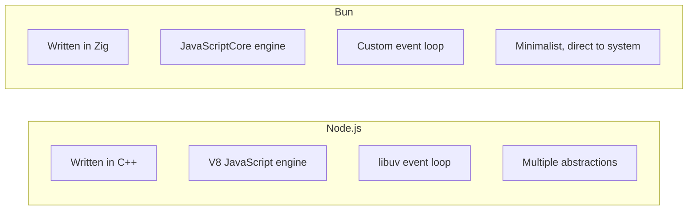
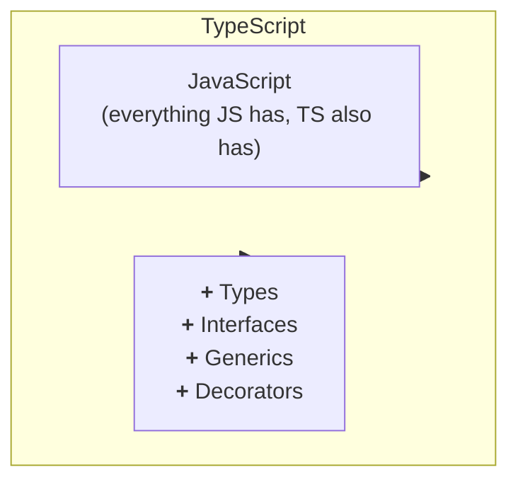

# Chapter 01: Bun and TypeScript Ecosystem

> **"Any fool can write code that a computer understands. Good programmers write code that humans understand."**
> -- Martin Fowler

---

## 1. Introduction to Bun

### 1.1 What is Bun?

**Bun** is a modern runtime for JavaScript and TypeScript, created by Jarred Sumner in 2021. It was designed to be a complete alternative to Node.js, but much faster.

**Analogy:**

Imagine you have an old car (Node.js) that works fine, but is slow and consumes a lot of fuel. Now imagine someone builds a new car (Bun) that:
- Is 3x faster
- Consumes 1/3 of the fuel
- Has built-in features that you previously had to buy separately

**Main Features:**

1. **JavaScript/TypeScript Runtime**: Runs JS and TS code directly
2. **Package Manager**: Manages dependencies (npm substitute)
3. **Test Runner**: Runs tests (Jest/Vitest substitute)
4. **Bundler**: Bundles code for production (webpack/esbuild substitute)
5. **Server-Side Rendering**: Renders React on the server

### 1.2 Why is Bun Faster?

Bun is written in **Zig**, a systems programming language focused on performance.

**Architecture Comparison:**



**Benchmarks (dependency installation):**

```bash
# Installing the same project (left-pad + 1 dependency)
npm install      # ~2.5s
pnpm install     # ~1.2s
yarn install     # ~1.4s
bun install      # ~0.09s  (28x faster!)
```

### 1.3 Installing Bun

```bash
# Linux/macOS
curl -fsSL https://bun.sh/install | bash

# Windows (PowerShell)
irm bun.sh/install.ps1 | iex

# Verify installation
bun --version
```

### 1.4 Bun Command Structure

```bash
# Basic commands
bun <file>             # Run a .ts or .js file
bun run <script>       # Run a package.json script
bun install            # Install dependencies
bun add <package>      # Add a dependency
bun remove <package>   # Remove a dependency

# Development commands
bun dev                # Run in development mode
bun build              # Bundle for production
bun test               # Run tests
bun typecheck          # Check TypeScript types

# Tool commands
bun upgrade            # Upgrade Bun itself
bun pm <cache>         # Manage package cache
bun completions        # Generate shell autocompletion
```

---

## 2. TypeScript from Scratch

### 2.1 What is TypeScript?

**TypeScript** is a **superset** of JavaScript that adds **static typing**.

**Venn Diagram:**



### 2.2 Why Use TypeScript?

#### Problem 1: Silent "Typos"

```typescript
// JavaScript
const user = {
  name: "Maria",
  age: 28
};

console.log(user.nam); // undefined (no error!)
// You typed "nam" instead of "name"
// JavaScript doesn't complain until runtime
```

```typescript
// TypeScript
const user = {
  name: "Maria",
  age: 28
};

console.log(user.nam); // Compilation error!
// Property 'nam' does not exist on type '{ name: string; age: number; }'
// The error appears BEFORE you run the code!
```

#### Problem 2: Incorrect Parameters

```typescript
// JavaScript
function add(a, b) {
  return a + b;
}

add("10", 20);  // "1020" (concatenation instead of sum!)
// JavaScript tries to be "smart" and concatenates
```

```typescript
// TypeScript
function add(a: number, b: number): number {
  return a + b;
}

add("10", 20);  // Compilation error!
// Argument of type 'string' is not assignable to parameter of type 'number'
// TypeScript protects you from silly errors
```

#### Problem 3: Dangerous Refactoring

Imagine you need to change a function that's used in 50 places in the code:

```typescript
// JavaScript
// You change the function from:
function processUser(name, age) { ... }

// To:
function processUser(name, age, email) { ... }

// Now you have to check ALL 50 places manually!
// If you forget one, it will break in production
```

```typescript
// TypeScript
// You change the function and the TYPE:
function processUser(
  name: string,
  age: number,
  email: string  // New parameter
) { ... }

// TypeScript shows ALL places that need to be updated!
// You don't forget any
```

### 2.3 Basic TypeScript Types

#### Primitive Types

```typescript
// String
let name: string = "Maria";
let template: string = `Hello, ${name}`;

// Number (all numbers are floating point)
let age: number = 28;
let price: number = 99.99;
let notation: number = 1.5e10;  // 15000000000

// Boolean
let active: boolean = true;
let verified: boolean = false;

// Null and Undefined
let nullValue: null = null;
let undefinedValue: undefined = undefined;

// Any (AVOID USING!)
let anything: any = "can be anything";
// "Any" is the enemy! TypeScript loses its power
```

#### Arrays

```typescript
// Array of numbers
let numbers: number[] = [1, 2, 3, 4, 5];

// Array of strings
let names: string[] = ["Ana", "Bruno", "Carlos"];

// Generic array (same as syntax above)
let prices: Array<number> = [10.5, 20.3, 30.1];

// Array of arrays (matrix)
let matrix: number[][] = [
  [1, 2, 3],
  [4, 5, 6],
  [7, 8, 9]
];

// Tuple (array with fixed size and types)
let coordinate: [number, number] = [10, 20];
// coordinate.push(30);  // Error if strict: true
```

#### Objects

```typescript
// Basic object type
let user: { name: string; age: number } = {
  name: "Maria",
  age: 28
};

// With optional properties
let product: {
  name: string;
  price: number;
  discount?: number;  // Optional (may or may not exist)
} = {
  name: "Laptop",
  price: 2500,
  // discount is optional
};

// With readonly properties
let config: {
  readonly apiUrl: string;  // Cannot be modified
  timeout: number;
} = {
  apiUrl: "https://api.example.com",
  timeout: 5000
};

// config.apiUrl = "new";  // Error!
config.timeout = 10000;    // OK
```

### 2.4 Type Inference

TypeScript is **smart**: it can infer types automatically.

```typescript
// TypeScript knows "x" is number
let x = 10;

// TypeScript knows "y" is string
let y = "hello";

// TypeScript knows "z" is boolean
let z = true;

// TypeScript knows "nums" is number[]
let nums = [1, 2, 3];

// You don't always need to specify types explicitly!
```

**When to specify, when to let it infer?**

```typescript
// GOOD - Let TypeScript infer
const user = { name: "Maria", age: 28 };

// GOOD - Specify when returning from function
function createUser(): { name: string; age: number } {
  return { name: "Maria", age: 28 };
}

// GOOD - Specify in function parameters
function process(user: { name: string; age: number }) {
  // ...
}
```

### 2.5 Union Types

Allows a variable to be of **multiple types**:

```typescript
// Can be string OR number
let id: string | number = 123;
id = "abc";  // OK
id = 456;    // OK

// Literal types (specific values)
let direction: "up" | "down" | "left" | "right";
direction = "up";       // OK
direction = "diagonal"; // Error!

// Practical example in the project
type Status = "connecting" | "connected" | "closed" | "error";

function updateStatus(status: Status) {
  // Only these 4 values are allowed
}

// Null or value
function findUser(id: number): User | null {
  const user = database.find(id);
  return user ?? null;  // Returns null if not found
}
```

### 2.6 Interfaces vs Type Aliases

#### Type Aliases

```typescript
type User = {
  name: string;
  age: number;
  email?: string;
};

// With generic types
type Response<T> = {
  data: T;
  status: number;
  success: boolean;
};

type UserResponse = Response<User>;
```

#### Interfaces

```typescript
interface User {
  name: string;
  age: number;
  email?: string;
}

// Interfaces can be extended
interface UserWithPermissions extends User {
  permissions: string[];
}

// Interfaces can be implemented by classes
class UserService implements User {
  name: string;
  age: number;
  email?: string;

  constructor(name: string, age: number) {
    this.name = name;
    this.age = age;
  }
}
```

**Which to use?**

```typescript
// Use type for:
// - Union types
type Id = string | number;
// - Tuples
type Coordinate = [number, number];
// - Mappings
type Mapping = { [key: string]: number };

// Use interface for:
// - Object shapes
interface User { ... }
// - Extensions
interface Admin extends User { ... }
// - Class implementation
class Service implements User { ... }
```

### 2.7 Generics

**Generics** allow creating **reusable** code with **variable types**.

#### The Problem

```typescript
// Without generics - you need to duplicate code
function getFirstString(list: string[]): string {
  return list[0];
}

function getFirstNumber(list: number[]): number {
  return list[0];
}

// Duplication! Not DRY (Don't Repeat Yourself)
```

#### The Solution with Generics

```typescript
// With generics - one function for all types
function getFirst<T>(list: T[]): T {
  return list[0];
}

// TypeScript infers the type automatically
const firstNumber = getFirst([1, 2, 3]);  // number
const firstString = getFirst(["a", "b", "c"]);  // string

// Or you can specify explicitly
const first = getFirst<number>([1, 2, 3]);  // number
```

#### Generics with Multiple Types

```typescript
function createPair<K, V>(key: K, value: V): [K, V] {
  return [key, value];
}

const pair1 = createPair("name", "Maria");  // [string, string]
const pair2 = createPair(1, true);          // [number, boolean]
const pair3 = createPair("age", 28);        // [string, number]
```

#### Generics in Interfaces

```typescript
interface APIResponse<T> {
  data: T;
  status: number;
  message: string;
}

interface User {
  id: number;
  name: string;
}

interface Product {
  id: number;
  name: string;
  price: number;
}

// Reusing the same interface
const userResponse: APIResponse<User> = {
  data: { id: 1, name: "Maria" },
  status: 200,
  message: "OK"
};

const productResponse: APIResponse<Product> = {
  data: { id: 1, name: "Laptop", price: 2500 },
  status: 200,
  message: "OK"
};
```

#### Generics with Constraints

```typescript
// "T extends { length: number }" means:
// "T can be any type, AS LONG AS it has the 'length' property"
function getLength<T extends { length: number }>(item: T): number {
  return item.length;
}

getLength("hello");    // 5 (string has .length)
getLength([1, 2, 3]);  // 3 (array has .length)
getLength({ length: 10 });  // 10 (object with .length)
// getLength(123);  // Error! number doesn't have .length
```

#### Example in the Project

See `src/http.ts:35`:

```typescript
// "T" is the type of data that will be returned
export async function fetchJson<T>(url: string, options: FetchOptions = {}): Promise<T> {
  // ...
  return (await res.json()) as T;
}

// Usage in code
type User = { name: string; age: number };
const user = await fetchJson<User>("https://api.example.com/user");
// TypeScript knows "user" is of type User
```

---

## 3. TypeScript Configuration in the Project

### 3.1 tsconfig.json Explained

See the project's `tsconfig.json` file:

```json
{
  "compilerOptions": {
    "target": "ES2022",
    "module": "ES2022",
    "moduleResolution": "Bundler",
    "esModuleInterop": true,
    "strict": true,
    "noEmit": true,
    "skipLibCheck": true,
    "types": ["bun-types"],
    "resolveJsonModule": true
  },
  "include": ["src/**/*.ts"]
}
```

#### Explanation of Each Option:

```json
{
  "compilerOptions": {
    // "target" - JavaScript version TypeScript compiles to
    // ES2022 is quite modern, supports async/await, classes, etc.
    "target": "ES2022",

    // "module" - Module system
    // ES2022 uses modern import/export
    "module": "ES2022",

    // "moduleResolution" - How TypeScript resolves imports
    // "Bundler" is for tools like Bun, Vite, esbuild
    "moduleResolution": "Bundler",

    // "esModuleInterop" - Allows importing CommonJS (require) as ES6
    "esModuleInterop": true,

    // "strict" - Enables ALL strict checking options
    // Includes: noImplicitAny, strictNullChecks, strictFunctionTypes, etc.
    // Highly recommended!
    "strict": true,

    // "noEmit" - Don't generate .js files
    // Bun runs TypeScript directly, so we don't need to compile
    "noEmit": true,

    // "skipLibCheck" - Don't check types in library .d.ts files
    // Speeds up compilation
    "skipLibCheck": true,

    // "types" - Which type declarations to include
    // "bun-types" includes Bun-specific types
    "types": ["bun-types"],

    // "resolveJsonModule" - Allows importing JSON files
    "resolveJsonModule": true
  },

  // "include" - Which TypeScript files to include
  "include": ["src/**/*.ts"]
}
```

### 3.2 Strict Mode (strict: true)

When you enable `"strict": true`, TypeScript enables:

```typescript
// 1. noImplicitAny - Doesn't allow implicit "any"
function add(a, b) {  // Error! Parameters have implicit 'any' type
  return a + b;
}

// Correction:
function add(a: number, b: number): number {  // OK
  return a + b;
}

// 2. strictNullChecks - Checks null/undefined explicitly
function process(value: string | null) {
  console.log(value.toUpperCase());  // Error! value can be null

  // Correction 1: Type guard
  if (value !== null) {
    console.log(value.toUpperCase());  // OK
  }

  // Correction 2: Optional chaining
  console.log(value?.toUpperCase());  // OK

  // Correction 3: Nullish coalescing
  const safeValue = value ?? "default";
  console.log(safeValue.toUpperCase());  // OK
}

// 3. strictFunctionTypes - Checks function types strictly
type ReceivesString = (x: string) => void;

const func: ReceivesString = (x: "specific") => {
  // Error! string != "specific" (string is broader)
};

// 4. strictPropertyInitialization - Checks property initialization
class User {
  name: string;  // Error! Not initialized
  age?: number;  // OK, optional, OK not to initialize

  constructor() {
    this.name = "Maria";  // Initialized in constructor
  }
}
```

---

## 4. Advanced Types in the Project

### 4.1 Utility Types

TypeScript has built-in utility types:

```typescript
// Partial<T> - All properties become optional
type User = {
  name: string;
  age: number;
  email: string;
};

type PartialUser = Partial<User>;
// Equivalent to:
// { name?: string; age?: number; email?: string; }

// Required<T> - All properties become required
type OptionalUser = {
  name?: string;
  age?: number;
};

type CompleteUser = Required<OptionalUser>;
// { name: string; age: number }

// Readonly<T> - All properties become readonly
type ReadOnlyUser = Readonly<User>;
// { readonly name: string; readonly age: number; readonly email: string; }

// Record<K, V> - Creates an object type with keys K and values V
type UsersTable = Record<string, User>;
// Equivalent to: { [key: string]: User }

// Pick<T, K> - Selects only some properties
type BasicUser = Pick<User, "name" | "email">;
// { name: string; email: string; }

// Omit<T, K> - Removes some properties
type UserWithoutEmail = Omit<User, "email">;
// { name: string; age: number; }
```

### 4.2 Type Guards and Type Narrowing

**Type Guards** allow checking types at runtime:

```typescript
// typeof type guard
function process(value: string | number) {
  if (typeof value === "string") {
    // TypeScript knows "value" is string here
    console.log(value.toUpperCase());
  } else {
    // TypeScript knows "value" is number here
    console.log(value.toFixed(2));
  }
}

// instanceof type guard
class Cat {
  meow() { console.log("Meow!"); }
}

class Dog {
  bark() { console.log("Woof!"); }
}

function makeNoise(animal: Cat | Dog) {
  if (animal instanceof Cat) {
    animal.meow();
  } else {
    animal.bark();
  }
}

// in type guard
interface Car {
  type: "car";
  doors: number;
}

interface Motorcycle {
  type: "motorcycle";
  cc: number;
}

function description(vehicle: Car | Motorcycle) {
  if (vehicle.type === "car") {
    console.log(`Car with ${vehicle.doors} doors`);
  } else {
    console.log(`Motorcycle with ${vehicle.cc}cc`);
  }
}

// Type predicate (custom type guard)
function isString(value: unknown): value is string {
  return typeof value === "string";
}

function processUnknown(value: unknown) {
  if (isString(value)) {
    // TypeScript knows "value" is string here
    console.log(value.toUpperCase());
  }
}
```

### 4.3 Unknown vs Any

**Always prefer `unknown` over `any`!**

```typescript
// any - DANGEROUS! Disables all type checking
function processAny(data: any) {
  data.anything;  // No error, but can break at runtime
  data().method().property;  // Everything is allowed!
}

// unknown - SAFE! You need to check before using
function processUnknown(data: unknown) {
  // data.toUpperCase();  // Error! Can't use unknown directly

  if (typeof data === "string") {
    console.log(data.toUpperCase());  // OK! We verified it's string
  }
}

// Example from project: src/api.ts:31
export async function fetchEvents(limit = 10, offset = 0) {
  const res = await fetchJson<unknown>(url);  // unknown is safe!
  if (Array.isArray(res)) {
    return res as GammaEvent[];  // Type guard: checks if it's array
  }
  // ...
}
```

---

## 5. TypeScript Patterns in the Project

### 5.1 API Return Types

```typescript
// src/api.ts - Example of well-defined types
export type GammaEvent = Record<string, unknown>;
export type GammaMarket = Record<string, unknown>;

export type MarketInfo = {
  eventId?: string;
  eventTitle?: string;
  marketId?: string;
  question?: string;
  conditionId?: string;
  slug?: string;
  outcomes: string[];           // Required array
  clobTokenIds: string[];       // Required array
  volume24hr?: number;          // Optional
  priceChange24hr?: number;
  bestBid?: number;
  bestAsk?: number;
};
```

**Why `Record<string, unknown>`?**

```typescript
// When API returns dynamic or poorly documented data
type GammaEvent = Record<string, unknown>;

// This means: "an object with any string properties,
// but we don't know the values in advance"

// It's safer than "any" because you need to check before using
function processEvent(event: GammaEvent) {
  // event.title;  // Error! Can't access unknown
  // event["title"];  // Error!

  const title = event.title as string;  // Type assertion (last resort)
  console.log(title);
}
```

### 5.2 Functions with Default Parameters

```typescript
// src/api.ts:22
export async function fetchEvents(limit = 10, offset = 0) {
  // If "limit" not passed, uses 10
  // If "offset" not passed, uses 0
}

// Usage
await fetchEvents();          // limit=10, offset=0
await fetchEvents(20);        // limit=20, offset=0
await fetchEvents(20, 50);    // limit=20, offset=50
```

### 5.3 Type Assertions (Casting)

```typescript
// Sometimes you know more than TypeScript
// (Use with caution! Last resort.)

// Syntax 1: as
const value = data as string;

// Syntax 2: <> (doesn't work in JSX/TSX)
const value = <string>data;

// Example from project: src/api.ts:32
if (Array.isArray(res)) return res as GammaEvent[];
// "res" is "unknown", but we verified it's array
// so we can cast to GammaEvent[]
```

---

## 6. TypeScript Best Practices

### 6.1 Avoid "any"

```typescript
// BAD
function process(data: any) {
  return data.property;
}

// GOOD
function process(data: unknown) {
  if (data && typeof data === "object" && "property" in data) {
    return (data as { property: string }).property;
  }
  throw new Error("Invalid data");
}

// BETTER - Well-defined types
interface Data {
  property: string;
}

function process(data: Data) {
  return data.property;
}
```

### 6.2 Use Type Guards

```typescript
// BAD - Assumption
function getLength(value: unknown): number {
  return (value as { length: number }).length;
}

// GOOD - Type guard
function hasLength(value: unknown): value is { length: number } {
  return (
    typeof value === "object" &&
    value !== null &&
    "length" in value &&
    typeof (value as { length: number }).length === "number"
  );
}

function getLength(value: unknown): number {
  if (hasLength(value)) {
    return value.length;
  }
  return 0;
}
```

### 6.3 Prefer Immutability

```typescript
// BAD - Mutation
function addUser(list: User[], user: User) {
  list.push(user);  // Modifies the original array!
}

// GOOD - Immutability
function addUser(list: User[], user: User): User[] {
  return [...list, user];  // Returns a new array
}

// BETTER - Readonly
function addUser(
  list: ReadonlyArray<User>,
  user: User
): User[] {
  return [...list, user];
}
```

### 6.4 Use Literal Types

```typescript
// BAD
function setStatus(status: string) {
  // Any string is accepted - easy typo error
}

// GOOD
type Status = "pending" | "active" | "completed";

function setStatus(status: Status) {
  // Only 3 values allowed - autocomplete helps!
}
```

---

## 7. Practical Exercises

### Exercise 1: Basic Types

Create a file `exercises.ts` and implement:

```typescript
// 1. Create a type "Product" with:
//    - name (string)
//    - price (number)
//    - discount (number, optional)
//    - stock (number, default 0)

type Product = {
  // Your answer here
};

// 2. Create a function that calculates final price with discount
function calculateFinalPrice(product: Product): number {
  // Your answer here
}

// 3. Create a type "Cart" that is an array of Product
type Cart = Product[];

// 4. Create a function that calculates cart total
function calculateTotal(cart: Cart): number {
  // Your answer here
}
```

### Exercise 2: Generics

```typescript
// 1. Create a generic function "first" that returns the first element of an array

// 2. Create a generic function "last" that returns the last element

// 3. Create a type "Response" with generics that has:
//    - success: boolean
//    - data: T
//    - error?: string

// 4. Use the Response type to create functions that return User or Error
```

### Exercise 3: Type Guards

```typescript
// 1. Create a type guard to check if a value is string

// 2. Create a type guard to check if an object has the "id" property

// 3. Create a function that accepts string | number and returns the length
//    (string: size, number: digits)
```

---

## 8. Chapter Summary

- **Bun** is a modern runtime, 28x faster than npm
- **TypeScript** adds static typing to JavaScript
- **Types** prevent errors at compile time
- **Generics** allow reusable code with variable types
- **Type guards** allow checking types at runtime
- **Unknown** is safer than **any**
- **Strict mode** should always be active

---

## 9. Learn More

- **Bun Documentation**: https://bun.sh/docs
- **TypeScript Documentation**: https://www.typescriptlang.org/docs/
- **TypeScript Deep Dive**: https://basarat.gitbook.io/typescript/
- **Effective TypeScript**: https://effectivetypescript.com/

---

**Final Exercise: Refactoring**

Find 3 places in the project code (in `src/`) where you could improve the types. Make the improvements and explain why they make the code safer.

---

## Check Your Understanding

Test your TypeScript and Bun knowledge by answering the questions below.

### Question 1: Basic Types

**What is the result of this code?**

```typescript
let x: string | number = "hello";
x = 42;
console.log(typeof x);
```

<details>
<summary>Answer</summary>

The code compiles because `x` was explicitly declared as `string | number`, so both are allowed. `typeof x` would be `"number"`.

**Lesson:** Union types allow multiple types, but you need to handle both at runtime.
</details>

---

### Question 2: Type Guards

**What's wrong with this code?**

```typescript
function process(data: unknown) {
  console.log(data.toUpperCase());  // Error here!
}
```

<details>
<summary>Answer</summary>

`unknown` doesn't allow accessing properties directly! You need to use a type guard:

```typescript
// Corrected
function process(data: unknown) {
  if (typeof data === "string") {
    console.log(data.toUpperCase());  // OK - TypeScript knows it's string
  }
}
```

**Lesson:** Always check the type of `unknown` before using.
</details>

---

### Question 3: Generics

**What does this function do?**

```typescript
function getFirst<T>(arr: T[]): T | undefined {
  return arr[0];
}
```

<details>
<summary>Answer</summary>

Returns the first element of an array, or `undefined` if the array is empty.

**The `<T>` is a generic** - means the function works with any array type, and the return type will be the same type as the array elements.

**Examples:**
```typescript
getFirst<number>([1, 2, 3]);      // Returns: number | undefined
getFirst<string>(["a", "b", "c"]); // Returns: string | undefined
getFirst([true, false]);           // TypeScript infers: boolean | undefined
```
</details>

---

### Question 4: Strict Mode

**Why use `"strict": true` in tsconfig.json?**

<details>
<summary>Answer</summary>

Strict mode enables ALL TypeScript type checks:

1. **noImplicitAny** - Prohibits implicit `any`
2. **strictNullChecks** - Checks null/undefined explicitly
3. **strictFunctionTypes** - Checks function types strictly
4. **strictPropertyInitialization** - Checks if properties were initialized

**Benefit:** Catches more errors at compile-time instead of runtime.

**Cost:** More verbosity, but worth it for serious projects.
</details>

---

## Common Pitfalls

### Pitfall: Using `any` Type

**BAD:**
```typescript
function process(data: any) {
  return data.value;  // No type checking
}
```

**Why is it bad?**
- Disables TypeScript completely for that value
- Loses all type safety benefits
- Errors only appear at runtime

**GOOD:**
```typescript
// Option 1: Use unknown with type guard
function process(data: unknown) {
  if (data && typeof data === "object" && "value" in data) {
    return (data as { value: string }).value;
  }
}

// Option 2: Use generics
function process<T extends Record<string, unknown>>(data: T) {
  return data.value;
}
```

---

### Pitfall: Forgetting `await` in `forEach`

**BAD:**
```typescript
items.forEach(async (item) => {
  await process(item);  // forEach does NOT wait!
});
console.log("All processed!");  // Runs BEFORE processing
```

**Problem:**
`forEach` ignores the value returned by the callback, including promises.

**GOOD - Option 1:**
```typescript
for (const item of items) {
  await process(item);  // Waits for each one
}
console.log("All processed!");  // Runs AFTER
```

**GOOD - Option 2 (Parallel):**
```typescript
await Promise.all(items.map(item => process(item)));
console.log("All processed!");
```

---

### Pitfall: Unsafe Type Assertion

**BAD:**
```typescript
const data = getFromAPI();
const user = data as User;  // Forces type without checking
console.log(user.name);     // Can fail at runtime if not User
```

**GOOD:**
```typescript
const data = getFromAPI();

// Check first
function isUser(data: unknown): data is User {
  return (
    typeof data === "object" &&
    data !== null &&
    "name" in data &&
    "email" in data
  );
}

if (isUser(data)) {
  console.log(data.name);  // Type safe
}
```

---

## Troubleshooting

### Problem: "Cannot find module 'blessed'"

**Error:**
```
error: Cannot find module "blessed" from "$PATH/src/tui.ts"
```

**Cause:**
You forgot to install dependencies.

**Solution:**
```bash
# 1. Delete node_modules and lock
rm -rf node_modules bun.lockb

# 2. Reinstall dependencies
bun install

# 3. Verify
ls node_modules/blessed  # Should exist
```

**Prevention:**
Always run `bun install` after:
- `git clone` of a new project
- `git pull` with package.json changes
- `bun add` of new dependency

---

### Problem: "TS2307: Cannot find module"

**Error:**
```
src/api.ts:1:25 - error TS2307: Cannot find module './utils' or its corresponding type declarations
```

**Cause:**
TypeScript can't find the relative module.

**Solution:**
```bash
# 1. Check if file exists
ls -la src/utils.ts

# 2. Check the name (case sensitive!)
# utils.ts != Utils.ts != util.ts

# 3. Check the import
# If file is utils.ts:
import { something } from './utils';     # OK (without .ts)
import { something } from './utils.ts';  # OK (with .ts)
import { something } from './Utils';     # Wrong case
```

---

## Milestone Completed

After completing this chapter, you should be able to:

- [ ] Explain the difference between `any` and `unknown`
- [ ] Write basic TypeScript types
- [ ] Create and use generics
- [ ] Implement type guards
- [ ] Understand and configure tsconfig.json
- [ ] Use Bun features (test runner, package manager)
- [ ] Avoid common TypeScript pitfalls

**Practical Exercise:**
Before advancing, create a file `test.ts` with:
- 3 different types (interface, type, enum)
- 1 generic function
- 1 type guard
- Run with `bun --bun run test.ts` and verify no errors

---

## Design Decisions

### Decision 1: Why `strict: true` in tsconfig?

**Alternatives Considered:**
1. **strict: false** - More permissive TypeScript
2. **strict: true** - More rigorous TypeScript - **CHOSEN**

**Trade-offs:**

| Mode | Development | Production Bugs | Learning Curve |
|------|-------------|-----------------|----------------|
| strict: false | Fast | Many bugs | Low |
| strict: true | Slower at first | Few bugs | High |

**Why strict mode was chosen:**
- **Catches bugs at compile-time**: `null`, `undefined`, wrong types
- **Better autocomplete**: IDE knows exactly which types to use
- **Safer refactoring**: Changes break build immediately
- **Living documentation**: Types work as docs

**Example of prevented bug:**
```typescript
// WITHOUT STRICT (compiles but breaks at runtime!)
function greeting(name: string | null) {
  return "Hello, " + name.toUpperCase();  // Crashes if name is null!
}

// WITH STRICT (doesn't compile!)
function greeting(name: string | null) {
  // Error: Object is possibly 'null'
  return "Hello, " + name.toUpperCase();
}
```

**Code reference:** `tsconfig.json:3` - `"strict": true`

---

### Decision 2: Why `moduleResolution: "bundler"`?

**Alternatives Considered:**
1. **node** - Traditional Node.js style resolution
2. **node16** - Node.js resolution with ESM
3. **bundler** - Bundler style resolution - **CHOSEN**

**Why bundler was chosen:**
- **Compatible with Bun**: Bun uses similar resolution
- **No mandatory extensions**: `import { foo } from './bar'` works
- **Supports TypeScript exports**: `.ts` files work without problems

**Code reference:** `tsconfig.json:5` - `"moduleResolution": "bundler"`

---

## External Resources

### Learn More About:

**Bun:**
- [Bun Documentation](https://bun.sh/docs) - Complete official documentation
- [Bun Runtime](https://github.com/oven-sh/bun) - GitHub repository
- [Bun vs Node Comparison](https://bun.sh/#bun-vs-node) - Benchmarks

**TypeScript:**
- [TypeScript Handbook](https://www.typescriptlang.org/docs/handbook/intro.html) - Official guide
- [TypeScript Deep Dive](https://basarat.gitbook.io/typescript/) - Free book
- [Effective TypeScript](https://effectivetypescript.com/) - 62 practical tips

**Generics:**
- [TypeScript Generics Guide](https://www.typescriptlang.org/docs/handbook/2/generics.html) - Official
- [Understanding TypeScript Generics](https://www.totaltypescript.com/typescript-generics) - Tutorial

**Type Guards:**
- [Type Narrowing](https://www.typescriptlang.org/docs/handbook/2/narrowing.html) - Official
- [Type Guards Explained](https://mariusschulz.com/blog/type-guards-in-typescript) - Blog post

### Recommended Videos:

- [TypeScript in 50 Minutes](https://www.youtube.com/watch?v=B7xa5mKR6JE) - YouTube (50 min)
- [Understanding Generics](https://www.youtube.com/watch?v=6N5IjOYg_-E) - YouTube (15 min)
- [Advanced TypeScript Patterns](https://www.youtube.com/watch?v=kYKX7_UEvzA) - YouTube (30 min)

### Useful Tools:

- [TypeScript Playground](https://www.typescriptlang.org/play) - Test TS online
- [bun.sh](https://bun.sh) - Bun installation and docs

---

**Next Chapter:** Architecture and Project Structure

[Continue to Chapter 2](./02-architecture-structure.md)

---

**Version:** 1.0.0
**Last Updated:** January 2026
