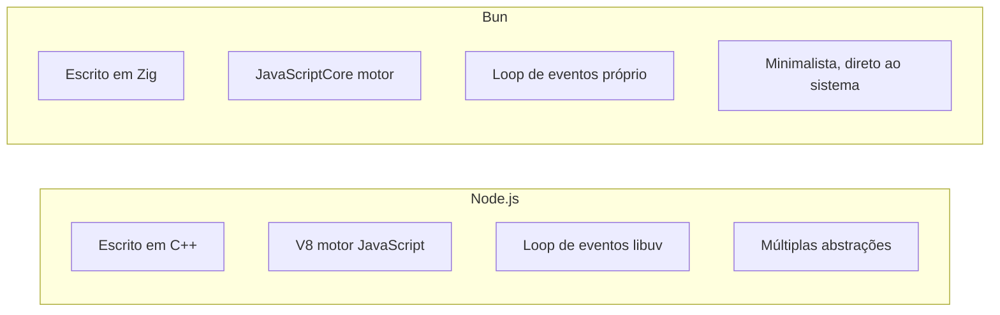
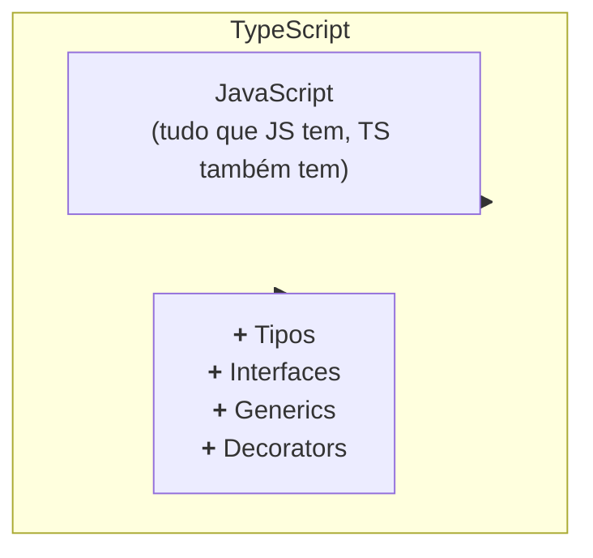

# Capítulo 01: Ecossistema Bun e TypeScript

> **"Qualquer tolo pode escrever código que um computador entende. Bons programadores escrevem código que humanos entendem."**
> — Martin Fowler

---

## 1. Introdução ao Bun

### 1.1 O Que é Bun?

**Bun** é um runtime moderno para JavaScript e TypeScript, criado por Jarred Sumner em 2021. Ele foi projetado para ser uma alternativa completa ao Node.js, mas muito mais rápida.

**Analogia:**

Imagine que você tem um carro antigo (Node.js) que funciona bem, mas é lento e consome muito combustível. Agora imagine alguém constrói um novo carro (Bun) que:
- É 3x mais rápido
- Consome 1/3 do combustível
- Tem recursos embutidos que antes você precisava comprar separadamente

**Principais Características:**

1. **Runtime JavaScript/TypeScript**: Executa código JS e TS diretamente
2. **Package Manager**: Gerencia dependências (substituto do npm)
3. **Test Runner**: Executa testes (substituto do Jest/Vitest)
4. **Bundler**: Empacota código para produção (substituto do webpack/esbuild)
5. **Server-Side Rendering**: Renderiza React no servidor

### 1.2 Por Que Bun é Mais Rápido?

Bun é escrito em **Zig**, uma linguagem de programação de sistemas focada em performance.

**Comparativo de Arquitetura:**



**Benchmarks (instalação de dependências):**

```bash
# Instalando o mesmo projeto (left-pad + 1 dependency)
npm install      # ~2.5s
pnpm install     # ~1.2s
yarn install     # ~1.4s
bun install      # ~0.09s  (28x mais rápido!)
```

### 1.3 Instalando o Bun

```bash
# Linux/macOS
curl -fsSL https://bun.sh/install | bash

# Windows (PowerShell)
irm bun.sh/install.ps1 | iex

# Verificar instalação
bun --version
```

### 1.4 Estrutura de Comandos Bun

```bash
# Comandos básicos
bun <arquivo>          # Executa um arquivo .ts ou .js
bun run <script>       # Executa um script do package.json
bun install            # Instala dependências
bun add <pacote>       # Adiciona uma dependência
bun remove <pacote>    # Remove uma dependência

# Comandos de desenvolvimento
bun dev                # Executa em modo desenvolvimento
bun build              # Empacota para produção
bun test               # Executa testes
bun typecheck          # Verifica tipos TypeScript

# Comandos de ferramentas
bun upgrade            # Atualiza o próprio Bun
bun pm <cache>         # Gerencia cache de pacotes
bun completions        # Gera autocompletar para shell
```

---

## 2. TypeScript do Zero

### 2.1 O Que é TypeScript?

**TypeScript** é um **superconjunto** de JavaScript que adiciona **tipagem estática**.

**Diagrama de Venn:**



### 2.2 Por Que Usar TypeScript?

#### Problema 1: "Typos" Silenciosos

```typescript
// JavaScript
const usuario = {
  nome: "Maria",
  idade: 28
};

console.log(usuario.nom); // undefined (sem erro!)
// ↑ Você digitou "nom" em vez de "nome"
// ↑ JavaScript não reclama até runtime
```

```typescript
// TypeScript
const usuario = {
  nome: "Maria",
  idade: 28
};

console.log(usuario.nom); // ❌ Erro de compilação!
// Property 'nom' does not exist on type '{ nome: string; idade: number; }'
// ↑ O erro aparece ANTES de você executar o código!
```

#### Problema 2: Parâmetros Incorretos

```typescript
// JavaScript
function somar(a, b) {
  return a + b;
}

somar("10", 20);  // "1020" (concatenação em vez de soma!)
// ↑ JavaScript tenta ser "esperto" e concatena
```

```typescript
// TypeScript
function somar(a: number, b: number): number {
  return a + b;
}

somar("10", 20);  // ❌ Erro de compilação!
// Argument of type 'string' is not assignable to parameter of type 'number'
// ↑ TypeScript protege você de erros bobos
```

#### Problema 3: Refatoração Perigosa

Imagine que você precisa mudar uma função que é usada em 50 lugares do código:

```typescript
// JavaScript
// Você muda a função de:
function processarUsuario(nome, idade) { ... }

// Para:
function processarUsuario(nome, idade, email) { ... }

// Agora você tem que verificar TODOS os 50 lugares manualmente!
// Se esquecer um, vai quebrar em produção
```

```typescript
// TypeScript
// Você muda a função e o TIPO:
function processarUsuario(
  nome: string,
  idade: number,
  email: string  // ← Novo parâmetro
) { ... }

// TypeScript mostra TODOS os lugares que precisam ser atualizados!
// Você não esquece nenhum
```

### 2.3 Tipos Básicos TypeScript

#### Tipos Primitivos

```typescript
// String
let nome: string = "Maria";
let template: string = `Olá, ${nome}`;

// Number (todos os números são ponto flutuante)
let idade: number = 28;
let preco: number = 99.99;
let notacao: number = 1.5e10;  // 15000000000

// Boolean
let ativo: boolean = true;
let verificado: boolean = false;

// Null e Undefined
let nula: null = null;
let indefinida: undefined = undefined;

// Any (EVITE USAR!)
let qualquer: any = "posso ser qualquer coisa";
// ↑ "Any" é o inimigo! TypeScript perde o poder
```

#### Arrays

```typescript
// Array de números
let numeros: number[] = [1, 2, 3, 4, 5];

// Array de strings
let nomes: string[] = ["Ana", "Bruno", "Carlos"];

// Array genérico (mesma coisa que a sintaxe acima)
let precos: Array<number> = [10.5, 20.3, 30.1];

// Array de arrays (matriz)
let matriz: number[][] = [
  [1, 2, 3],
  [4, 5, 6],
  [7, 8, 9]
];

// Tupla (array com tamanho e tipos fixos)
let coordenada: [number, number] = [10, 20];
// coordenada.push(30);  // Erro se strict: true
```

#### Objects

```typescript
// Object type básico
let usuario: { nome: string; idade: number } = {
  nome: "Maria",
  idade: 28
};

// Com propriedades opcionais
let produto: {
  nome: string;
  preco: number;
  desconto?: number;  // ← Opcional (pode existir ou não)
} = {
  nome: "Notebook",
  preco: 2500,
  // desconto é opcional
};

// Com propriedades readonly
let config: {
  readonly apiUrl: string;  // ← Não pode ser modificada
  timeout: number;
} = {
  apiUrl: "https://api.example.com",
  timeout: 5000
};

// config.apiUrl = "novo";  // ❌ Erro!
config.timeout = 10000;      // ✅ OK
```

### 2.4 Type Inference (Inferência de Tipos)

TypeScript é **esperto**: ele pode inferir tipos automaticamente.

```typescript
// TypeScript sabe que "x" é number
let x = 10;

// TypeScript sabe que "y" é string
let y = "hello";

// TypeScript sabe que "z" é boolean
let z = true;

// TypeScript sabe que "nums" é number[]
let nums = [1, 2, 3];

// Você não precisa especificar tipos explicitamente sempre!
```

**Quando especificar, quando deixar inferir?**

```typescript
// ✅ BOM - Deixe TypeScript inferir
const usuario = { nome: "Maria", idade: 28 };

// ✅ BOM - Especifique quando retorna de função
function criarUsuario(): { nome: string; idade: number } {
  return { nome: "Maria", idade: 28 };
}

// ✅ BOM - Especifique em parâmetros de função
function processar(usuario: { nome: string; idade: number }) {
  // ...
}
```

### 2.5 Union Types (Tipos União)

Permite que uma variável seja de **múltiplos tipos**:

```typescript
// Pode ser string OU number
let id: string | number = 123;
id = "abc";  // OK
id = 456;    // OK

// Literal types (valores específicos)
let direcao: "cima" | "baixo" | "esquerda" | "direita";
direcao = "cima";     // OK
direcao = "diagonal"; // ❌ Erro!

// Exemplo prático no projeto
type Status = "connecting" | "connected" | "closed" | "error";

function atualizarStatus(status: Status) {
  // Apenas esses 4 valores são permitidos
}

// Null ou valor
function encontrarUsuario(id: number): Usuario | null {
  const usuario = database.buscar(id);
  return usuario ?? null;  // Retorna null se não encontrar
}
```

### 2.6 Interfaces vs Type Aliases

#### Type Aliases

```typescript
type Usuario = {
  nome: string;
  idade: number;
  email?: string;
};

// Com tipos genéricos
type Resposta<T> = {
  dados: T;
  status: number;
  sucesso: boolean;
};

type UsuarioResposta = Resposta<Usuario>;
```

#### Interfaces

```typescript
interface Usuario {
  nome: string;
  idade: number;
  email?: string;
}

// Interfaces podem ser estendidas
interface UsuarioComPermissoes extends Usuario {
  permissoes: string[];
}

// Interfaces podem ser implementadas por classes
class UsuarioService implements Usuario {
  nome: string;
  idade: number;
  email?: string;

  constructor(nome: string, idade: number) {
    this.nome = nome;
    this.idade = idade;
  }
}
```

**Qual usar?**

```typescript
// ✅ Use type para:
// - Union types
type Id = string | number;
// - Tuplas
type Coordenada = [number, number];
// - Mapeamentos
type Mapeamento = { [key: string]: number };

// ✅ Use interface para:
// - Formas de objetos
interface Usuario { ... }
// - Extensões
interface Admin extends Usuario { ... }
// - Implementação de classes
class Service implements Usuario { ... }
```

### 2.7 Generics

**Generics** permitem criar código **reutilizável** com **tipos variáveis**.

#### O Problema

```typescript
// Sem generics - você precisa duplicar código
function retornarPrimeiroString(lista: string[]): string {
  return lista[0];
}

function retornarPrimeiroNumber(lista: number[]): number {
  return lista[0];
}

// ↑ Duplicação! Não DRY (Don't Repeat Yourself)
```

#### A Solução com Generics

```typescript
// Com generics - uma função para todos os tipos
function retornarPrimeiro<T>(lista: T[]): T {
  return lista[0];
}

// TypeScript infere o tipo automaticamente
const primeiroNumero = retornarPrimeiro([1, 2, 3]);  // number
const primeiraString = retornarPrimeiro(["a", "b", "c"]);  // string

// Ou você pode especificar explicitamente
const primeiro = retornarPrimeiro<number>([1, 2, 3]);  // number
```

#### Generics com Múltiplos Tipos

```typescript
function criarPar<K, V>(chave: K, valor: V): [K, V] {
  return [chave, valor];
}

const par1 = criarPar("nome", "Maria");  // [string, string]
const par2 = criarPar(1, true);          // [number, boolean]
const par3 = criarPar("idade", 28);      // [string, number]
```

#### Generics em Interfaces

```typescript
interface RespostaAPI<T> {
  dados: T;
  status: number;
  mensagem: string;
}

interface Usuario {
  id: number;
  nome: string;
}

interface Produto {
  id: number;
  nome: string;
  preco: number;
}

// Reutilizando a mesma interface
const usuarioResposta: RespostaAPI<Usuario> = {
  dados: { id: 1, nome: "Maria" },
  status: 200,
  mensagem: "OK"
};

const produtoResposta: RespostaAPI<Produto> = {
  dados: { id: 1, nome: "Notebook", preco: 2500 },
  status: 200,
  mensagem: "OK"
};
```

#### Generics com Constraints (Restrições)

```typescript
// "T extends { length: number }" significa:
// "T pode ser qualquer tipo, DESDE QUE tenha a propriedade 'length'"
function comprimento<T extends { length: number }>(item: T): number {
  return item.length;
}

comprimento("hello");    // 5 (string tem .length)
comprimento([1, 2, 3]);  // 3 (array tem .length)
comprimento({ length: 10 });  // 10 (objeto com .length)
// comprimento(123);  // ❌ Erro! number não tem .length
```

#### Exemplo no Projeto

Veja `src/http.ts:35`:

```typescript
// "T" é o tipo de dado que será retornado
export async function fetchJson<T>(url: string, options: FetchOptions = {}): Promise<T> {
  // ...
  return (await res.json()) as T;
}

// Uso no código
type Usuario = { nome: string; idade: number };
const usuario = await fetchJson<Usuario>("https://api.example.com/user");
// ↑ TypeScript sabe que "usuario" é do tipo Usuario
```

---

## 3. Configuração TypeScript no Projeto

### 3.1 tsconfig.json Explicado

Veja o arquivo `tsconfig.json` do projeto:

```json
{
  "compilerOptions": {
    "target": "ES2022",
    "module": "ES2022",
    "moduleResolution": "Bundler",
    "esModuleInterop": true,
    "strict": true,
    "noEmit": true,
    "skipLibCheck": true,
    "types": ["bun-types"],
    "resolveJsonModule": true
  },
  "include": ["src/**/*.ts"]
}
```

#### Explicação de Cada Opção:

```json
{
  "compilerOptions": {
    // "target" - Versão do JavaScript para qual o TypeScript compila
    // ES2022 é bem moderno, suporta async/await, classes, etc.
    "target": "ES2022",

    // "module" - Sistema de módulos
    // ES2022 usa import/export modernos
    "module": "ES2022",

    // "moduleResolution" - Como o TypeScript resolve importações
    // "Bundler" é para ferramentas como Bun, Vite, esbuild
    "moduleResolution": "Bundler",

    // "esModuleInterop" - Permite importar CommonJS (require) como ES6
    "esModuleInterop": true,

    // "strict" - Ativa TODAS as opções de verificação estrita
    // Inclui: noImplicitAny, strictNullChecks, strictFunctionTypes, etc.
    // É altamente recomendado!
    "strict": true,

    // "noEmit" - Não gera arquivos .js
    // Bun executa TypeScript diretamente, então não precisamos compilar
    "noEmit": true,

    // "skipLibCheck" - Não verifica tipos em arquivos .d.ts de bibliotecas
    // Acelera a compilação
    "skipLibCheck": true,

    // "types" - Quais tipos de declaração incluir
    // "bun-types" inclui tipos específicos do Bun
    "types": ["bun-types"],

    // "resolveJsonModule" - Permite importar arquivos JSON
    "resolveJsonModule": true
  },

  // "include" - Quais arquivos TypeScript incluir
  "include": ["src/**/*.ts"]
}
```

### 3.2 Modo Estrito (strict: true)

Quando você ativa `"strict": true`, o TypeScript habilita:

```typescript
// 1. noImplicitAny - Não permite "any" implícito
function somar(a, b) {  // ❌ Erro! Parâmetros têm tipo implícito 'any'
  return a + b;
}

// Correção:
function somar(a: number, b: number): number {  // ✅
  return a + b;
}

// 2. strictNullChecks - Verifica null/undefined explicitamente
function processar(valor: string | null) {
  console.log(valor.toUpperCase());  // ❌ Erro! valor pode ser null

  // Correção 1: Type guard
  if (valor !== null) {
    console.log(valor.toUpperCase());  // ✅
  }

  // Correção 2: Optional chaining
  console.log(valor?.toUpperCase());  // ✅

  // Correção 3: Nullish coalescing
  const valorSeguro = valor ?? "default";
  console.log(valorSeguro.toUpperCase());  // ✅
}

// 3. strictFunctionTypes - Verifica tipos de função estritamente
type FuncaoRecebeString = (x: string) => void;

const funcao: FuncaoRecebeString = (x: "especifico") => {
  // ❌ Erro! string ≠ "especifico" (string é mais amplo)
};

// 4. strictPropertyInitialization - Verifica inicialização de propriedades
class Usuario {
  nome: string;  // ❌ Erro! Não inicializada
  idade?: number;  // ✅ Opcional, OK não inicializar

  constructor() {
    this.nome = "Maria";  // ✅ Inicializada no constructor
  }
}
```

---

## 4. Tipos Avançados no Projeto

### 4.1 Utility Types

TypeScript tem tipos utilitários embutidos:

```typescript
// Partial<T> - Todas as propriedades ficam opcionais
type Usuario = {
  nome: string;
  idade: number;
  email: string;
};

type UsuarioParcial = Partial<Usuario>;
// Equivalente a:
// { nome?: string; idade?: number; email?: string; }

// Required<T> - Todas as propriedades ficam obrigatórias
type UsuarioOpcional = {
  nome?: string;
  idade?: number;
};

type UsuarioCompleto = Required<UsuarioOpcional>;
// { nome: string; idade: number }

// Readonly<T> - Todas as propriedades ficam readonly
type UsuarioReadOnly = Readonly<Usuario>;
// { readonly nome: string; readonly idade: number; readonly email: string; }

// Record<K, V> - Cria um tipo de objeto com chaves K e valores V
type TabelaUsuarios = Record<string, Usuario>;
// Equivalente a: { [chave: string]: Usuario }

// Pick<T, K> - Seleciona apenas algumas propriedades
type UsuarioBasico = Pick<Usuario, "nome" | "email">;
// { nome: string; email: string; }

// Omit<T, K> - Remove algumas propriedades
type UsuarioSemEmail = Omit<Usuario, "email">;
// { nome: string; idade: number; }
```

### 4.2 Type Guards e Type Narrowing

**Type Guards** permitem verificar tipos em runtime:

```typescript
// typeof type guard
function processar(valor: string | number) {
  if (typeof valor === "string") {
    // TypeScript sabe que "valor" é string aqui
    console.log(valor.toUpperCase());
  } else {
    // TypeScript sabe que "valor" é number aqui
    console.log(valor.toFixed(2));
  }
}

// instanceof type guard
class Gato {
  miar() { console.log("Miau!"); }
}

class Cachorro {
  latir() { console.log("Au au!"); }
}

function fazerBarulho(animal: Gato | Cachorro) {
  if (animal instanceof Gato) {
    animal.miar();
  } else {
    animal.latir();
  }
}

// in type guard
interface Carro {
  tipo: "carro";
  portas: number;
}

interface Moto {
  tipo: "moto";
  cilindradas: number;
}

function descricao(veiculo: Carro | Moto) {
  if (veiculo.tipo === "carro") {
    console.log(`Carro com ${veiculo.portas} portas`);
  } else {
    console.log(`Moto de ${veiculo.cilindradas}cc`);
  }
}

// Type predicate (type guard customizado)
function ehString(valor: unknown): valor is string {
  return typeof valor === "string";
}

function processarDesconhecido(valor: unknown) {
  if (ehString(valor)) {
    // TypeScript sabe que "valor" é string aqui
    console.log(valor.toUpperCase());
  }
}
```

### 4.3 Unknown vs Any

**Sempre prefira `unknown` ao invés de `any`!**

```typescript
// any - PERIGOSO! Desativa toda verificação de tipos
function processarAny(dado: any) {
  dado.qualquerCoisa;  // Sem erro, mas pode quebrar em runtime
  dado().metodo().propriedade;  // Tudo é permitido!
}

// unknown - SEGURO! Você precisa verificar antes de usar
function processarUnknown(dado: unknown) {
  // dado.toUpperCase();  // ❌ Erro! Não podemos usar unknown diretamente

  if (typeof dado === "string") {
    console.log(dado.toUpperCase());  // ✅ OK! Verificamos que é string
  }
}

// Exemplo do projeto: src/api.ts:31
export async function fetchEvents(limit = 10, offset = 0) {
  const res = await fetchJson<unknown>(url);  // ← unknown é seguro!
  if (Array.isArray(res)) {
    return res as GammaEvent[];  // Type guard: verifica se é array
  }
  // ...
}
```

---

## 5. Padrões TypeScript no Projeto

### 5.1 Tipos de Retorno de API

```typescript
// src/api.ts - Exemplo de tipos bem definidos
export type GammaEvent = Record<string, unknown>;
export type GammaMarket = Record<string, unknown>;

export type MarketInfo = {
  eventId?: string;
  eventTitle?: string;
  marketId?: string;
  question?: string;
  conditionId?: string;
  slug?: string;
  outcomes: string[];           // ← Array obrigatório
  clobTokenIds: string[];       // ← Array obrigatório
  volume24hr?: number;          // ← Opcional
  priceChange24hr?: number;
  bestBid?: number;
  bestAsk?: number;
};
```

**Por que `Record<string, unknown>`?**

```typescript
// Quando a API retorna dados dinâmicos ou mal documentados
type GammaEvent = Record<string, unknown>;

// Isso significa: "um objeto com quaisquer propriedades string,
// mas não sabemos os valores de antemão"

// É mais seguro que "any" porque você precisa verificar antes de usar
function processarEvento(evento: GammaEvent) {
  // evento.titulo;  // ❌ Erro! Não podemos acessar unknown
  // evento["titulo"];  // ❌ Erro!

  const titulo = evento.titulo as string;  // Type assertion (último recurso)
  console.log(titulo);
}
```

### 5.2 Funções com Parâmetros Default

```typescript
// src/api.ts:22
export async function fetchEvents(limit = 10, offset = 0) {
  // Se não passar "limit", usa 10
  // Se não passar "offset", usa 0
}

// Uso
await fetchEvents();          // limit=10, offset=0
await fetchEvents(20);        // limit=20, offset=0
await fetchEvents(20, 50);    // limit=20, offset=50
```

### 5.3 Type Assertions (Casting)

```typescript
// Às vezes você sabe mais que o TypeScript
// (Use com cuidado! Último recurso.)

// Sintaxe 1: as
const valor = data as string;

// Sintaxe 2: <> (não funciona em JSX/TSX)
const valor = <string>data;

// Exemplo do projeto: src/api.ts:32
if (Array.isArray(res)) return res as GammaEvent[];
// ↑ "res" é "unknown", mas verificamos que é array
// ↑ então podemos fazer cast para GammaEvent[]
```

---

## 6. Boas Práticas TypeScript

### 6.1 Evite "any"

```typescript
// ❌ RUIM
function processar(dado: any) {
  return dado.propriedade;
}

// ✅ BOM
function processar(dado: unknown) {
  if (dado && typeof dado === "object" && "propriedade" in dado) {
    return (dado as { propriedade: string }).propriedade;
  }
  throw new Error("Dado inválido");
}

// ✅ MELHOR - Tipos bem definidos
interface Dado {
  propriedade: string;
}

function processar(dado: Dado) {
  return dado.propriedade;
}
```

### 6.2 Use Type Guards

```typescript
// ❌ RUIM - Assumption
function getComprimento(valor: unknown): number {
  return (valor as { length: number }).length;
}

// ✅ BOM - Type guard
function temComprimento(valor: unknown): valor is { length: number } {
  return (
    typeof valor === "object" &&
    valor !== null &&
    "length" in valor &&
    typeof (valor as { length: number }).length === "number"
  );
}

function getComprimento(valor: unknown): number {
  if (temComprimento(valor)) {
    return valor.length;
  }
  return 0;
}
```

### 6.3 Prefer Imutabilidade

```typescript
// ❌ RUIM - Mutação
function adicionarUsuario(lista: Usuario[], usuario: Usuario) {
  lista.push(usuario);  // Modifica o array original!
}

// ✅ BOM - Imutabilidade
function adicionarUsuario(lista: Usuario[], usuario: Usuario): Usuario[] {
  return [...lista, usuario];  // Retorna um novo array
}

// ✅ MELHOR - Readonly
function adicionarUsuario(
  lista: ReadonlyArray<Usuario>,
  usuario: Usuario
): Usuario[] {
  return [...lista, usuario];
}
```

### 6.4 Use Tipos Literais

```typescript
// ❌ RUIM
function setStatus(status: string) {
  // Qualquer string é aceita - fácil erro de digitação
}

// ✅ BOM
type Status = "pending" | "active" | "completed";

function setStatus(status: Status) {
  // Apenas 3 valores permitidos - autocomplete ajuda!
}
```

---

## 7. Exercícios Práticos

### Exercício 1: Tipos Básicos

Crie um arquivo `exercicios.ts` e implemente:

```typescript
// 1. Crie um tipo "Produto" com:
//    - nome (string)
//    - preco (number)
//    - desconto (number, opcional)
//    - estoque (number, default 0)

type Produto = {
  // Sua resposta aqui
};

// 2. Crie uma função que calcula o preço final com desconto
function calcularPrecoFinal(produto: Produto): number {
  // Sua resposta aqui
}

// 3. Crie um tipo "Carrinho" que é um array de Produto
type Carrinho = Produto[];

// 4. Crie uma função que calcula o total do carrinho
function calcularTotal(carrinho: Carrinho): number {
  // Sua resposta aqui
}
```

### Exercício 2: Generics

```typescript
// 1. Crie uma função genérica "primeiro" que retorna o primeiro elemento de um array

// 2. Crie uma função genérica "ultimo" que retorna o último elemento

// 3. Crie um tipo "Resposta" com generics que tem:
//    - sucesso: boolean
//    - dados: T
//    - erro?: string

// 4. Use o tipo Resposta para criar funções que retornam Usuario ou Erro
```

### Exercício 3: Type Guards

```typescript
// 1. Crie um type guard para verificar se um valor é string

// 2. Crie um type guard para verificar se um objeto tem a propriedade "id"

// 3. Crie uma função que aceita string | number e retorna o comprimento
//    (string: tamanho, number: dígitos)
```

---

## 8. Resumo do Capítulo

- **Bun** é um runtime moderno, 28x mais rápido que npm
- **TypeScript** adiciona tipagem estática ao JavaScript
- **Tipos** previnem erros em tempo de compilação
- **Generics** permitem código reutilizável com tipos variáveis
- **Type guards** permitem verificar tipos em runtime
- **Unknown** é mais seguro que **any**
- **Strict mode** deve sempre estar ativo

---

## 9. Para Saber Mais

- **Documentação Bun**: https://bun.sh/docs
- **Documentação TypeScript**: https://www.typescriptlang.org/docs/
- **TypeScript Deep Dive**: https://basarat.gitbook.io/typescript/
- **Effective TypeScript**: https://effectivetypescript.com/

---

**Exercício Final: Refatoração**

Encontre 3 lugares no código do projeto (em `src/`) onde você poderia melhorar os tipos. Faça as melhorias e explique por que elas tornam o código mais seguro.

---

## ✅ Check Your Understanding

Teste seu conhecimento de TypeScript e Bun respondendo às perguntas abaixo.

### Pergunta 1: Tipos Básicos

**Qual o resultado deste código?**

```typescript
let x: string | number = "hello";
x = 42;
console.log(typeof x);
```

<details>
<summary>Erro de Compilação (Resposta)</summary>

Erro! TypeScript infere que `x` pode ser `string` ou `number` inicialmente como `"hello"` (string), mas depois tenta atribuir `42` (number).

**Na verdade:** O código compila porque `x` foi declarado explicitamente como `string | number`, então ambos são permitidos. `typeof x` seria `"number"`.

**Lição:** Union types permitem múltiplos tipos, mas você precisa lidar com ambos em runtime.
</details>

---

### Pergunta 2: Type Guards

**O que está errado neste código?**

```typescript
function processar(data: unknown) {
  console.log(data.toUpperCase());  // ← Erro aqui!
}
```

<details>
<summary>Resposta</summary>

`unknown` não permite acessar propriedades diretamente! Você precisa usar type guard:

```typescript
// ✅ Corrigido
function processar(data: unknown) {
  if (typeof data === "string") {
    console.log(data.toUpperCase());  // OK - TypeScript sabe que é string
  }
}
```

**Lição:** Sempre verifique o tipo de `unknown` antes de usar.
</details>

---

### Pergunta 3: Generics

**O que esta função faz?**

```typescript
function getFirst<T>(arr: T[]): T | undefined {
  return arr[0];
}
```

<details>
<summary>Resposta</summary>

Retorna o primeiro elemento de um array, ou `undefined` se o array estiver vazio.

**O `<T>` é um generic** - significa que a função funciona com qualquer tipo de array, e o tipo de retorno será o mesmo tipo dos elementos do array.

**Exemplos:**
```typescript
getFirst<number>([1, 2, 3]);      // Retorna: number | undefined
getFirst<string>(["a", "b", "c"]); // Retorna: string | undefined
getFirst([true, false]);           // TypeScript infere: boolean | undefined
```
</details>

---

### Pergunta 4: Strict Mode

**Por que usar `"strict": true` no tsconfig.json?**

<details>
<summary>Resposta</summary>

O strict mode habilita TODAS as verificações de tipo do TypeScript:

1. **noImplicitAny** - Proíbe `any` implícito
2. **strictNullChecks** - Verifica null/undefined explicitamente
3. **strictFunctionTypes** - Verifica tipos de função estritamente
4. **strictPropertyInitialization** - Verifica se propriedades foram inicializadas

**Benefício:** Captura mais erros em tempo de compilação em vez de runtime.

**Custo:** Mais verbosidade, mas vale a pena para projetos sérios.
</details>

---

## ⚠️ Common Pitfalls

### Pitfall: Usar `any` Tipo

**❌ RUIM:**
```typescript
function process(data: any) {
  return data.value;  // Sem type checking
}
```

**Por que é ruim?**
- Desativa TypeScript completamente para aquele valor
- Perde todos os benefícios de type safety
- Erros só aparecem em runtime

**✅ BOM:**
```typescript
// Opção 1: Use unknown com type guard
function process(data: unknown) {
  if (data && typeof data === "object" && "value" in data) {
    return (data as { value: string }).value;
  }
}

// Opção 2: Use generics
function process<T extends Record<string, unknown>>(data: T) {
  return data.value;
}
```

---

### Pitfall: Esquecer `await` em `forEach`

**❌ RUIM:**
```typescript
items.forEach(async (item) => {
  await process(item);  // ❌ forEach NÃO espera!
});
console.log("Todos processados!");  // Executa ANTES de processar
```

**Problema:**
`forEach` ignora o valor retornado pelo callback, incluindo promises.

**✅ BOM - Opção 1:**
```typescript
for (const item of items) {
  await process(item);  // ✅ Aguarda cada um
}
console.log("Todos processados!");  // Executa DEPOIS
```

**✅ BOM - Opção 2 (Paralelo):**
```typescript
await Promise.all(items.map(item => process(item)));
console.log("Todos processados!");
```

---

### Pitfall: Type Assertion Inseguro

**❌ RUIM:**
```typescript
const data = getFromAPI();
const user = data as User;  // ❌ Força tipo sem verificar
console.log(user.name);     // Pode falhar em runtime se não for User
```

**✅ BOM:**
```typescript
const data = getFromAPI();

// Verifique antes
function isUser(data: unknown): data is User {
  return (
    typeof data === "object" &&
    data !== null &&
    "name" in data &&
    "email" in data
  );
}

if (isUser(data)) {
  console.log(data.name);  // ✅ Type safe
}
```

---

## 🔧 Troubleshooting

### Problema: "Cannot find module 'blessed'"

**Erro:**
```
error: Cannot find module "blessed" from "$PATH/src/tui.ts"
```

**Causa:**
Você esqueceu de instalar as dependências.

**Solução:**
```bash
# 1. Delete node_modules e lock
rm -rf node_modules bun.lockb

# 2. Reinstall dependencies
bun install

# 3. Verify
ls node_modules/blessed  # Deve existir
```

**Prevenção:**
Sempre execute `bun install` após:
- `git clone` de um projeto novo
- `git pull` com mudanças no package.json
- `bun add` de nova dependência

---

### Problema: "TS2307: Cannot find module"

**Erro:**
```
src/api.ts:1:25 - error TS2307: Cannot find module './utils' or its corresponding type declarations
```

**Causa:**
TypeScript não consegue encontrar o módulo relativo.

**Solução:**
```bash
# 1. Verifique se o arquivo existe
ls -la src/utils.ts

# 2. Verifique o nome (case sensitive!)
# utils.ts ≠ Utils.ts ≠ util.ts

# 3. Verifique a import
# Se arquivo é utils.ts:
import { algo } from './utils';     // ✅ (sem .ts)
import { algo } from './utils.ts';  // ✅ (com .ts)
import { algo } from './Utils';     // ❌ (case errado)
```

---

## 🎯 Milestone Completado

Após completar este capítulo, você deve ser capaz de:

- [ ] Explicar a diferença entre `any` e `unknown`
- [ ] Escrever tipos TypeScript básicos
- [ ] Criar e usar generics
- [ ] Implementar type guards
- [ ] Entender e configurar tsconfig.json
- [ ] Usar features do Bun (test runner, package manager)
- [ ] Evitar pitfalls comuns de TypeScript

**Exercício Prático:**
Antes de avançar, crie um arquivo `test.ts` com:
- 3 tipos diferentes (interface, type, enum)
- 1 função genérica
- 1 type guard
- Execute com `bun run test.ts` e verifique sem erros

---

## 🎓 Design Decisions

### Decisão 1: Por que `strict: true` no tsconfig?

**Alternativas Consideradas:**
1. **strict: false** - TypeScript mais permissivo
2. **strict: true** - TypeScript mais rigoroso ✅ **ESCOLHIDO**

**Trade-offs:**

| Modo | Desenvolvimento | Bugs em Produção | Curva de Aprendizado |
|------|-----------------|------------------|---------------------|
| strict: false | ⭐⭐⭐ Rápido | ❌ Muitos bugs | Baixa |
| strict: true | ⭐⭐ Lento no início | ✅ Poucos bugs | Alta |

**Por que strict mode foi escolhido:**
- ✅ **Catches bugs em compile-time**: `null`, `undefined`, tipos errados
- ✅ **Melhor autocompletar**: IDE sabe exatamente quais tipos usar
- ✅ **Refactoring mais seguro**: Mudanças quebram build imediatamente
- ✅ **Documentação viva**: Tipos funcionam como docs

**Exemplo de bug evitado:**
```typescript
// ❌ SEM STRICT (compila mas quebra em runtime!)
function saudacao(nome: string | null) {
  return "Olá, " + nome.toUpperCase();  // Crasha se nome for null!
}

// ✅ COM STRICT (não compila!)
function saudacao(nome: string | null) {
  // Error: Object is possibly 'null'
  return "Olá, " + nome.toUpperCase();
}
```

**Referência no código:** `tsconfig.json:3` - `"strict": true`

---

### Decisão 2: Por que `moduleResolution: "bundler"`?

**Alternativas Consideradas:**
1. **node** - Resolução estilo Node.js tradicional
2. **node16** - Resolução Node.js com ESM
3. **bundler** - Resolução estilo bundler ✅ **ESCOLHIDO**

**Por que bundler foi escolhido:**
- ✅ **Compatível com Bun**: Bun usa resolução similar
- ✅ **Sem extensões obrigatórias**: `import { foo } from './bar'` funciona
- ✅ **Suporta TypeScript exports**: Arquivos `.ts` sem problemas

**Referência no código:** `tsconfig.json:5` - `"moduleResolution": "bundler"`

---

## 📚 Recursos Externos

### Aprender Mais Sobre:

**Bun:**
- [Bun Documentation](https://bun.sh/docs) - Documentação oficial completa
- [Bun Runtime](https://github.com/oven-sh/bun) - Repositório GitHub
- [Bun vs Node Comparison](https://bun.sh/#bun-vs-node) - Benchmarks

**TypeScript:**
- [TypeScript Handbook](https://www.typescriptlang.org/docs/handbook/intro.html) - Guia oficial
- [TypeScript Deep Dive](https://basarat.gitbook.io/typescript/) - Livro gratuito
- [Effective TypeScript](https://effectivetypescript.com/) - 62 dicas práticas

**Generics:**
- [TypeScript Generics Guide](https://www.typescriptlang.org/docs/handbook/2/generics.html) - Oficial
- [Understanding TypeScript Generics](https://www.totaltypescript.com/typescript-generics) - Tutorial

**Type Guards:**
- [Type Narrowing](https://www.typescriptlang.org/docs/handbook/2/narrowing.html) - Oficial
- [Type Guards Explained](https://mariusschulz.com/blog/type-guards-in-typescript) - Blog post

### Vídeos Recomendados:

- [TypeScript in 50 Minutes](https://www.youtube.com/watch?v=B7xa5mKR6JE) - YouTube (50 min)
- [Understanding Generics](https://www.youtube.com/watch?v=6N5IjOYg_-E) - YouTube (15 min)
- [Advanced TypeScript Patterns](https://www.youtube.com/watch?v=kYKX7_UEvzA) - YouTube (30 min)

### Ferramentas Úteis:

- [TypeScript Playground](https://www.typescriptlang.org/play) - Teste TS online
- [bun.sh](https://bun.sh) - Instalação e docs do Bun

---

**Próximo Capítulo:** Arquitetura e Estrutura do Projeto

[Continue para o Capítulo 2](./02-arquitetura-estrutura.md)
