# Chapter 02: Architecture and Project Structure

> **"Complexity is the enemy. The simpler, the better."**
> -- John Carmack

---

## 1. Architectural Overview

### 1.1 What is Software Architecture?

**Software architecture** is how you organize and structure your project's code. It's like the blueprint of a house: it defines where the rooms, kitchen, living room are, and how they connect.

**Practical Analogy:**

Imagine you're building a restaurant:

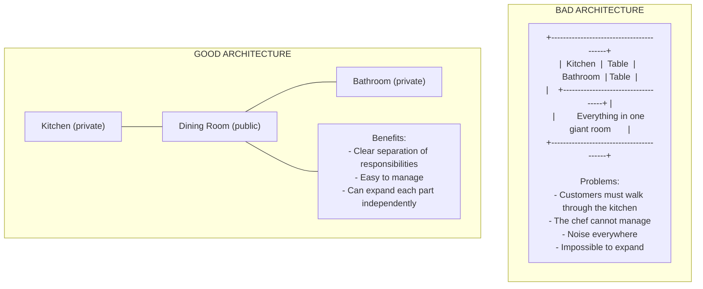

### 1.2 Polymarket Analyzer Architecture

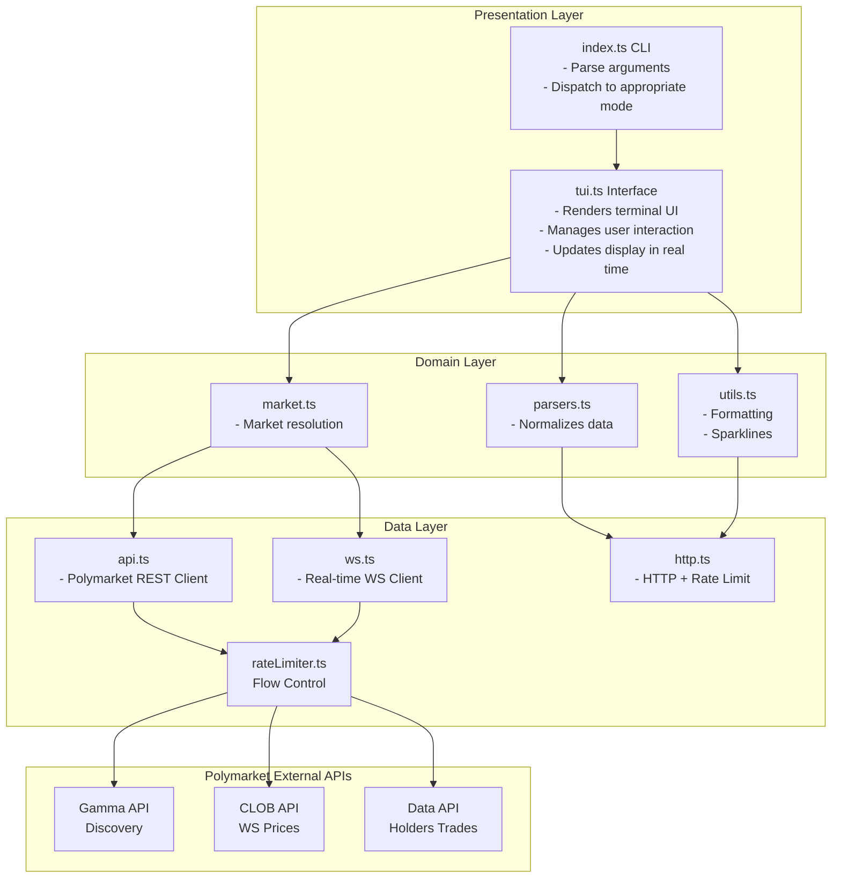

---

## 2. Directory Structure

### 2.1 Complete Project Map

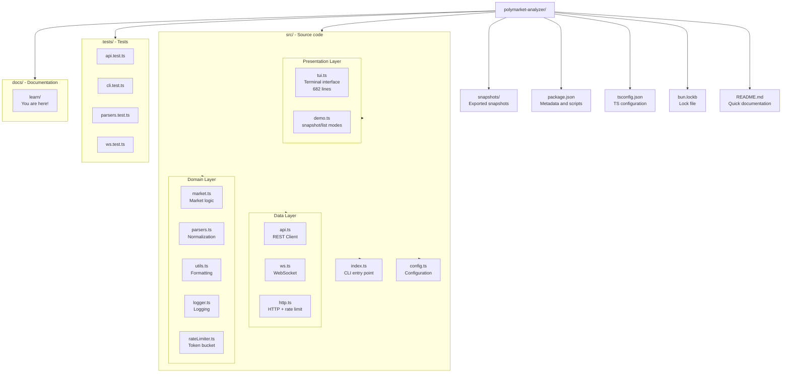

### 2.2 Why This Structure?

#### Separation of Concerns

Each file/module has **one clear responsibility**:

```typescript
// BAD - Everything in one file
// api.ts (1000 lines)
// - Data fetching
// - Rate limiting
// - Parsing
// - Normalization
// - WebSocket
// - Logging
// - Formatting

// GOOD - Separated into modules
// api.ts (400 lines) - Only data fetching
// rateLimiter.ts (42 lines) - Only rate limiting
// parsers.ts (84 lines) - Only parsing
// http.ts (116 lines) - HTTP + rate limiting
// ws.ts (200 lines) - Only WebSocket
// logger.ts (30 lines) - Only logging
// utils.ts (37 lines) - Only formatting
```

#### Benefits of Separation:

1. **Easy to find things** - Rate limiting code is in `rateLimiter.ts`
2. **Easy to test** - Each module can be tested in isolation
3. **Easy to modify** - Changing rate limiting doesn't affect parsing
4. **Easy to reuse** - `utils.ts` can be used in other projects

---

## 3. Anatomy of Main Files

### 3.1 config.ts - Centralized Configuration

See `src/config.ts`:

```typescript
export const CONFIG = {
  // Base API URLs
  gammaBase: "https://gamma-api.polymarket.com",
  clobRestBase: "https://clob.polymarket.com",
  clobWsBase: "wss://ws-subscriptions-clob.polymarket.com/ws/",
  dataApiBase: "https://data-api.polymarket.com",

  // Refresh intervals (ms)
  refreshMs: 3000,         // General data: 3 seconds
  historyMs: 30000,        // History: 30 seconds
  holdersMs: 60000,        // Holders: 60 seconds
  radarMs: 60000,          // Radar: 60 seconds

  // Stale data limits
  wsStaleMs: 15000,        // WebSocket: 15 seconds
  restStaleMs: 20000,      // REST: 20 seconds

  // Data limits
  historyFidelity: 30,     // History points
  holdersLimit: 8,         // Top holders
  orderbookDepth: 10,      // Order book levels
  radarLimit: 10,          // Markets in radar

  // Timeouts
  restTimeoutMs: 10000,    // Request timeout
};
```

**Why centralize configuration?**

```typescript
// BAD - Hardcoded values scattered around
async function fetchEvents() {
  const response = await fetch("https://gamma-api.polymarket.com/events");
  await sleep(3000);  // Where did this 3000 come from?
}

async function fetchMarkets() {
  const response = await fetch("https://gamma-api.polymarket.com/markets");
  await sleep(3000);  // What if you need to change it in one place?
}

// GOOD - Centralized configuration
const CONFIG = { refreshMs: 3000 };

async function fetchEvents() {
  await sleep(CONFIG.refreshMs);  // One place to change
}
```

**Benefits:**
- Easy to modify - Change in one place, affects all
- Easy to test - Mock `CONFIG` in tests
- Documentation - Values and units documented
- Consistency - Everyone uses the same values

### 3.2 index.ts - Entry Point

See `src/index.ts`:

```typescript
#!/usr/bin/env bun
import { CONFIG } from "./config";
import { listMarkets, runSnapshot } from "./demo";
import { runDashboard } from "./tui";

// --- 1. Type definitions ---
type Options = {
  market?: string;      // Market ID
  slug?: string;        // Market slug
  intervalMs: number;   // Refresh interval
  limit: number;        // Market limit
  once: boolean;        // Snapshot mode
  listMarkets: boolean; // List mode
  ws: boolean;          // Use WebSocket
  json: boolean;        // JSON output
};

// --- 2. Argument parsing ---
const opts = parseArgs(process.argv.slice(2));

// --- 3. Mode dispatch ---
if (opts.listMarkets) {
  await listMarkets(opts.limit, opts.json);
  process.exit(0);
}

if (opts.once) {
  await runSnapshot({ ... });
  process.exit(0);
}

await runDashboard({ ... });
```

**Execution Flow:**

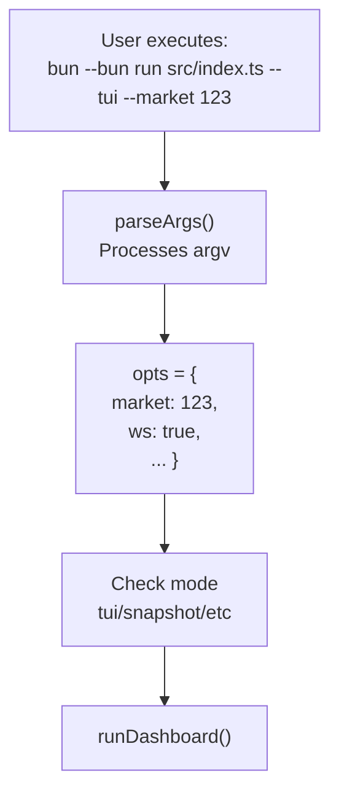

### 3.3 http.ts - Smart HTTP Client

See `src/http.ts`:

```typescript
// --- 1. Types ---
export type FetchOptions = {
  method?: "GET" | "POST";
  headers?: Record<string, string>;
  body?: unknown;
  timeoutMs?: number;
  retries?: number;
};

// --- 2. Known rate limits ---
const RATE_LIMITS = [
  { host: "clob.polymarket.com", path: "/book", limit: 1500 },
  { host: "clob.polymarket.com", path: "/price", limit: 1500 },
  // ... more rules
];

// --- 3. Main function ---
export async function fetchJson<T>(
  url: string,
  options: FetchOptions = {}
): Promise<T> {
  // 1. Identify applicable rate limit
  const limitRule = matchRateLimit(url);
  if (limitRule) await limiter.take(limitRule);

  // 2. Try with retry
  let attempt = 0;
  while (true) {
    try {
      // 3. Fetch with timeout
      const res = await fetch(url, { ... });
      if (!res.ok) {
        // 4. Check if should retry
        if (shouldRetry(res.status) && attempt < retries) {
          await backoff(attempt);
          continue;
        }
        throw new Error(...);
      }
      return await res.json();
    } catch (err) {
      if (attempt < retries) {
        await backoff(attempt);
        continue;
      }
      throw err;
    }
  }
}
```

**Request Flow:**

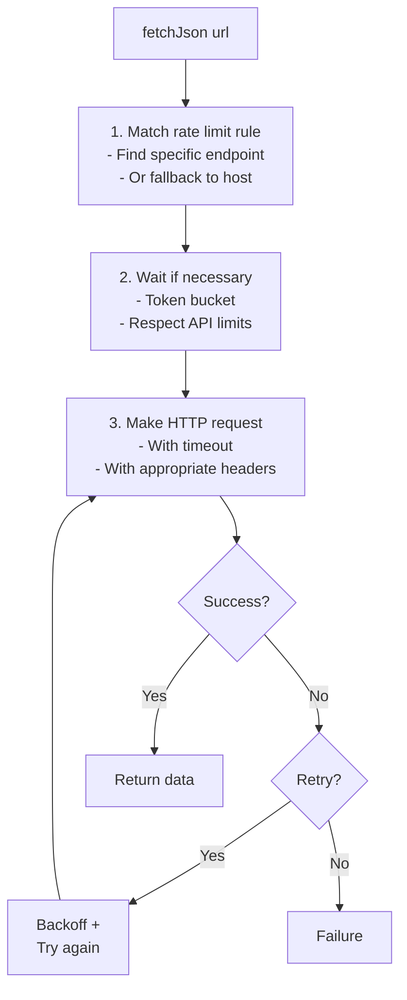

### 3.4 rateLimiter.ts - Token Bucket

See `src/rateLimiter.ts`:

```typescript
export class RateLimiter {
  private buckets = new Map<string, Bucket>();

  async take(rule: RateLimitRule): Promise<void> {
    const now = Date.now();
    let bucket = this.buckets.get(rule.key);

    // 1. Create or reset bucket
    if (!bucket || now >= bucket.resetAt) {
      bucket = { tokens: rule.limit, resetAt: now + rule.windowMs };
      this.buckets.set(rule.key, bucket);
    }

    // 2. Consume token
    if (bucket.tokens > 0) {
      bucket.tokens -= 1;
      return;  // Has tokens, can continue
    }

    // 3. Wait for reset
    const waitMs = Math.max(0, bucket.resetAt - now) + jitter(20, 120);
    await sleep(waitMs);
    return this.take(rule);  // Recursion after wait
  }
}
```

**Token Bucket Analogy:**

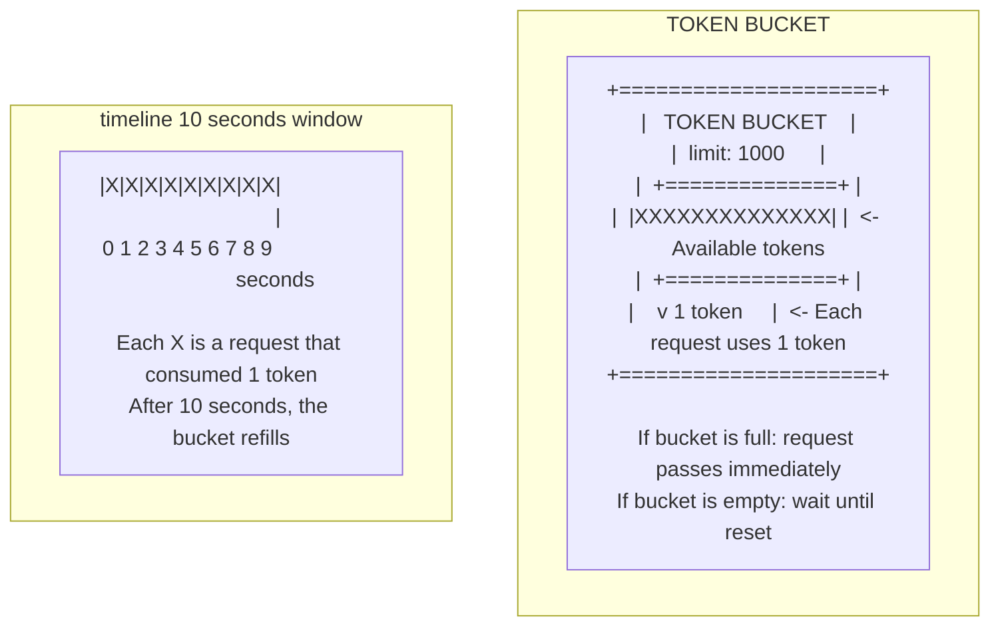

**Why Jitter?**

```typescript
function jitter(min: number, max: number) {
  return Math.floor(min + Math.random() * (max - min));
}

// Without jitter:
// 10 clients retry at the same moment
// -> "Thundering herd" -> Server overloaded

// With jitter:
// 10 clients retry at random moments
// -> Distributed load -> Server handles it
```

### 3.5 parsers.ts - Data Normalization

See `src/parsers.ts`:

```typescript
// --- Problem: APIs return different formats ---
// API 1: { price: 0.65 }
// API 2: { best_price: 0.65 }
// API 3: { value: 0.65 }

// --- Solution: Extraction functions ---
export function extractPrice(response: Record<string, unknown>) {
  const direct = response.price ?? response.best_price ?? response.value;
  if (direct !== undefined) return asNumber(direct);
  return undefined;
}

// --- Order book: multiple formats ---
// Format 1: { bids: [[price, size], ...] }
// Format 2: { bids: [{ price: 0.65, size: 100 }, ...] }
// Format 3: { buys: [{ p: 0.65, s: 100 }, ...] }

export function normalizeLevels(levels: unknown[]): OrderbookLevel[] {
  return levels
    .map((level) => {
      // Array [price, size]
      if (Array.isArray(level)) {
        return {
          price: asNumber(level[0]) ?? 0,
          size: asNumber(level[1]) ?? 0
        };
      }
      // Object { price, size }
      if (level && typeof level === "object") {
        const record = level as Record<string, unknown>;
        return {
          price: asNumber(record.price ?? record.p ?? record.rate) ?? 0,
          size: asNumber(record.size ?? record.s ?? record.amount) ?? 0
        };
      }
      return null;
    })
    .filter((level): level is OrderbookLevel => level !== null)
    .filter((level) => level.price !== 0 && level.size !== 0);
}
```

**Normalization Flow:**

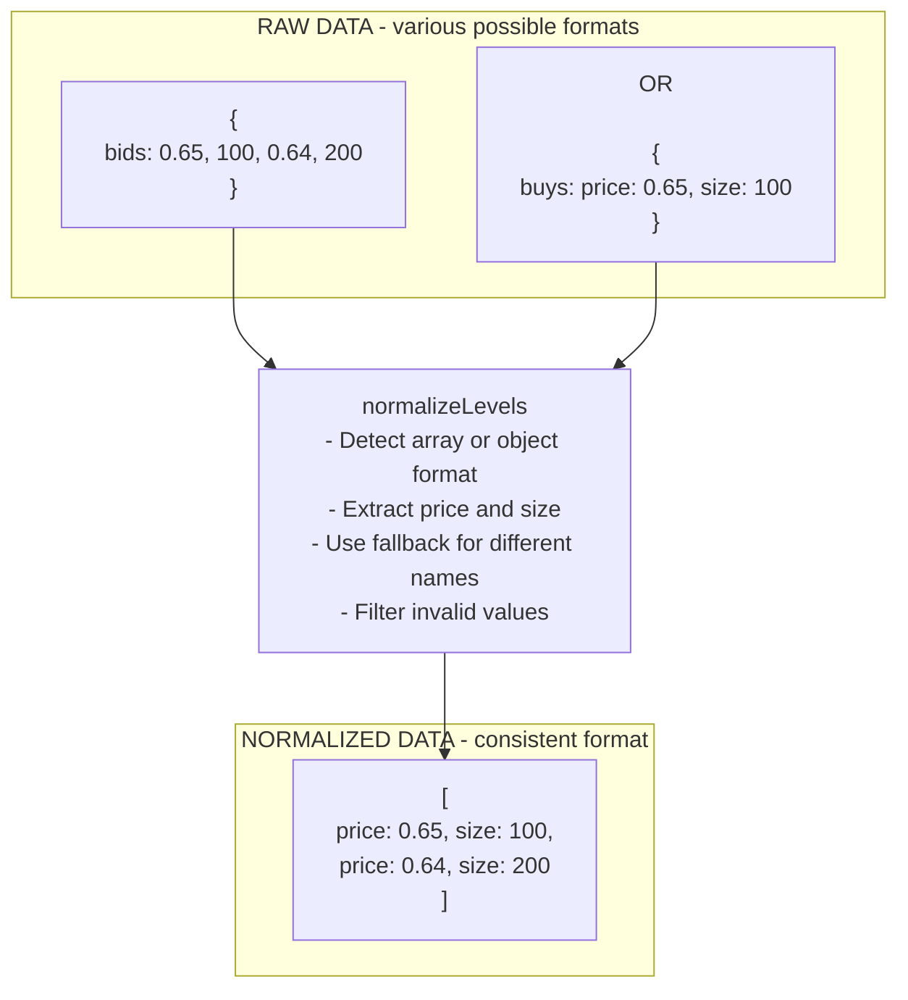

### 3.6 market.ts - Market Resolution

See `src/market.ts`:

```typescript
export async function resolveMarket(
  opts: ResolveOptions,
  radar: MarketInfo[]
): Promise<MarketInfo | null> {
  // 1. Try to resolve by slug
  if (opts.slug) {
    // 1a. Try to fetch market by slug
    try {
      const market = await fetchMarketBySlug(opts.slug);
      const normalized = normalizeMarket(market, undefined);
      if (normalized) return normalized;
    } catch (_) { }

    // 1b. Try to fetch event by slug
    try {
      const event = await fetchEventBySlug(opts.slug);
      const market = firstMarketFromEvent(event);
      if (market) return market;
    } catch (_) { }
  }

  // 2. Try to resolve by condition ID
  if (opts.market) {
    try {
      const market = await fetchMarketByConditionId(opts.market);
      if (market) {
        const normalized = normalizeMarket(market, undefined);
        if (normalized) return normalized;
      }
    } catch (_) { }

    // 2b. Fallback to local radar
    const match = radar.find((item) => item.conditionId === opts.market);
    if (match) return match;
  }

  // 3. Last resort: first from radar
  return radar[0] ?? null;
}
```

**Resolution Strategy:**

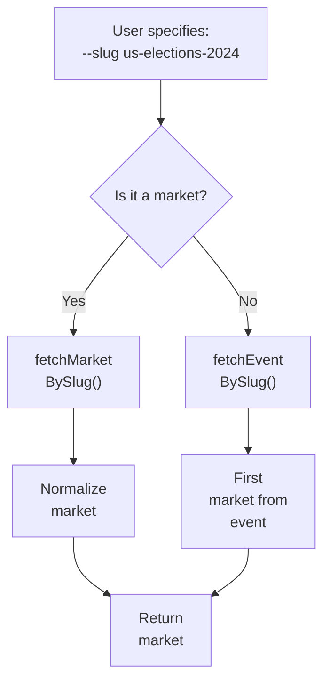

---

## 4. Design Patterns Used

### 4.1 Singleton Pattern

**Singleton** ensures that a class has **only one instance**.

```typescript
// http.ts
const limiter = new RateLimiter();  // <- Single global instance

export async function fetchJson<T>(...) {
  if (limitRule) await limiter.take(limitRule);
  // ...
}
```

**Why Singleton?**

```
WITHOUT SINGLETON:
---------------------------------------------
fetchJson1() -> new RateLimiter() -> limiter1
fetchJson2() -> new RateLimiter() -> limiter2
fetchJson3() -> new RateLimiter() -> limiter3

Problem:
- Each limiter has its own state
- Rate limits are not shared
- You can exceed the global limit!

WITH SINGLETON:
---------------------------------------------
fetchJson1() -> limiter (same instance)
fetchJson2() -> limiter (same instance)
fetchJson3() -> limiter (same instance)

Benefit:
- Shared state
- Rate limits respected globally
```

### 4.2 Strategy Pattern

**Strategy** allows swapping algorithms at runtime.

```typescript
// market.ts - Resolution strategies
export async function resolveMarket(opts, radar) {
  // Strategy 1: By slug
  if (opts.slug) { /* ... */ }

  // Strategy 2: By condition ID
  if (opts.market) { /* ... */ }

  // Strategy 3: Fallback to radar
  return radar[0] ?? null;
}
```

### 4.3 Factory Pattern

**Factory** centralizes the creation of complex objects.

```typescript
// parsers.ts - Level factory
export function normalizeLevels(levels: unknown[]): OrderbookLevel[] {
  return levels
    .map((level) => {
      // Create OrderbookLevel based on format
      if (Array.isArray(level)) {
        return { price: asNumber(level[0]) ?? 0, size: asNumber(level[1]) ?? 0 };
      }
      if (level && typeof level === "object") {
        // ...
      }
    })
    .filter((level): level is OrderbookLevel => level !== null);
}
```

### 4.4 Retry Pattern

**Retry** attempts operations that may fail transiently.

```typescript
// http.ts
let attempt = 0;
while (true) {
  try {
    const res = await fetch(url, { ... });
    if (!res.ok && shouldRetry(res.status) && attempt < retries) {
      attempt += 1;
      await backoff(attempt);  // <- Exponential backoff
      continue;  // <- Try again
    }
    return await res.json();
  } catch (err) {
    if (attempt < retries) {
      attempt += 1;
      await backoff(attempt);
      continue;  // <- Try again
    }
    throw err;  // <- Give up after N attempts
  }
}
```

**Exponential Backoff:**

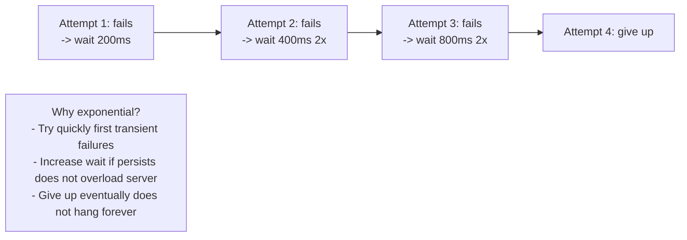

---

## 5. Complete Data Flow

### 5.1 Data Chain: From User to Screen

```mermaid
graph TD
    S1["1. USER EXECUTES COMMAND<br/>bun --bun run src/index.ts --tui --market 12345"]
    S2["2. CLI PARSES ARGUMENTS index.ts<br/>parseArgs -> opts = market: 12345, ws: true"]
    S3["3. LOADS MARKET RADAR<br/>market.ts + api.ts<br/><br/>loadRadar 10 -> fetchEvents -> normalizeMarket<br/><br/>Result: MarketInfo 10 markets"]
    S4["4. RESOLVES SPECIFIC MARKET<br/>market.ts<br/><br/>resolveMarket { market: 12345 }, radar<br/>-> fetchMarketByConditionId 12345<br/>-> normalizeMarket<br/><br/>Result: MarketInfo market 12345"]
    S5["5. CONNECTS WEBSOCKET ws.ts<br/><br/>connectMarketWs tokenIds, handlers<br/>-> Opens WebSocket connection<br/>-> Sends subscription message<br/>-> Receives real-time updates"]
    S6["6. FETCHES ADDITIONAL DATA<br/>api.ts + http.ts<br/><br/>getOrderbook -> fetchJson -> normalizeOrderbook<br/>getPrices -> fetchJson -> extractPrice<br/>getPriceHistory -> fetchJson -> extractHistory<br/>getHolders -> fetchJson -> normalizeHolders"]
    S7["7. UPDATES STATE tui.ts<br/><br/>Every time new data arrives WS or REST:<br/>- Updates state variables<br/>- Recalculates derived spread, midpoint<br/>- Checks staleness"]
    S8["8. RENDERS INTERFACE tui.ts<br/><br/>screen.render -> blessed renders all components:<br/>- Header status, clock, WS status<br/>- Radar table market list<br/>- Market box market details<br/>- Pulse panel real-time prices<br/>- Orderbook table order book<br/>- History panel sparkline<br/>- Holders table top holders<br/>- Alerts and Status warnings, errors"]
    S9["9. REFRESH LOOP tui.ts<br/><br/>setInterval refreshMs:<br/>- Fetch REST data<br/>- Update state<br/>- Render<br/>- Repeat"]

    S1 --> S2
    S2 --> S3
    S3 --> S4
    S4 --> S5
    S5 --> S6
    S6 --> S7
    S7 --> S8
    S8 --> S9
    S9 --> S6
```

### 5.2 Application Global State

```typescript
// tui.ts - State variables
let radar: MarketInfo[] = [];              // Market list
let currentMarket: MarketInfo | null = null; // Current market
let currentOutcomeIndex = 0;               // Selected outcome
let orderbook: OrderbookState | null = null; // Order book
let prices: PricesInfo | null = null;      // Prices
let priceHistory: number[] = [];           // History
let holders: HolderInfo[] = [];            // Holders
let wsConnected = false;                   // WS connected?
let lastWsUpdate = 0;                      // Last WS message
let lastError = "";                        // Last error
```

**State Update Flow:**

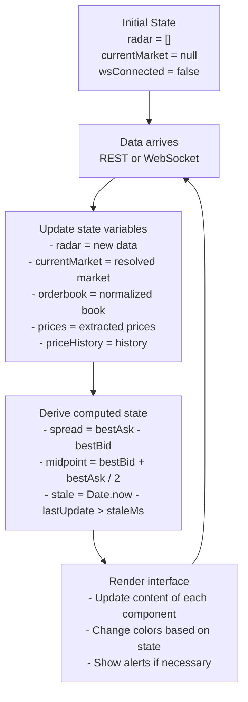

---

## 6. Architecture Best Practices

### 6.1 Dependency Inversion

**Depend on abstractions, not concrete implementations.**

```typescript
// BAD - Depends on concrete implementation
import { blessed } from "blessed";

function renderUI(data: MarketData) {
  const screen = blessed.screen({ ... });  // Coupled to blessed
  // ...
}

// GOOD - Depends on abstraction
interface Screen {
  render(): void;
  append(component: unknown): void;
}

function renderUI(screen: Screen, data: MarketData) {
  screen.append(...);  // Any Screen implementation
}
```

### 6.2 Don't Repeat Yourself (DRY)

**Don't repeat code. Extract into reusable functions.**

```typescript
// BAD - Repetition
const price1 = data.price !== undefined ? data.price : 0;
const price2 = data.best_price !== undefined ? data.best_price : 0;
const price3 = data.value !== undefined ? data.value : 0;

// GOOD - Reusable function
function extractPrice(data: Record<string, unknown>) {
  return data.price ?? data.best_price ?? data.value ?? 0;
}

const price1 = extractPrice(data1);
const price2 = extractPrice(data2);
const price3 = extractPrice(data3);
```

### 6.3 Single Responsibility Principle (SRP)

**Each function/module should have a single responsibility.**

```typescript
// BAD - Does multiple things
async function processMarket(id: string) {
  const raw = await fetch(`/markets/${id}`);
  const data = await raw.json();
  const normalized = normalizeMarket(data);
  const formatted = formatMarket(normalized);
  const rendered = renderMarket(formatted);
  return rendered;
}

// GOOD - Each function does one thing
async function fetchMarket(id: string) { /* ... */ }
function normalizeMarket(data: unknown) { /* ... */ }
function formatMarket(market: MarketInfo) { /* ... */ }
function renderMarket(formatted: FormattedMarket) { /* ... */ }

// Composition
async function processMarket(id: string) {
  const data = await fetchMarket(id);
  const normalized = normalizeMarket(data);
  const formatted = formatMarket(normalized);
  return renderMarket(formatted);
}
```

### 6.4 Fail Fast

**Error early, error loud.**

```typescript
// BAD - Silent error
function getMarketId(market: MarketInfo): string {
  return (market as any).conditionId ?? "default";
  // If undefined, returns "default" silently
}

// GOOD - Explicit error
function getMarketId(market: MarketInfo): string {
  if (!market.conditionId) {
    throw new Error("Market must have a conditionId");
  }
  return market.conditionId;
}
```

---

## 7. Practical Exercises

### Exercise 1: Map the Flow

Map the complete flow when the user presses the 'n' key (next market):

1. Where is the keypress captured? (`tui.ts`)
2. How does the state change? (`currentOutcomeIndex`)
3. What needs to be reloaded? (WebSocket, REST)
4. How is the interface updated? (`screen.render()`)

### Exercise 2: Add a New Endpoint

Add a new fictional endpoint to the API:

```typescript
// 1. Add the function in api.ts
export async function fetchMarketStats(marketId: string) {
  // ...
}

// 2. Add the rate limit in http.ts
const RATE_LIMITS = [
  // ...
  { host: "api.polymarket.com", path: "/stats", limit: 500 }
];

// 3. Call from tui.ts to show market stats
```

### Exercise 3: Refactoring

Find a place in the code where DRY is being violated and refactor:

```typescript
// Hint: Look for repeated code in api.ts
// Example: fetchEvents, fetchMarkets are very similar
// Extract the common logic into a fetchPaginated() function
```

---

## 8. Chapter Summary

- **Layered architecture**: Presentation -> Domain -> Data
- **Separation of concerns**: Each file has a clear function
- **Centralized configuration**: `config.ts` avoids "magic numbers"
- **Design patterns**: Singleton, Strategy, Factory, Retry
- **Data flow**: CLI -> API -> Parse -> State -> Render
- **Best practices**: DRY, SRP, Fail Fast

---

## 9. Further Reading

- **Clean Architecture**: Robert C. Martin
- **Design Patterns**: Gang of Four
- **Refactoring**: Martin Fowler
- **The Pragmatic Programmer**: Andrew Hunt and David Thomas

---

## Check Your Understanding

### Question 1: Separation of Concerns

**Which file should NOT have responsibility for:**

<details>
<summary>A) api.ts - Market data</summary>

No - api.ts SHOULD have responsibility for fetching market data
</details>

<details>
<summary>B) tui.ts - Terminal interface</summary>

No - tui.ts SHOULD have responsibility for rendering the interface
</details>

<details>
<summary>C) http.ts - Rate limiting (PARTIALLY CORRECT)</summary>

Partially correct - http.ts IMPLEMENTS rate limiting, but the limit configuration is in it.
The responsibility to DEFINE the rate limits could be in config.ts.
</details>

**Principle:** Each module should have ONE clear responsibility.

---

### Question 2: Data Flow

**Put in order the data flow when the user executes `bun --bun run dev`:**

<details>
<summary>Answer</summary>

1. index.ts -> Parse CLI arguments
2. market.ts -> Resolve market (by slug/ID)
3. api.ts -> Fetch data from Gamma API
4. ws.ts -> Connect WebSocket
5. api.ts -> Fetch order book/prices REST
6. parsers.ts -> Normalize data
7. tui.ts -> Render interface
8. Loop -> Update with WebSocket + REST polling
</details>

---

### Question 3: Singleton Pattern

**Why use Singleton for RateLimiter?**

<details>
<summary>Answer</summary>

**Why:**
- We need ONE single shared instance
- Each fetchJson function must use the SAME rate limiter
- This way we respect GLOBAL API limits

**Without Singleton:**
```typescript
// Each call creates its own limiter
fetchJson(url1);  // limiter A (10 tokens)
fetchJson(url2);  // limiter B (10 tokens)
// Total: 20 requests in 10 seconds -> MAY EXCEED LIMIT!
```

**With Singleton:**
```typescript
// All calls share the same limiter
fetchJson(url1);  // limiter (10 tokens)
fetchJson(url2);  // limiter (9 tokens remaining)
// Total: 19 requests in 10 seconds -> RESPECTS LIMIT
```
</details>

---

## Common Pitfalls

### Pitfall: High Coupling

**BAD:**
```typescript
// tui.ts depends directly on API implementation
import { fetchEvents } from "./api";

async function render() {
  const events = await fetchEvents(10);  // Coupled!
  // ...
}
```

**Problem:**
If `fetchEvents` changes, `tui.ts` breaks. Hard to test.

**GOOD:**
```typescript
// Interface (contract)
interface MarketSource {
  getEvents(limit: number): Promise<Event[]>;
}

// tui.ts depends on interface, not implementation
async function render(source: MarketSource) {
  const events = await source.getEvents(10);
  // ...
}

// Usage
const api = new PolymarketAPI();
await render(api);  // Works with any MarketSource implementation
```

---

### Pitfall: Not Separating Layers

**BAD - Everything mixed:**
```typescript
// main.ts
async function main() {
  const response = await fetch("https://api.com/data");
  const data = await response.json();
  const normalized = normalizeData(data);
  const screen = blessed.screen({ /* ... */ });
  const box = blessed.box({ /* ... */ });
  box.setContent(JSON.stringify(normalized));
  screen.append(box);
  screen.render();
}
```

**GOOD - Separated layers:**
```typescript
// api.ts
async function fetchData() { /* ... */ }

// parsers.ts
function normalizeData(data) { /* ... */ }

// tui.ts
function renderData(data) { /* ... */ }

// main.ts (orchestration)
async function main() {
  const rawData = await fetchData();
  const normalized = normalizeData(rawData);
  renderData(normalized);
}
```

---

## Troubleshooting

### Problem: "Circular Dependency"

**Error:**
```
Error: Circular dependency detected
src/api.ts -> src/market.ts -> src/api.ts
```

**Cause:**
api.ts imports market.ts and market.ts imports api.ts.

**Solution:**
```typescript
// Option 1: Move shared functions to a third module
// src/types.ts - Define types that both use
// src/utils.ts - Define utility functions that both use

// Option 2: Invert dependency
// Instead of api.ts importing market.ts, have market.ts receive market as a parameter
```

**Prevention:**
Draw the dependency graph before coding. Avoid cycles.

---

## Milestone Completed

After completing this chapter, you should be able to:

- [ ] Identify the architecture layers
- [ ] Understand the complete data flow
- [ ] Locate each file in the project
- [ ] Explain design patterns used
- [ ] Avoid high coupling
- [ ] Separate responsibilities correctly

**Practical Exercise:**
Draw on paper the complete flow when:
1. User executes `--market 12345`
2. WebSocket receives a price update
3. User presses 'n' (next market)

Compare with the chapter diagram and discuss the differences.

---

## Design Decisions

### Decision 1: Why 3-layer architecture?

**Alternatives Considered:**
1. **Single monolith** - Everything in one file
2. **2 layers** - Only data and presentation
3. **3 layers** - Presentation, domain, data [CHOSEN]
4. **Microservices** - Separate services

**Trade-offs:**

| Architecture | Complexity | Maintainability | Testability | Scalability |
|-------------|------------|------------------|-------------|-------------|
| Monolith | Very low | Very low | Very low | Very low |
| 2 Layers | Low | Low | Low | Low |
| 3 Layers | Medium | High | High | Medium |
| Microservices | Very high | Medium | High | Very high |

**Why 3 layers was chosen:**
- Clear separation: Each layer has a single responsibility
- Testability: Layers can be tested independently
- Maintainability: Changes in one layer don't affect others
- Flexibility: Easy to swap one layer's implementation

**Example of flexibility:**
```typescript
// Data layer can be swapped:
// From: api.ts (HTTP)
// To: api-mock.ts (Mocked data for tests)
// Upper layers don't need to change!
```

**Reference in code:**
- `src/tui.ts` (Presentation)
- `src/market.ts` (Domain)
- `src/api.ts` (Data)

---

### Decision 2: Why Singleton for Rate Limiter?

**Alternatives Considered:**
1. **Single global instance** - Global variable
2. **Singleton Pattern** - Class with getInstance() [CHOSEN]
3. **Dependency Injection** - Injected as parameter

**Why Singleton was chosen:**
- Shared state: Rate limiting needs a global counter
- Thread-safe: One instance avoids race conditions
- Simplicity: Easy to use anywhere

**Risk:**
- Hard to test: Global state between tests
- **Mitigation**: `reset()` method to clear state between tests

**Reference in code:** `src/rateLimiter.ts` - Singleton implementation

---

### Decision 3: Why separate `parsers.ts` from `api.ts`?

**Alternatives Considered:**
1. **Everything in api.ts** - Fetch + parse together
2. **Separated** - api.ts (fetch) + parsers.ts (parse) [CHOSEN]

**Why separation was chosen:**
- Single Responsibility: api.ts fetches data, parsers.ts converts
- Reusable: Parsers can be used for cached data
- Testable: Easy to test parsing without making real requests

**Example:**
```typescript
// api.ts
async function getOrderbook(tokenId) {
  const raw = await fetchJson(url);  // Fetch data
  return raw;  // Return raw
}

// parsers.ts
function normalizeOrderbook(raw) {  // Convert
  // Normalization logic
  return normalized;
}
```

**Reference in code:**
- `src/api.ts:190-200` - Data fetching
- `src/parsers.ts:34-45` - Normalization

---

## External Resources

### Learn More About:

**Software Architecture:**
- [Clean Architecture](https://blog.cleancoder.com/uncle-bob/2012/08/13/the-clean-architecture.html) - Uncle Bob
- [Layered Architecture](https://en.wikipedia.org/wiki/Multilayered_architecture) - Wikipedia
- [Design Patterns](https://refactoring.guru/design-patterns) - Refactoring Guru

**Separation of Concerns:**
- [SOC Principle](https://en.wikipedia.org/wiki/Separation_of_concerns) - Wikipedia
- [Single Responsibility Principle](https://en.wikipedia.org/wiki/Single-responsibility_principle) - Wikipedia

**Dependency Injection:**
- [DI Explained](https://www.youtube.com/watch?v=IKD2-MAkXyQ) - YouTube (15 min)
- [Inversion of Control](https://martinfowler.com/articles/injection.html) - Martin Fowler

**Rate Limiting:**
- [Token Bucket Algorithm](https://en.wikipedia.org/wiki/Token_bucket) - Wikipedia
- [Rate Limiting Best Practices](https://cloud.google.com/architecture/rate-limiting-strategies-techniques) - Google Cloud

### Recommended Videos:

- [Software Architecture Explained](https://www.youtube.com/watch?v=8640g_jWfqg) - YouTube (30 min)
- [Clean Code Principles](https://www.youtube.com/watch?v=7EmboKQH8lM) - YouTube (45 min)
- [Rate Limiting Strategies](https://www.youtube.com/watch?v=M9A7oQHs8QI) - YouTube (20 min)

---

**Next Chapter:** Integration with Polymarket APIs

[Continue to Chapter 3](./03-polymarket-apis.md)

---

**Version:** 1.0.0
**Last Updated:** January 2026
