# Capítulo 02: Arquitetura e Estrutura do Projeto

> **"A complexidade é o inimigo. Quanto mais simples, melhor."**
> — John Carmack

---

## 1. Visão Arquitetural

### 1.1 O Que é Arquitetura de Software?

**Arquitetura de software** é como você organiza e estrutura o código do seu projeto. É como a planta de uma casa: define onde ficam os quartos, a cozinha, a sala, e como eles se conectam.

**Analogia Prática:**

Imagine que você está construindo um restaurante:

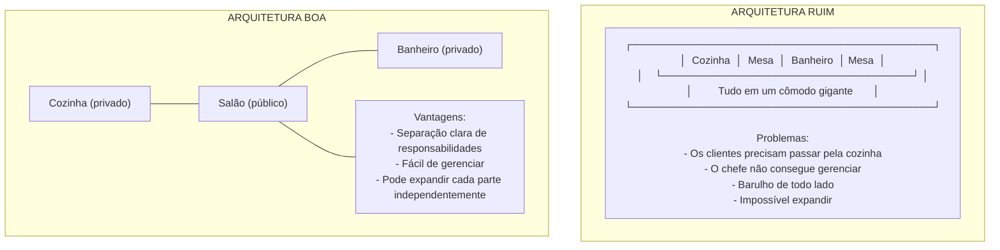

### 1.2 Arquitetura do Polymarket Analyzer

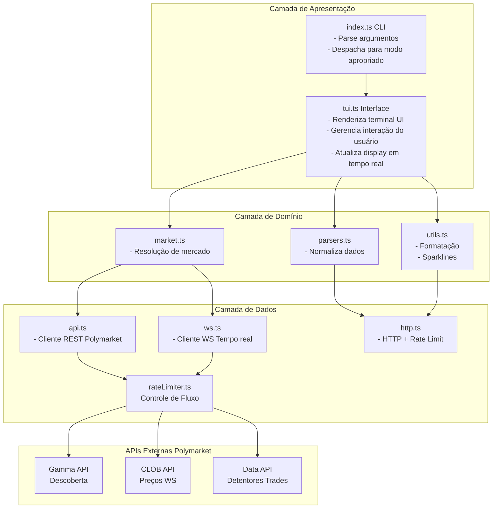

---

## 2. Estrutura de Diretórios

### 2.1 Mapa Completo do Projeto

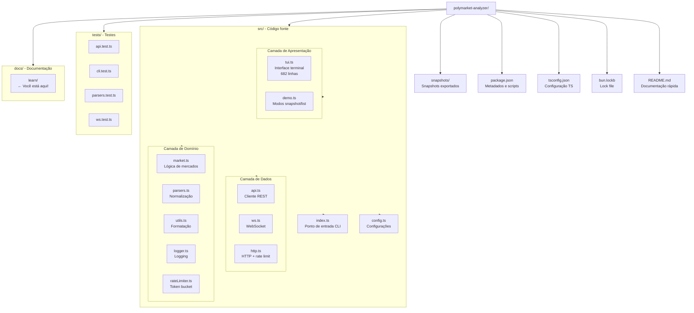

### 2.2 Por Que Essa Estrutura?

#### Separação de Responsabilidades (Separation of Concerns)

Cada arquivo/módulo tem **uma responsabilidade clara**:

```typescript
// ❌ RUIM - Tudo em um arquivo
// api.ts (1000 linhas)
// - Fetch de dados
// - Rate limiting
// - Parsing
// - Normalização
// - WebSocket
// - Logging
// - Formatação

// ✅ BOM - Separado em módulos
// api.ts (400 linhas) - Apenas fetch de dados
// rateLimiter.ts (42 linhas) - Apenas rate limiting
// parsers.ts (84 linhas) - Apenas parsing
// http.ts (116 linhas) - HTTP + rate limiting
// ws.ts (200 linhas) - Apenas WebSocket
// logger.ts (30 linhas) - Apenas logging
// utils.ts (37 linhas) - Apenas formatação
```

#### Vantagens da Separação:

1. **Fácil de encontrar coisas** - O código de rate limiting está em `rateLimiter.ts`
2. **Fácil de testar** - Cada módulo pode ser testado isoladamente
3. **Fácil de modificar** - Mudar rate limiting não afeta parsing
4. **Fácil de reutilizar** - `utils.ts` pode ser usado em outros projetos

---

## 3. Anatomia dos Arquivos Principais

### 3.1 config.ts - Configurações Centralizadas

Veja `src/config.ts`:

```typescript
export const CONFIG = {
  // URLs base das APIs
  gammaBase: "https://gamma-api.polymarket.com",
  clobRestBase: "https://clob.polymarket.com",
  clobWsBase: "wss://ws-subscriptions-clob.polymarket.com/ws/",
  dataApiBase: "https://data-api.polymarket.com",

  // Intervalos de refresh (ms)
  refreshMs: 3000,         // Dados gerais: 3 segundos
  historyMs: 30000,        // Histórico: 30 segundos
  holdersMs: 60000,        // Detentores: 60 segundos
  radarMs: 60000,          // Radar: 60 segundos

  // Limites de stale data (dados antigos)
  wsStaleMs: 15000,        // WebSocket: 15 segundos
  restStaleMs: 20000,      // REST: 20 segundos

  // Limites de dados
  historyFidelity: 30,     // Pontos de histórico
  holdersLimit: 8,         // Top detentores
  orderbookDepth: 10,      // Níveis do order book
  radarLimit: 10,          // Mercados no radar

  // Timeouts
  restTimeoutMs: 10000,    // Timeout de requisições
};
```

**Por que centralizar configurações?**

```typescript
// ❌ RUIM - Valores "hardcoded" espalhados
async function fetchEvents() {
  const response = await fetch("https://gamma-api.polymarket.com/events");
  await sleep(3000);  // ← De onde veio esse 3000?
}

async function fetchMarkets() {
  const response = await fetch("https://gamma-api.polymarket.com/markets");
  await sleep(3000);  // E se precisar mudar em um só lugar?
}

// ✅ BOM - Configuração centralizada
const CONFIG = { refreshMs: 3000 };

async function fetchEvents() {
  await sleep(CONFIG.refreshMs);  // ← Um lugar para mudar
}
```

**Benefícios:**
- ✅ Fácil modificar - Mude em um lugar, afeta todos
- ✅ Fácil testar - Mock `CONFIG` nos testes
- ✅ Documentação - Valores e unidades documentados
- ✅ Consistência - Todos usam os mesmos valores

### 3.2 index.ts - Ponto de Entrada

Veja `src/index.ts`:

```typescript
#!/usr/bin/env bun
import { CONFIG } from "./config";
import { listMarkets, runSnapshot } from "./demo";
import { runDashboard } from "./tui";

// ─── 1. Definição de tipos ───
type Options = {
  market?: string;      // ID do mercado
  slug?: string;        // Slug do mercado
  intervalMs: number;   // Intervalo de refresh
  limit: number;        // Limite de mercados
  once: boolean;        // Modo snapshot
  listMarkets: boolean; // Modo listagem
  ws: boolean;          // Usar WebSocket
  json: boolean;        // Output JSON
};

// ─── 2. Parse de argumentos ───
const opts = parseArgs(process.argv.slice(2));

// ─── 3. Despacho de modo ───
if (opts.listMarkets) {
  await listMarkets(opts.limit, opts.json);
  process.exit(0);
}

if (opts.once) {
  await runSnapshot({ ... });
  process.exit(0);
}

await runDashboard({ ... });
```

**Fluxo de Execução:**

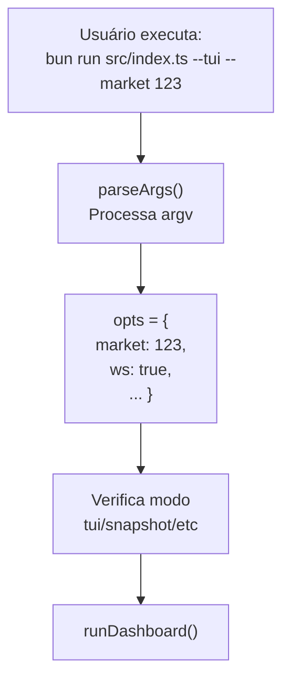

### 3.3 http.ts - Cliente HTTP Inteligente

Veja `src/http.ts`:

```typescript
// ─── 1. Tipos ───
export type FetchOptions = {
  method?: "GET" | "POST";
  headers?: Record<string, string>;
  body?: unknown;
  timeoutMs?: number;
  retries?: number;
};

// ─── 2. Rate limits conhecidos ───
const RATE_LIMITS = [
  { host: "clob.polymarket.com", path: "/book", limit: 1500 },
  { host: "clob.polymarket.com", path: "/price", limit: 1500 },
  // ... mais regras
];

// ─── 3. Função principal ───
export async function fetchJson<T>(
  url: string,
  options: FetchOptions = {}
): Promise<T> {
  // 1. Identifica rate limit aplicável
  const limitRule = matchRateLimit(url);
  if (limitRule) await limiter.take(limitRule);

  // 2. Tenta com retry
  let attempt = 0;
  while (true) {
    try {
      // 3. Faz fetch com timeout
      const res = await fetch(url, { ... });
      if (!res.ok) {
        // 4. Verifica se deve retry
        if (shouldRetry(res.status) && attempt < retries) {
          await backoff(attempt);
          continue;
        }
        throw new Error(...);
      }
      return await res.json();
    } catch (err) {
      if (attempt < retries) {
        await backoff(attempt);
        continue;
      }
      throw err;
    }
  }
}
```

**Fluxo de uma Requisição:**

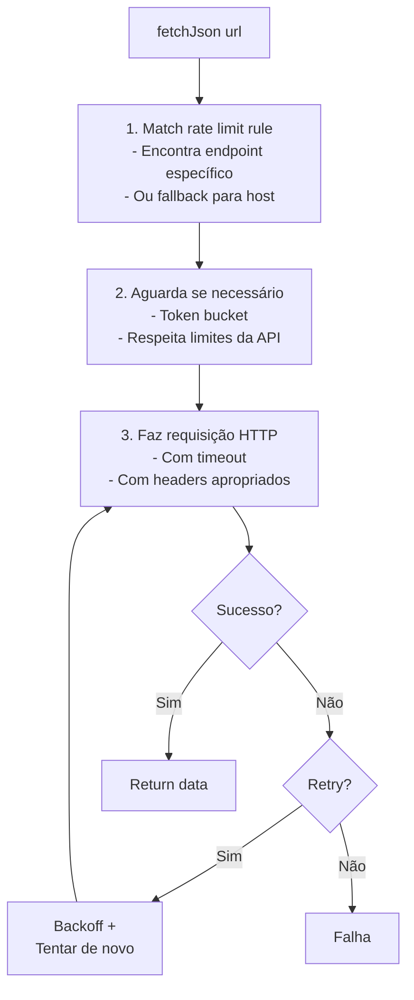

### 3.4 rateLimiter.ts - Token Bucket

Veja `src/rateLimiter.ts`:

```typescript
export class RateLimiter {
  private buckets = new Map<string, Bucket>();

  async take(rule: RateLimitRule): Promise<void> {
    const now = Date.now();
    let bucket = this.buckets.get(rule.key);

    // 1. Cria ou reseta bucket
    if (!bucket || now >= bucket.resetAt) {
      bucket = { tokens: rule.limit, resetAt: now + rule.windowMs };
      this.buckets.set(rule.key, bucket);
    }

    // 2. Consome token
    if (bucket.tokens > 0) {
      bucket.tokens -= 1;
      return;  // Tem tokens, pode continuar
    }

    // 3. Aguarda reset
    const waitMs = Math.max(0, bucket.resetAt - now) + jitter(20, 120);
    await sleep(waitMs);
    return this.take(rule);  // Recursão após wait
  }
}
```

**Analogia do Token Bucket:**

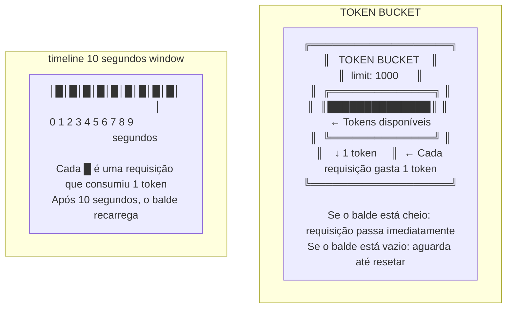

**Por que Jitter?**

```typescript
function jitter(min: number, max: number) {
  return Math.floor(min + Math.random() * (max - min));
}

// Sem jitter:
// 10 clientes fazem retry no mesmo momento
// → "Thundering herd" → Servidor sobrecarregado

// Com jitter:
// 10 clientes fazem retry em momentos aleatórios
// → Load distribuído → Servidor aguenta
```

### 3.5 parsers.ts - Normalização de Dados

Veja `src/parsers.ts`:

```typescript
// ─── Problema: APIs retornam formatos diferentes ───
// API 1: { price: 0.65 }
// API 2: { best_price: 0.65 }
// API 3: { value: 0.65 }

// ─── Solução: Funções de extração ───
export function extractPrice(response: Record<string, unknown>) {
  const direct = response.price ?? response.best_price ?? response.value;
  if (direct !== undefined) return asNumber(direct);
  return undefined;
}

// ─── Order book: múltiplos formatos ───
// Formato 1: { bids: [[price, size], ...] }
// Formato 2: { bids: [{ price: 0.65, size: 100 }, ...] }
// Formato 3: { buys: [{ p: 0.65, s: 100 }, ...] }

export function normalizeLevels(levels: unknown[]): OrderbookLevel[] {
  return levels
    .map((level) => {
      // Array [price, size]
      if (Array.isArray(level)) {
        return {
          price: asNumber(level[0]) ?? 0,
          size: asNumber(level[1]) ?? 0
        };
      }
      // Objeto { price, size }
      if (level && typeof level === "object") {
        const record = level as Record<string, unknown>;
        return {
          price: asNumber(record.price ?? record.p ?? record.rate) ?? 0,
          size: asNumber(record.size ?? record.s ?? record.amount) ?? 0
        };
      }
      return null;
    })
    .filter((level): level is OrderbookLevel => level !== null)
    .filter((level) => level.price !== 0 && level.size !== 0);
}
```

**Fluxo de Normalização:**

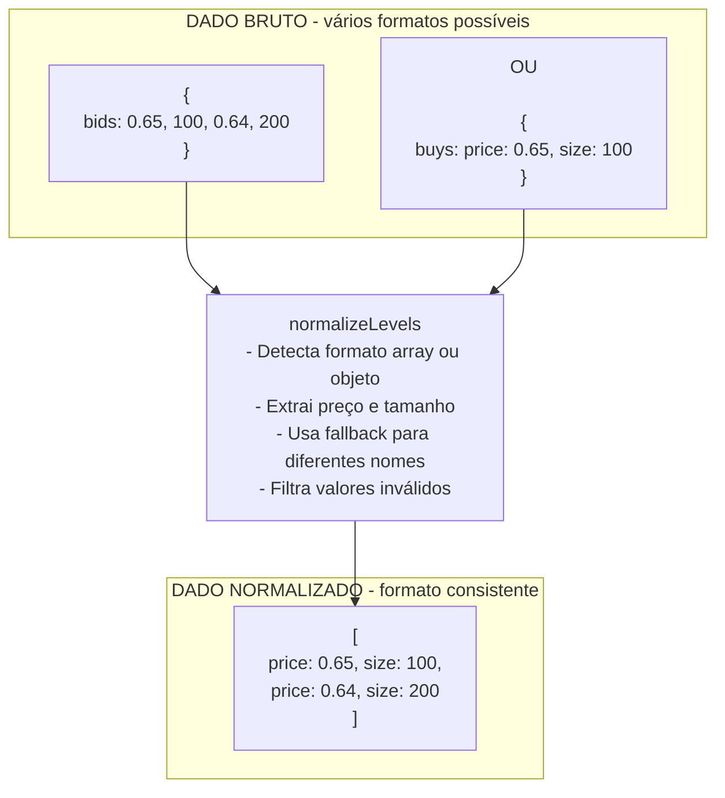

### 3.6 market.ts - Resolução de Mercados

Veja `src/market.ts`:

```typescript
export async function resolveMarket(
  opts: ResolveOptions,
  radar: MarketInfo[]
): Promise<MarketInfo | null> {
  // 1. Tenta resolver por slug
  if (opts.slug) {
    // 1a. Tenta buscar mercado por slug
    try {
      const market = await fetchMarketBySlug(opts.slug);
      const normalized = normalizeMarket(market, undefined);
      if (normalized) return normalized;
    } catch (_) { }

    // 1b. Tenta buscar evento por slug
    try {
      const event = await fetchEventBySlug(opts.slug);
      const market = firstMarketFromEvent(event);
      if (market) return market;
    } catch (_) { }
  }

  // 2. Tenta resolver por condition ID
  if (opts.market) {
    try {
      const market = await fetchMarketByConditionId(opts.market);
      if (market) {
        const normalized = normalizeMarket(market, undefined);
        if (normalized) return normalized;
      }
    } catch (_) { }

    // 2b. Fallback para radar local
    const match = radar.find((item) => item.conditionId === opts.market);
    if (match) return match;
  }

  // 3. Último recurso: primeiro do radar
  return radar[0] ?? null;
}
```

**Estratégia de Resolução:**

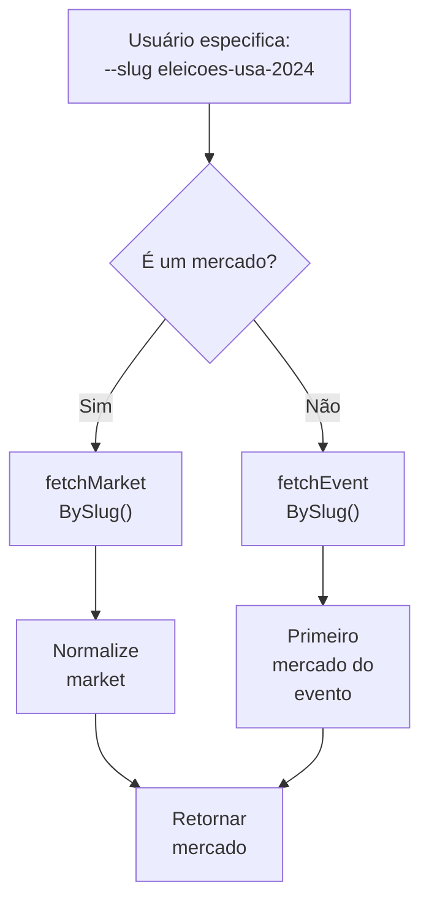

---

## 4. Padrões de Design Utilizados

### 4.1 Singleton Pattern

**Singleton** garante que uma classe tenha **apenas uma instância**.

```typescript
// http.ts
const limiter = new RateLimiter();  // ← Única instância global

export async function fetchJson<T>(...) {
  if (limitRule) await limiter.take(limitRule);
  // ...
}
```

**Por que Singleton?**

```
SEM SINGLETON:
─────────────────────────────────────────────
fetchJson1() → new RateLimiter() → limiter1
fetchJson2() → new RateLimiter() → limiter2
fetchJson3() → new RateLimiter() → limiter3

Problema:
- Cada limiter tem seu próprio estado
- Rate limits não são compartilhados
- Você pode exceder o limite global!

COM SINGLETON:
─────────────────────────────────────────────
fetchJson1() → limiter (mesma instância)
fetchJson2() → limiter (mesma instância)
fetchJson3() → limiter (mesma instância)

Benefício:
- Estado compartilhado
- Rate limits respeitados globalmente
```

### 4.2 Strategy Pattern

**Strategy** permite trocar algoritmos em runtime.

```typescript
// market.ts - Estratégias de resolução
export async function resolveMarket(opts, radar) {
  // Estratégia 1: Por slug
  if (opts.slug) { /* ... */ }

  // Estratégia 2: Por condition ID
  if (opts.market) { /* ... */ }

  // Estratégia 3: Fallback para radar
  return radar[0] ?? null;
}
```

### 4.3 Factory Pattern

**Factory** centraliza a criação de objetos complexos.

```typescript
// parsers.ts - Factory de níveis
export function normalizeLevels(levels: unknown[]): OrderbookLevel[] {
  return levels
    .map((level) => {
      // Cria OrderbookLevel baseado no formato
      if (Array.isArray(level)) {
        return { price: asNumber(level[0]) ?? 0, size: asNumber(level[1]) ?? 0 };
      }
      if (level && typeof level === "object") {
        // ...
      }
    })
    .filter((level): level is OrderbookLevel => level !== null);
}
```

### 4.4 Retry Pattern

**Retry** tenta operações que podem falhar transitoriamente.

```typescript
// http.ts
let attempt = 0;
while (true) {
  try {
    const res = await fetch(url, { ... });
    if (!res.ok && shouldRetry(res.status) && attempt < retries) {
      attempt += 1;
      await backoff(attempt);  // ← Exponential backoff
      continue;  // ← Tenta de novo
    }
    return await res.json();
  } catch (err) {
    if (attempt < retries) {
      attempt += 1;
      await backoff(attempt);
      continue;  // ← Tenta de novo
    }
    throw err;  // ← Desiste após N tentativas
  }
}
```

**Exponential Backoff:**

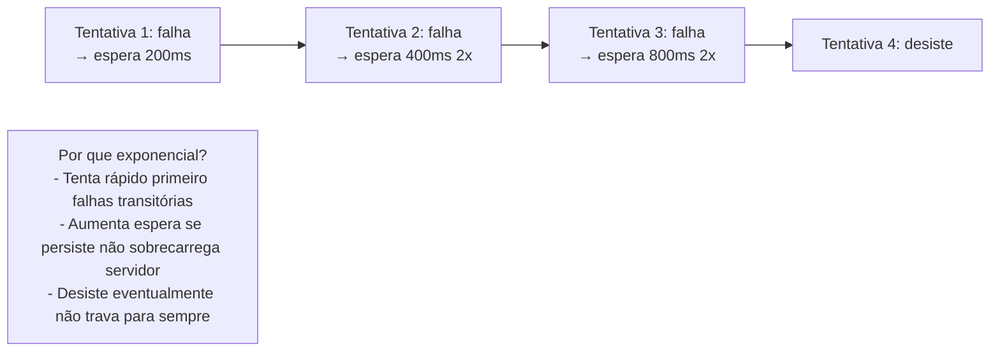

---

## 5. Fluxo de Dados Completo

### 5.1 Cadeia de Dados: Do Usuário à Tela

```mermaid
graph TD
    S1["1. USUÁRIO EXECUTA COMANDO<br/>bun run src/index.ts --tui --market 12345"]
    S2["2. CLI PARSE ARGUMENTOS index.ts<br/>parseArgs → opts = market: 12345, ws: true"]
    S3["3. CARREGA RADAR DE MERCADOS<br/>market.ts + api.ts<br/><br/>loadRadar 10 → fetchEvents → normalizeMarket<br/><br/>Resultado: MarketInfo 10 mercados"]
    S4["4. RESOLVE MERCADO ESPECÍFICO<br/>market.ts<br/><br/>resolveMarket { market: 12345 }, radar<br/>→ fetchMarketByConditionId 12345<br/>→ normalizeMarket<br/><br/>Resultado: MarketInfo mercado 12345"]
    S5["5. CONECTA WEBSOCKET ws.ts<br/><br/>connectMarketWs tokenIds, handlers<br/>→ Abre conexão WebSocket<br/>→ Envia subscription message<br/>→ Recebe atualizações em tempo real"]
    S6["6. BUSCA DADOS ADICIONAIS<br/>api.ts + http.ts<br/><br/>getOrderbook → fetchJson → normalizeOrderbook<br/>getPrices → fetchJson → extractPrice<br/>getPriceHistory → fetchJson → extractHistory<br/>getHolders → fetchJson → normalizeHolders"]
    S7["7. ATUALIZA ESTADO tui.ts<br/><br/>Toda vez que chega dado novo WS ou REST:<br/>- Atualiza variáveis de estado<br/>- Recalcula derivados spread, midpoint<br/>- Verifica staleness"]
    S8["8. RENDERIZA INTERFACE tui.ts<br/><br/>screen.render → blessed renderiza todos os componentes:<br/>- Header status, relógio, WS status<br/>- Radar table lista de mercados<br/>- Market box detalhes do mercado<br/>- Pulse panel preços em tempo real<br/>- Orderbook table livro de ofertas<br/>- History panel sparkline<br/>- Holders table top detentores<br/>- Alerts and Status warnings, erros"]
    S9["9. LOOP DE REFRESH tui.ts<br/><br/>setInterval refreshMs:<br/>- Busca dados REST<br/>- Atualiza estado<br/>- Renderiza<br/>- Repete"]

    S1 --> S2
    S2 --> S3
    S3 --> S4
    S4 --> S5
    S5 --> S6
    S6 --> S7
    S7 --> S8
    S8 --> S9
    S9 --> S6
```

### 5.2 Estado Global da Aplicação

```typescript
// tui.ts - Variáveis de estado
let radar: MarketInfo[] = [];              // Lista de mercados
let currentMarket: MarketInfo | null = null; // Mercado atual
let currentOutcomeIndex = 0;               // Outcome selecionado
let orderbook: OrderbookState | null = null; // Order book
let prices: PricesInfo | null = null;      // Preços
let priceHistory: number[] = [];           // Histórico
let holders: HolderInfo[] = [];            // Detentores
let wsConnected = false;                   // WS conectado?
let lastWsUpdate = 0;                      // Última msg WS
let lastError = "";                        // Último erro
```

**Fluxo de Atualização de Estado:**

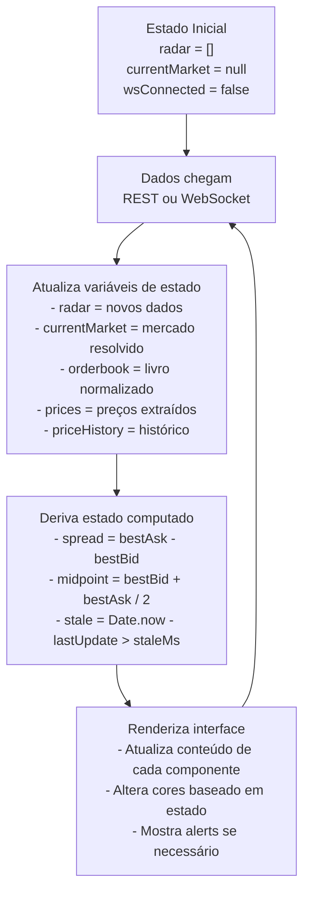

---

## 6. Boas Práticas de Arquitetura

### 6.1 Dependency Inversion

**Dependa de abstrações, não de implementações concretas.**

```typescript
// ❌ RUIM - Depende de implementação concreta
import { blessed } from "blessed";

function renderUI(data: MarketData) {
  const screen = blessed.screen({ ... });  // Acoplado ao blessed
  // ...
}

// ✅ BOM - Depende de abstração
interface Screen {
  render(): void;
  append(component: unknown): void;
}

function renderUI(screen: Screen, data: MarketData) {
  screen.append(...);  // Qualquer implementação de Screen
}
```

### 6.2 Don't Repeat Yourself (DRY)

**Não repita código. Extraia para funções reutilizáveis.**

```typescript
// ❌ RUIM - Repetição
const price1 = data.price !== undefined ? data.price : 0;
const price2 = data.best_price !== undefined ? data.best_price : 0;
const price3 = data.value !== undefined ? data.value : 0;

// ✅ BOM - Função reutilizável
function extractPrice(data: Record<string, unknown>) {
  return data.price ?? data.best_price ?? data.value ?? 0;
}

const price1 = extractPrice(data1);
const price2 = extractPrice(data2);
const price3 = extractPrice(data3);
```

### 6.3 Single Responsibility Principle (SRP)

**Cada função/módulo deve ter uma única responsabilidade.**

```typescript
// ❌ RUIM - Faz múltiplas coisas
async function processarMercado(id: string) {
  const raw = await fetch(`/markets/${id}`);
  const data = await raw.json();
  const normalized = normalizeMarket(data);
  const formatted = formatMarket(normalized);
  const rendered = renderMarket(formatted);
  return rendered;
}

// ✅ BOM - Cada função faz uma coisa
async function fetchMarket(id: string) { /* ... */ }
function normalizeMarket(data: unknown) { /* ... */ }
function formatMarket(market: MarketInfo) { /* ... */ }
function renderMarket(formatted: FormattedMarket) { /* ... */ }

// Composição
async function processarMercado(id: string) {
  const data = await fetchMarket(id);
  const normalized = normalizeMarket(data);
  const formatted = formatMarket(normalized);
  return renderMarket(formatted);
}
```

### 6.4 Fail Fast

**Erro cedo, erro loud.**

```typescript
// ❌ RUIM - Erro silencioso
function getMarketId(market: MarketInfo): string {
  return (market as any).conditionId ?? "default";
  // ↑ Se for undefined, retorna "default" silenciosamente
}

// ✅ BOM - Erro explícito
function getMarketId(market: MarketInfo): string {
  if (!market.conditionId) {
    throw new Error("Market must have a conditionId");
  }
  return market.conditionId;
}
```

---

## 7. Exercícios Práticos

### Exercício 1: Mapeie o Fluxo

Mapeie o fluxo completo de quando o usuário pressiona a tecla 'n' (próximo mercado):

1. Onde o keypress é capturado? (`tui.ts`)
2. Como o estado muda? (`currentOutcomeIndex`)
3. O que precisa ser recarregado? (WebSocket, REST)
4. Como a interface é atualizada? (`screen.render()`)

### Exercício 2: Adicione um Novo Endpoint

Adicione um novo endpoint fictício à API:

```typescript
// 1. Adicione a função em api.ts
export async function fetchMarketStats(marketId: string) {
  // ...
}

// 2. Adicione o rate limit em http.ts
const RATE_LIMITS = [
  // ...
  { host: "api.polymarket.com", path: "/stats", limit: 500 }
];

// 3. Chame de tui.ts para mostrar stats do mercado
```

### Exercício 3: Refatoração

Encontre um lugar no código onde DRY está sendo violado e refatore:

```typescript
// Dica: Procure por código repetido em api.ts
// Exemplo: fetchEvents, fetchMarkets são muito similares
// Extraia a lógica comum para uma função fetchPaginated()
```

---

## 8. Resumo do Capítulo

- **Arquitetura em camadas**: Apresentação → Domínio → Dados
- **Separação de responsabilidades**: Cada arquivo tem uma função clara
- **Configuração centralizada**: `config.ts` evita "magic numbers"
- **Padrões de design**: Singleton, Strategy, Factory, Retry
- **Fluxo de dados**: CLI → API → Parse → Estado → Render
- **Boas práticas**: DRY, SRP, Fail Fast

---

## 9. Para Saber Mais

- **Clean Architecture**: Robert C. Martin
- **Design Patterns**: Gang of Four
- **Refactoring**: Martin Fowler
- **The Pragmatic Programmer**: Andrew Hunt e David Thomas

---

## ✅ Check Your Understanding

### Pergunta 1: Separação de Responsabilidades

**Qual arquivo NÃO deve ter responsabilidade por:**

<details>
<summary>A) api.ts - Dados de mercado</summary>

❌ Não - api.ts DEVE ter responsabilidade por buscar dados de mercado
</details>

<details>
<summary>B) tui.ts - Interface de terminal</summary>

❌ Não - tui.ts DEVE ter responsabilidade por renderizar a interface
</details>

<details>
<summary>C) http.ts - Rate limiting (PARCIALMENTE CORRETA)</summary>

⚠️ Parcialmente correta - http.ts IMPLEMENTA rate limiting, mas a configuração de limits está nele.
A responsabilidade de DEFINIR os rate limits poderia estar em config.ts.
</details>

**Princípio:** Cada módulo deve ter UMA responsabilidade clara.

---

### Pergunta 2: Fluxo de Dados

**Coloque em ordem o fluxo de dados quando o usuário executa `bun run dev`:**

<details>
<summary>Resposta</summary>

1. index.ts → Parse argumentos CLI
2. market.ts → Resolve mercado (por slug/ID)
3. api.ts → Busca dados da Gamma API
4. ws.ts → Conecta WebSocket
5. api.ts → Busca order book/preços REST
6. parsers.ts → Normaliza dados
7. tui.ts → Renderiza interface
8. Loop → Atualiza com WebSocket + polling REST
</details>

---

### Pergunta 3: Singleton Pattern

**Por que usar Singleton para RateLimiter?**

<details>
<summary>Resposta</summary>

**Por que:**
- Precisamos de UMA única instância compartilhada
- Cada função fetchJson deve usar o MESMO rate limiter
- Assim respeitamos limites GLOBAIS da API

**Sem Singleton:**
```typescript
// ❌ Cada chamada cria seu próprio limiter
fetchJson(url1);  // limiter A (10 tokens)
fetchJson(url2);  // limiter B (10 tokens)
// Total: 20 requisições em 10 segundos → PODE EXCEDER LIMITE!
```

**Com Singleton:**
```typescript
// ✅ Todas chamadas compartilham o mesmo limiter
fetchJson(url1);  // limiter (10 tokens)
fetchJson(url2);  // limiter (9 tokens restantes)
// Total: 19 requisições em 10 segundos → RESPEITA LIMITE
```
</details>

---

## ⚠️ Common Pitfalls

### Pitfall: Acoplamento Alto

**❌ RUIM:**
```typescript
// tui.ts depende diretamente de implementação de API
import { fetchEvents } from "./api";

async function render() {
  const events = await fetchEvents(10);  // Acoplado!
  // ...
}
```

**Problema:**
Se `fetchEvents` mudar, `tui.ts` quebra. Difícil testar.

**✅ BOM:**
```typescript
// Interface (contrato)
interface MarketSource {
  getEvents(limit: number): Promise<Event[]>;
}

// tui.ts depende de interface, não implementação
async function render(source: MarketSource) {
  const events = await source.getEvents(10);
  // ...
}

// Uso
const api = new PolymarketAPI();
await render(api);  // Funciona com qualquer implementação de MarketSource
```

---

### Pitfall: Não Separar Camadas

**❌ RUIM - Tudo misturado:**
```typescript
// main.ts
async function main() {
  const response = await fetch("https://api.com/data");
  const data = await response.json();
  const normalized = normalizeData(data);
  const screen = blessed.screen({ /* ... */ });
  const box = blessed.box({ /* ... */ });
  box.setContent(JSON.stringify(normalized));
  screen.append(box);
  screen.render();
}
```

**✅ BOM - Camadas separadas:**
```typescript
// api.ts
async function fetchData() { /* ... */ }

// parsers.ts
function normalizeData(data) { /* ... */ }

// tui.ts
function renderData(data) { /* ... */ }

// main.ts (orquestração)
async function main() {
  const rawData = await fetchData();
  const normalized = normalizeData(rawData);
  renderData(normalized);
}
```

---

## 🔧 Troubleshooting

### Problema: "Circular Dependency"

**Erro:**
```
Error: Circular dependency detected
src/api.ts → src/market.ts → src/api.ts
```

**Causa:**
api.ts importa market.ts e market.ts importa api.ts.

**Solução:**
```typescript
// ✅ Opção 1: Mover funções compartilhadas para terceiro módulo
// src/types.ts - Define tipos que ambos usam
// src/utils.ts - Define funções utilitárias que ambos usam

// ✅ Opção 2: Inverter dependência
// Em vez de api.ts importar market.ts, faça market.ts receber market como parâmetro
```

**Prevenção:**
Desenhe o grafo de dependências antes de codificar. Evite ciclos.

---

## 🎯 Milestone Completado

Após completar este capítulo, você deve ser capaz de:

- [ ] Identificar as camadas da arquitetura
- [ ] Entender o fluxo de dados completo
- [ ] Localizar cada arquivo no projeto
- [ ] Explicar padrões de design usados
- [ ] Evitar acoplamento alto
- [ ] Separar responsabilidades corretamente

**Exercício Prático:**
Desenhe em papel o fluxo completo quando:
1. Usuário executa `--market 12345`
2. WebSocket recebe atualização de preço
3. Usuário pressiona 'n' (próximo mercado)

Compare com o diagrama do capítulo e discuta as diferenças.

---

## 🎓 Design Decisions

### Decisão 1: Por que arquitetura em 3 camadas?

**Alternativas Consideradas:**
1. **Monolito único** - Tudo em um arquivo
2. **2 camadas** - Apenas dados e apresentação
3. **3 camadas** - Apresentação, domínio, dados ✅ **ESCOLHIDO**
4. **Microserviços** - Serviços separados

**Trade-offs:**

| Arquitetura | Complexidade | Manutenibilidade | Testabilidade | Escalabilidade |
|-------------|--------------|-------------------|----------------|----------------|
| Monolito | ⭐ Muito baixa | ⭐ Muito baixa | ⭐ Muito baixa | ⭐ Muito baixa |
| 2 Camadas | ⭐⭐ Baixa | ⭐⭐ Baixa | ⭐⭐ Baixa | ⭐⭐ Baixa |
| 3 Camadas | ⭐⭐⭐ Média | ⭐⭐⭐⭐ Alta | ⭐⭐⭐⭐ Alta | ⭐⭐⭐ Média |
| Microserviços | ⭐⭐⭐⭐⭐ Muito alta | ⭐⭐⭐ Média | ⭐⭐⭐⭐ Alta | ⭐⭐⭐⭐⭐ Muito alta |

**Por que 3 camadas foi escolhido:**
- ✅ **Separação clara**: Cada camada tem responsabilidade única
- ✅ **Testabilidade**: Camadas podem ser testadas independentemente
- ✅ **Manutenibilidade**: Mudanças em uma camada não afetam outras
- ✅ **Flexibilidade**: Fácil trocar implementação de uma camada

**Exemplo de flexibilidade:**
```typescript
// Camada de dados pode ser trocada:
// De: api.ts (HTTP)
// Para: api-mock.ts (Dados mockados para testes)
// Camadas acima não precisam mudar!
```

**Referência no código:**
- `src/tui.ts` (Apresentação)
- `src/market.ts` (Domínio)
- `src/api.ts` (Dados)

---

### Decisão 2: Por que Singleton para Rate Limiter?

**Alternativas Consideradas:**
1. **Instância única global** - Variável global
2. **Singleton Pattern** - Classe com getInstance() ✅ **ESCOLHIDO**
3. **Dependency Injection** - Injetado como parâmetro

**Por que Singleton foi escolhido:**
- ✅ **Estado compartilhado**: Rate limiting precisa de contador global
- ✅ **Thread-safe**: Uma instância evita race conditions
- ✅ **Simplicidade**: Fácil de usar em qualquer lugar

**Risco:**
- ❌ **Difícil de testar**: Estado global entre testes
- **Mitigação**: Método `reset()` para limpar estado entre testes

**Referência no código:** `src/rateLimiter.ts` - Implementação Singleton

---

### Decisão 3: Por que separar `parsers.ts` de `api.ts`?

**Alternativas Consideradas:**
1. **Tudo em api.ts** - Fetch + parse junto
2. **Separado** - api.ts (fetch) + parsers.ts (parse) ✅ **ESCOLHIDO**

**Por que separação foi escolhida:**
- ✅ **Single Responsibility**: api.ts busca dados, parsers.ts converte
- ✅ **Reutilizável**: Parsers podem ser usados para dados de cache
- ✅ **Testável**: Fácil testar parsing sem fazer requisições reais

**Exemplo:**
```typescript
// api.ts
async function getOrderbook(tokenId) {
  const raw = await fetchJson(url);  // Busca dados
  return raw;  // Retorna bruto
}

// parsers.ts
function normalizeOrderbook(raw) {  // Converte
  // Lógica de normalização
  return normalized;
}
```

**Referência no código:**
- `src/api.ts:190-200` - Fetch de dados
- `src/parsers.ts:34-45` - Normalização

---

## 📚 Recursos Externos

### Aprender Mais Sobre:

**Arquitetura de Software:**
- [Clean Architecture](https://blog.cleancoder.com/uncle-bob/2012/08/13/the-clean-architecture.html) - Uncle Bob
- [Layered Architecture](https://en.wikipedia.org/wiki/Multilayered_architecture) - Wikipedia
- [Design Patterns](https://refactoring.guru/design-patterns) - Refactoring Guru

**Separation of Concerns:**
- [SOC Principle](https://en.wikipedia.org/wiki/Separation_of_concerns) - Wikipedia
- [Single Responsibility Principle](https://en.wikipedia.org/wiki/Single-responsibility_principle) - Wikipedia

**Dependency Injection:**
- [DI Explained](https://www.youtube.com/watch?v=IKD2-MAkXyQ) - YouTube (15 min)
- [Inversion of Control](https://martinfowler.com/articles/injection.html) - Martin Fowler

**Rate Limiting:**
- [Token Bucket Algorithm](https://en.wikipedia.org/wiki/Token_bucket) - Wikipedia
- [Rate Limiting Best Practices](https://cloud.google.com/architecture/rate-limiting-strategies-techniques) - Google Cloud

### Vídeos Recomendados:

- [Software Architecture Explained](https://www.youtube.com/watch?v=8640g_jWfqg) - YouTube (30 min)
- [Clean Code Principles](https://www.youtube.com/watch?v=7EmboKQH8lM) - YouTube (45 min)
- [Rate Limiting Strategies](https://www.youtube.com/watch?v=M9A7oQHs8QI) - YouTube (20 min)

---

**Próximo Capítulo:** Integração com APIs Polymarket

[Continue para o Capítulo 3](./03-apis-polymarket.md)
