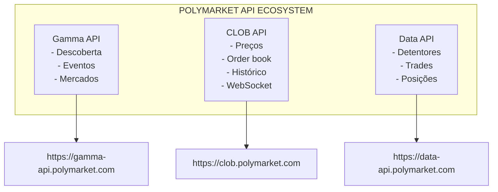
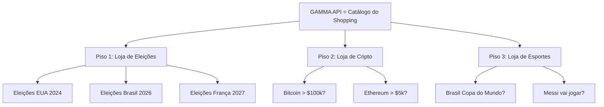
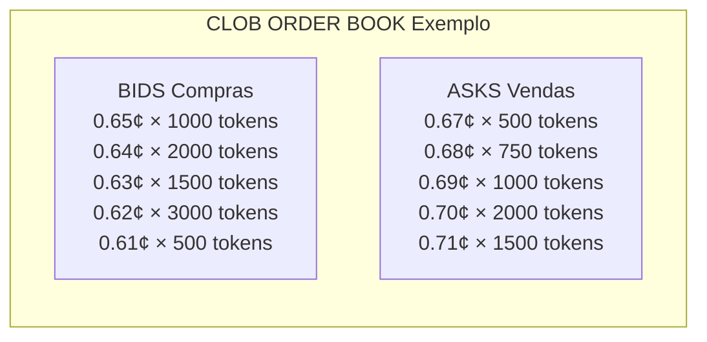
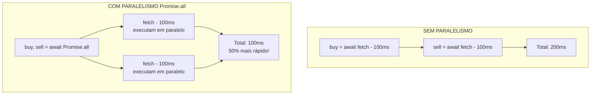
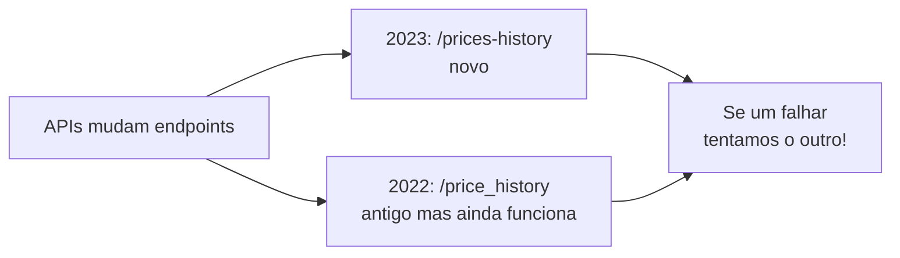

# Capítulo 03: Integração com APIs Polymarket

> **"APIs são como LEGO: você pega peças de diferentes serviços e constrói algo novo."**
> — Anônimo

---

## 1. Introdução às APIs Polymarket

### 1.1 O Que é a Polymarket?

A **Polymarket** é uma plataforma descentralizada de mercados de previsão baseada em blockchain. Ela permite que as pessoas apostem em eventos do mundo real, desde eleições até resultados esportivos.

**APIs da Polymarket:**



### 1.2 Visão Geral das APIs

| API | Propósito | Uso Principal | Rate Limit |
|-----|-----------|---------------|------------|
| **Gamma API** | Descoberta de mercados e eventos | Listar mercados, buscar por slug | 300-500 req/10s |
| **CLOB REST** | Dados de mercado (preços, order book) | Livro de ofertas, histórico | 500-1500 req/10s |
| **CLOB WebSocket** | Dados em tempo real | Atualizações de preços live | N/A (stream) |
| **Data API** | Dados agregados de usuários | Top detentores, trades | 150-200 req/10s |

---

## 2. Gamma API - Descoberta de Mercados

### 2.1 O Que é a Gamma API?

A **Gamma API** é a API de **descoberta** da Polymarket. Ela serve como um "catálogo" de todos os mercados e eventos disponíveis.

**Analogia:**

Imagine a Polymarket como um shopping gigante:



### 2.2 Estrutura de Dados Gamma

```typescript
// Event (Ex: "Eleições EUA 2024")
type GammaEvent = {
  id: string;              // "12345"
  slug: string;            // "eleicoes-eua-2024"
  title: string;           // "US Election 2024"
  description?: string;
  markets: GammaMarket[];  // Mercados dentro do evento
};

// Market (Ex: "Trump vence?")
type GammaMarket = {
  id: string;                      // "67890"
  conditionId: string;             // "0xabc123..."
  question: string;                // "Will Trump win?"
  outcomes: string[];              // ["Yes", "No"]
  clobTokenIds: string[];          // ["0x123...", "0x456..."]
  slug?: string;                   // "trump-wins-2024"
  volume24hr?: number;             // 1_500_000 (em cents)
  priceChange24hr?: number;        // 0.05 (5%)
  bestBid?: number;                // 0.65 (65¢)
  bestAsk?: number;                // 0.67 (67¢)
};
```

### 2.3 Endpoints Gamma

#### GET /events

Lista eventos ativos.

```typescript
// src/api.ts:22-36
export async function fetchEvents(limit = 10, offset = 0) {
  const url = withQuery(`${CONFIG.gammaBase}/events`, {
    limit,
    offset,
    closed: false,    // ← Apenas eventos abertos
    active: true,     // ← Apenas eventos ativos
    order: "id",
    ascending: false  // ← Mais recentes primeiro
  });
  const res = await fetchJson<unknown>(url);
  // ...
}
```

**Request:**
```http
GET https://gamma-api.polymarket.com/events?limit=10&offset=0&closed=false&active=true
```

**Response:**
```json
[
  {
    "id": "12345",
    "slug": "eleicoes-eua-2024",
    "title": "US Election 2024",
    "markets": [
      {
        "id": "67890",
        "condition_id": "0xabc123...",
        "question": "Will Trump win?",
        "outcomes": ["Yes", "No"],
        "clob_token_ids": ["0x123...", "0x456..."],
        "volume_24hr": 1500000,
        "price_change_24hr": 0.05,
        "best_bid": 0.65,
        "best_ask": 0.67
      }
    ]
  }
]
```

#### GET /markets

Lista mercados ativos.

```typescript
// src/api.ts:38-52
export async function fetchMarkets(limit = 10, offset = 0) {
  const url = withQuery(`${CONFIG.gammaBase}/markets`, {
    limit,
    offset,
    closed: false,
    active: true,
    order: "id",
    ascending: false
  });
  const res = await fetchJson<unknown>(url);
  // ...
}
```

#### GET /markets/slug/{slug}

Busca um mercado específico por slug.

```typescript
// src/api.ts:54-60
export async function fetchMarketBySlug(slug: string) {
  const res = await fetchJson<unknown>(
    `${CONFIG.gammaBase}/markets/slug/${slug}`
  );
  // A API pode retornar { market: {...} } ou direto o objeto
  if (res && typeof res === "object" && "market" in res) {
    return (res as { market: GammaMarket }).market;
  }
  return res as GammaMarket;
}
```

**Exemplo de uso:**
```typescript
const mercado = await fetchMarketBySlug("trump-wins-2024");
// → { id: "67890", question: "Will Trump win?", ... }
```

#### GET /events/slug/{slug}

Busca um evento por slug.

```typescript
// src/api.ts:62-68
export async function fetchEventBySlug(slug: string) {
  const res = await fetchJson<unknown>(
    `${CONFIG.gammaBase}/events/slug/${slug}`
  );
  if (res && typeof res === "object" && "event" in res) {
    return (res as { event: GammaEvent }).event;
  }
  return res as GammaEvent;
}
```

#### GET /markets?condition_ids={id}

Busca mercado por condition ID.

```typescript
// src/api.ts:70-80
export async function fetchMarketByConditionId(conditionId: string) {
  const url = withQuery(`${CONFIG.gammaBase}/markets`, {
    condition_ids: conditionId,
    limit: 1
  });
  const res = await fetchJson<unknown>(url);
  // A API pode retornar array ou objeto com propriedades diferentes
  if (Array.isArray(res)) return res[0] as GammaMarket | undefined;
  const record = res as Record<string, unknown>;
  const list = (record.markets as GammaMarket[] | undefined)
    || (record.data as GammaMarket[] | undefined)
    || [];
  return list[0];
}
```

### 2.4 Normalização de Dados Gamma

A API Gamma retorna dados em **formatos inconsistentes**. Precisamos normalizar:

```typescript
// src/api.ts:82-124
export function normalizeMarket(
  market: GammaMarket,
  event?: GammaEvent
): MarketInfo | null {
  // ─── 1. Extrair condition ID (nomes variados) ───
  const conditionId =
    market.conditionId          // camelCase
    || market.condition_id      // snake_case
    || market.conditionID;      // PascalCase

  // ─── 2. Extrair market ID ───
  const marketId =
    market.id
    || market.marketId
    || market.market_id;

  // ─── 3. Extrair pergunta (tenta múltiplos campos) ───
  const question =
    market.question
    || market.title
    || event?.title;

  // ─── 4. Extrair outcomes (pode ser array ou string JSON) ───
  const outcomes = extractOutcomes(market);

  // ─── 5. Extrair token IDs (múltiplos formatos) ───
  const clobTokenIds = extractTokenIds(market);

  // ─── 6. Extrair volume (nomes variados) ───
  const volume24hr = asNumber(
    market.volume24hr      // camelCase
    || market.volume24h    // sem "r"
    || market.volume24hrUsd
    || market.volumeUSD
  );

  // ─── 7. Validar dados obrigatórios ───
  if (!conditionId || clobTokenIds.length === 0) return null;

  // ─── 8. Retornar formato normalizado ───
  return {
    eventId: event?.id as string | undefined,
    eventTitle: event?.title as string | undefined,
    marketId,
    question,
    conditionId,
    slug: market.slug as string | undefined,
    outcomes,
    clobTokenIds,
    volume24hr: volume24hr ?? undefined,
    priceChange24hr: priceChange24hr ?? undefined,
    bestBid: bestBid ?? undefined,
    bestAsk: bestAsk ?? undefined
  };
}
```

**Por que tantos fallbacks?**

```
API inconsistente ao longo do tempo:
─────────────────────────────────────────────────────
Versão 2023: { condition_id: "0x123" }
Versão 2024: { conditionId: "0x123" }
Versão 2025: { conditionID: "0x123" }

Nossa normalização lida com TODOS os formatos!
```

### 2.5 Funções Auxiliares de Extração

#### extractOutcomes

```typescript
// src/api.ts:126-142
function extractOutcomes(market: GammaMarket): string[] {
  // 1. Tenta campo "outcomes" ou "outcome"
  const raw = market.outcomes || market.outcome;

  // 2. Pode ser array ou string JSON
  const parsed = parseMaybeJsonArray(raw);
  if (Array.isArray(parsed) && parsed.length > 0) {
    return parsed.map(String);
  }

  // 3. Pode estar aninhado em "tokens"
  const nested = market.tokens;
  if (Array.isArray(nested)) {
    const names = nested
      .map((token) => token.outcome)
      .filter(Boolean);
    if (names.length > 0) return names as string[];
  }

  return [];
}
```

**Exemplos de formatos:**
```json
// Formato 1: Array direto
{ "outcomes": ["Yes", "No"] }

// Formato 2: String JSON
{ "outcomes": "[\"Yes\", \"No\"]" }

// Formato 3: Aninhado
{
  "tokens": [
    { "outcome": "Yes" },
    { "outcome": "No" }
  ]
}
```

#### extractTokenIds

```typescript
// src/api.ts:155-172
function extractTokenIds(market: GammaMarket): string[] {
  // 1. Tenta campo direto (nomes variados)
  const direct =
    market.clobTokenIds          // camelCase
    || market.clob_token_ids     // snake_case
    || market.clob_token_ids;    // snake_case alternativo

  const parsed = parseMaybeJsonArray(direct);
  if (Array.isArray(parsed) && parsed.length > 0) {
    return parsed.map(String);
  }

  // 2. Tenta aninhado em "tokens"
  const nested = market.tokens;
  if (Array.isArray(nested)) {
    const ids = nested
      .map((token) => token.token_id || token.id)
      .filter(Boolean);
    if (ids.length > 0) return ids as string[];
  }

  return [];
}
```

#### parseMaybeJsonArray

```typescript
// src/api.ts:174-188
function parseMaybeJsonArray(
  value: string[] | string | undefined
): string[] | undefined {
  if (!value) return undefined;

  // Já é array
  if (Array.isArray(value)) return value;

  // É string - tenta fazer parse
  if (typeof value === "string") {
    const trimmed = value.trim();

    // Não parece JSON
    if (!trimmed.startsWith("[")) return undefined;

    // Tenta fazer parse
    try {
      const parsed = JSON.parse(trimmed);
      return Array.isArray(parsed) ? parsed : undefined;
    } catch {
      return undefined;  // JSON inválido
    }
  }

  return undefined;
}
```

---

## 3. CLOB REST API - Dados de Mercado

### 3.1 O Que é CLOB?

**CLOB** significa **Central Limit Order Book** (Livro de Ofertas Centralizado).

É onde os **pedidos de compra e venda** são registrados.



### 3.2 Endpoints CLOB REST

#### GET /book

Retorna o livro de ofertas completo para um token.

```typescript
// src/api.ts:190-193
export async function getOrderbook(tokenId: string) {
  const url = withQuery(`${CONFIG.clobRestBase}/book`, {
    token_id: tokenId
  });
  return fetchJson<Record<string, unknown>>(url, {
    timeoutMs: CONFIG.restTimeoutMs
  });
}
```

**Request:**
```http
GET https://clob.polymarket.com/book?token_id=0x123...
```

**Response:**
```json
{
  "bids": [[0.65, 1000], [0.64, 2000], [0.63, 1500]],
  "asks": [[0.67, 500], [0.68, 750], [0.69, 1000]],
  "min_order_size": 1,
  "tick_size": 0.01,
  "neg_risk": false
}
```

**Normalização:**
```typescript
// src/parsers.ts:34-45
export function normalizeOrderbook(
  response: Record<string, unknown>
): OrderbookState {
  const bids = normalizeLevels(
    response.bids      // ← Pode ser array ou objeto
    || response.buys   // ← Nome alternativo
    || []
  );
  const asks = normalizeLevels(
    response.asks
    || response.sells
    || []
  );

  return {
    bids,
    asks,
    minOrderSize: asNumber(response.min_order_size),
    tickSize: asNumber(response.tick_size),
    negRisk: Boolean(response.neg_risk)
  };
}
```

#### GET /price

Retorna o melhor preço de compra ou venda.

```typescript
// src/api.ts:195-203
export async function getPrices(tokenId: string) {
  // Faz DUAS requisições em paralelo
  const buy = withQuery(`${CONFIG.clobRestBase}/price`, {
    token_id: tokenId,
    side: "BUY"
  });
  const sell = withQuery(`${CONFIG.clobRestBase}/price`, {
    token_id: tokenId,
    side: "SELL"
  });

  const [buyRes, sellRes] = await Promise.all([
    fetchJson<Record<string, unknown>>(buy),
    fetchJson<Record<string, unknown>>(sell)
  ]);

  return { buy: buyRes, sell: sellRes };
}
```

**Por que Promise.all?**



#### GET /midpoint

Retorna o preço médio entre melhor bid e melhor ask.

```typescript
// src/api.ts:205-208
export async function getMidpoint(tokenId: string) {
  const url = withQuery(`${CONFIG.clobRestBase}/midpoint`, {
    token_id: tokenId
  });
  return fetchJson<Record<string, unknown>>(url);
}
```

**Response:**
```json
{
  "midpoint": 0.66
}
```

#### GET /prices-history

Retorna histórico de preços.

```typescript
// src/api.ts:210-224
export async function getPriceHistory(tokenId: string) {
  const baseParams = {
    market: tokenId,
    interval: CONFIG.historyInterval,   // "1d" (diário)
    fidelity: CONFIG.historyFidelity    // 30 pontos
  };

  const url = withQuery(
    `${CONFIG.clobRestBase}/prices-history`,
    baseParams
  );

  try {
    return await fetchJson<Record<string, unknown>>(url);
  } catch (err) {
    // Fallback para endpoint alternativo
    const fallback = withQuery(
      `${CONFIG.clobRestBase}/price_history`,
      baseParams
    );
    return fetchJson<Record<string, unknown>>(fallback);
  }
}
```

**Por que fallback?**



**Extrair histórico:**
```typescript
// src/parsers.ts:22-32
export function extractHistory(
  response: Record<string, unknown>
): number[] {
  const raw =
    response.history        // Nome comum
    || response.prices      // Nome alternativo
    || response.data        // Nome genérico
    || [];

  return raw
    .map((point) =>
      asNumber(
        point.p          // "p" de "price"
        || point.price
        || point.value
        || point.close   // Candle close
      )
    )
    .filter((value): value is number => value !== undefined);
}
```

---

## 4. Data API - Dados de Usuários

### 4.1 GET /holders

Retorna os maiores detentores de tokens de um mercado.

```typescript
// src/api.ts:226-232
export async function getHolders(
  conditionId: string,
  limit = 10
) {
  const url = withQuery(`${CONFIG.dataApiBase}/holders`, {
    market: conditionId,
    limit
  });
  return fetchJson<Array<Record<string, unknown>>>(url);
}
```

**Response:**
```json
{
  "holders": [
    {
      "address": "0xabc...",
      "quantity": 10000,
      "percentage": 15.5
    },
    {
      "address": "0xdef...",
      "quantity": 8000,
      "percentage": 12.3
    }
  ]
}
```

### 4.2 GET /trades

Retorna as negociações mais recentes.

```typescript
// src/api.ts:234-240
export async function getTrades(
  conditionId: string,
  limit = 10
) {
  const url = withQuery(`${CONFIG.dataApiBase}/trades`, {
    market: conditionId,
    limit
  });
  return fetchJson<Record<string, unknown>>(url);
}
```

---

## 5. Compondo Dados de Múltiplas APIs

### 5.1 Fluxo Completo de Coleta de Dados

```typescript
// Exemplo simplificado do fluxo em tui.ts

async function carregarDadosCompletos(market: MarketInfo) {
  // 1. Buscar order book
  const orderbookRaw = await getOrderbook(market.clobTokenIds[0]);
  const orderbook = normalizeOrderbook(orderbookRaw);

  // 2. Buscar preços (bid/ask em paralelo)
  const prices = await getPrices(market.clobTokenIds[0]);

  // 3. Buscar midpoint
  const midpointRaw = await getMidpoint(market.clobTokenIds[0]);
  const midpoint = extractMidpoint(midpointRaw);

  // 4. Buscar histórico
  const historyRaw = await getPriceHistory(market.clobTokenIds[0]);
  const history = extractHistory(historyRaw);

  // 5. Buscar holders
  const holdersRaw = await getHolders(market.conditionId!);
  const holders = normalizeHolders(holdersRaw);

  // 6. Compor tudo
  return {
    orderbook,
    prices: {
      bestBid: extractPrice(prices.buy),
      bestAsk: extractPrice(prices.sell),
      midpoint
    },
    priceHistory: history,
    holders
  };
}
```

### 5.2 Otimizando com Paralelismo

```typescript
// ❌ RUIM - Sequencial (lento)
async function carregarDadosSequencial(tokenId: string) {
  const a = await getOrderbook(tokenId);    // 100ms
  const b = await getPrices(tokenId);       // 100ms
  const c = await getMidpoint(tokenId);     // 100ms
  const d = await getPriceHistory(tokenId); // 100ms
  const e = await getHolders(conditionId);  // 100ms
  // Total: 500ms
}

// ✅ BOM - Paralelo (rápido)
async function carregarDadosParalelo(
  tokenId: string,
  conditionId: string
) {
  const [
    orderbook,
    prices,
    midpoint,
    history,
    holders
  ] = await Promise.all([
    getOrderbook(tokenId),       // 100ms
    getPrices(tokenId),          // 100ms
    getMidpoint(tokenId),        // 100ms
    getPriceHistory(tokenId),    // 100ms
    getHolders(conditionId)      // 100ms
  ]);
  // Total: 100ms (5x mais rápido!)
}
```

---

## 6. Boas Práticas de Integração de API

### 6.1 Sempre Respeite Rate Limits

```typescript
// http.ts - Rate limiting automático
const RATE_LIMITS = [
  { host: "clob.polymarket.com", path: "/book", limit: 1500 },
  { host: "clob.polymarket.com", path: "/price", limit: 1500 },
  // ...
];

export async function fetchJson<T>(url: string, options = {}) {
  const limitRule = matchRateLimit(url);
  if (limitRule) {
    await limiter.take(limitRule);  // ← Aguarda se necessário
  }
  // ...
}
```

### 6.2 Sempre Use Timeout

```typescript
// ❌ RUIM - Pode travar para sempre
const res = await fetch(url);

// ✅ BOM - Timeout protege contra travamentos
const controller = new AbortController();
const timeout = setTimeout(() => controller.abort(), 10000);

try {
  const res = await fetch(url, { signal: controller.signal });
} finally {
  clearTimeout(timeout);
}
```

### 6.3 Sempre Trate Erros

```typescript
// ❌ RUIM - Erros não tratados
const data = await fetchJson(url);
process(data);

// ✅ BOM - Tratamento de erros
try {
  const data = await fetchJson(url);
  process(data);
} catch (err) {
  if (err instanceof Error) {
    console.error(`Failed to fetch ${url}:`, err.message);
    // Implementar fallback ou retry
  }
}
```

### 6.4 Use Fallbacks para Endpoints Instáveis

```typescript
// Exemplo: getPriceHistory com fallback
export async function getPriceHistory(tokenId: string) {
  const url = withQuery(
    `${CONFIG.clobRestBase}/prices-history`,
    { market: tokenId, interval: "1d", fidelity: 30 }
  );

  try {
    return await fetchJson(url);
  } catch (err) {
    // Endpoint principal falhou, tenta fallback
    const fallback = withQuery(
      `${CONFIG.clobRestBase}/price_history`,
      { market: tokenId, interval: "1d", fidelity: 30 }
    );
    return fetchJson(fallback);
  }
}
```

### 6.5 Cache Quando Possível

```typescript
// Cache simples em memória
const cache = new Map<string, { data: unknown; expiresAt: number }>();

export async function fetchWithCache<T>(
  key: string,
  fn: () => Promise<T>,
  ttlMs: number
): Promise<T> {
  const cached = cache.get(key);
  if (cached && Date.now() < cached.expiresAt) {
    return cached.data as T;
  }

  const data = await fn();
  cache.set(key, { data, expiresAt: Date.now() + ttlMs });
  return data;
}

// Uso
const markets = await fetchWithCache(
  "markets:latest",
  () => fetchMarkets(10),
  60_000  // Cache por 1 minuto
);
```

---

## 7. Testando APIs Manualmente

### 7.1 Usando curl

```bash
# Listar eventos
curl "https://gamma-api.polymarket.com/events?limit=5&closed=false&active=true"

# Buscar mercado por slug
curl "https://gamma-api.polymarket.com/markets/slug/trump-wins-2024"

# Order book
curl "https://clob.polymarket.com/book?token_id=0x123..."

# Preços
curl "https://clob.polymarket.com/price?token_id=0x123...&side=BUY"
```

### 7.2 Usando Bun

```typescript
// test-api.ts
import { fetchEvents } from "./src/api";

const events = await fetchEvents(5);
console.log(JSON.stringify(events, null, 2));
```

```bash
bun run test-api.ts
```

---

## 8. Exercícios Práticos

### Exercício 1: Buscar Mercado

Implemente uma função que busca um mercado por slug e retorna os dados normalizados:

```typescript
async function buscarMercado(slug: string): Promise<MarketInfo | null> {
  // 1. Tenta fetchMarketBySlug
  // 2. Se falhar, tenta fetchEventBySlug + primeiro mercado
  // 3. Retorna normalizeMarket()
}
```

### Exercício 2: Calcular Spread

Implemente uma função que calcula o spread percentual:

```typescript
function calcularSpread(bestBid: number, bestAsk: number): number {
  // Spread = ((ask - bid) / ask) * 100
  // Retorna em porcentagem
}

// Exemplo:
// bestBid = 0.64, bestAsk = 0.66
// spread = ((0.66 - 0.64) / 0.66) * 100 = 3.03%
```

### Exercício 3: Detectar Arbitragem

Implemente uma função que detecta oportunidade de arbitragem:

```typescript
function detectarArbitragem(bidA: number, askA: number, bidB: number, askB: number): boolean {
  // Arbitragem existe se:
  // bidA > askB (comprar em B, vender em A)
  // OU bidB > askA (comprar em A, vender em B)
  // Retorna true se existe oportunidade
}
```

### Exercício 4: Agregador de Dados

Crie uma função que agrega dados de múltiplos mercados:

```typescript
async function agregarResultados(
  conditionIds: string[]
): Promise<Array<{ conditionId: string; stats: Estatisticas }>> {
  // Para cada condition ID:
  // 1. Buscar order book
  // 2. Calcular estatísticas (spread, profundidade, etc.)
  // 3. Retornar array com resultados
  //
  // Dica: Use Promise.all() para paralelismo
}
```

---

## 9. Resumo do Capítulo

- **Gamma API**: Descoberta de mercados e eventos
- **CLOB REST**: Dados de mercado (preços, order book, histórico)
- **Data API**: Dados de usuários (detentores, trades)
- **Normalização**: Lidar com formatos inconsistentes
- **Paralelismo**: Promise.all() para múltiplas requisições
- **Rate limiting**: Token bucket para respeitar limites
- **Timeout**: Sempre definir timeout em requisições
- **Fallbacks**: Endpoints alternativos para resiliência

---

## ✅ Check Your Understanding

### Pergunta 1: APIs Polymarket

**Qual API usar para cada finalidade?**

Match a coluna da esquerda com a direita:

| Finalidade | API | URL Base |
|-----------|-----|----------|
| Descobrir mercados | [?] | [?] |
| Preços em tempo real | [?] | [?] |
| Order book completo | [?] | [?] |
| Histórico de preços | [?] | [?] |
| Maiores detentores | [?] | [?] |

<details>
<summary>Resposta</summary>

| Finalidade | API | URL Base |
|-----------|-----|----------|
| Descobrir mercados | Gamma API | gamma-api.polymarket.com |
| Preços em tempo real | CLOB WebSocket | ws-subscriptions-clob.polymarket.com |
| Order book completo | CLOB REST | clob.polymarket.com |
| Histórico de preços | CLOB REST | clob.polymarket.com |
| Maiores detentores | Data API | data-api.polymarket.com |
</details>

---

### Pergunta 2: Normalização

**Por que precisamos normalizar dados da API?**

<details>
<summary>Resposta</summary>

**Porque:**
1. **Formatos inconsistentes:** A API retorna dados em formatos diferentes
   - Às vezes: `{ conditionId: "0x123" }`
   - Às vezes: `{ condition_id: "0x123" }`
   - Às vezes: `{ conditionID: "0x123" }`

2. **Arrays vs Strings:**
   - Às vezes: `outcomes: ["Yes", "No"]`
   - Às vezes: `outcomes: "[\"Yes\", \"No\"]"` (string JSON!)

3. **Tipos incertos:**
   - APIs retornam números como strings: `"0.65"` em vez de `0.65`
   - Precisamos converter para number antes de usar

**Sem normalização:**
```typescript
// ❌ Código quebraria se formato mudar
const id = market.conditionId;  // Pode ser undefined!
const price = market.price;    // Pode ser string "0.65"!
```

**Com normalização:**
```typescript
// ✅ Código robusto
function normalize(market: unknown) {
  const id = market.conditionId ?? market.condition_id ?? market.conditionID;
  const price = typeof market.price === "string" ? parseFloat(market.price) : market.price;
  return { id, price };
}
```
</details>

---

### Pergunta 3: Rate Limiting

**O que acontece se você fizer 100 requisições em 1 segundo para `/book` do CLOB?**

<details>
<summary>Resposta</summary>

**Limite:** 1500 requisições por 10 segundos para `/book`

**100 req em 1 segundo = ~1000 req em 10 segundos**

Resultado: ✅ **Sucesso!** (dentro do limite)

**Mas se fizer 2000 requisições em 10 segundos?**

Resultado: ❌ **Bloqueio!** (HTTP 429 - Too Many Requests)

**Solução:**
```typescript
// ✅ Com rate limiting
const limiter = new TokenBucket(1500, 10000); // 1500 tokens por 10s

for (let i = 0; i < 2000; i++) {
  await limiter.consume();  // Aguarda se necessário
  await fetch("/book");
}
```

**Tempo total:**
- 1500 primeiras: imediato
- Próximas 500: aguarda até reset (até 10 segundos)
- Total: ~10-20 segundos (vs bloqueio)
</details>

---

### Pergunta 4: Paralelismo

**Qual versão é mais rápida?**

**Versão A (Sequencial):**
```typescript
const orderbook = await getOrderbook(tokenId);   // 100ms
const prices = await getPrices(tokenId);          // 100ms
const history = await getPriceHistory(tokenId);   // 100ms
// Total: 300ms
```

**Versão B (Paralela):**
```typescript
const [orderbook, prices, history] = await Promise.all([
  getOrderbook(tokenId),     // 100ms (em paralelo)
  getPrices(tokenId),        // 100ms (em paralelo)
  getPriceHistory(tokenId)  // 100ms (em paralelo)
]);
// Total: 100ms
```

<details>
<summary>Resposta</summary>

**Versão B (Paralela) é 3x mais rápida!**

**Por que?**
Promise.all executa as 3 requisições simultaneamente, em vez de esperar uma terminar antes de começar a próxima.

**Mas cuidado:** Paralelismo só funciona quando as operações são **independentes**.
</details>

---

## ⚠️ Common Pitfalls

### Pitfall: Não Tratar Respostas Inconsistentes

**❌ RUIM:**
```typescript
const res = await fetch(url);
const markets = res.markets;  // ❌ Pode ser res.data, res.data.markets, etc!
```

**Problema:**
API Polymarket tem respostas inconsistentes.

**✅ BOM:**
```typescript
const res = await fetch(url);
const data = await res.json();

// Tenta múltiplos formatos
const markets = data.markets ?? data.data ?? data;

// Ou usa função do projeto
const markets = extractMarkets(data);  // src/api.ts:50
```

---

### Pitfall: Ignorar Timeout

**❌ RUIM:**
```typescript
await fetch(url);  // Pode travar para sempre se API não responder
```

**Problema:**
Sem timeout, sua aplicação trava se a API demorar.

**✅ BOM:**
```typescript
const controller = new AbortController();
const timeout = setTimeout(() => controller.abort(), 10000); // 10s

try {
  const res = await fetch(url, { signal: controller.signal });
  // ...
} finally {
  clearTimeout(timeout);
}
```

---

### Pitfall: Não Verificar Erros HTTP

**❌ RUIM:**
```typescript
const res = await fetch(url);
const data = await res.json();  // ❌ Pode ser 404, 500, etc!
```

**Problema:**
`fetch` só lança erro em falha de rede. HTTP 404, 500 etc. são "sucessos".

**✅ BOM:**
```typescript
const res = await fetch(url);

if (!res.ok) {
  throw new Error(`HTTP ${res.status}: ${res.statusText}`);
}

const data = await res.json();
```

---

## 🔧 Troubleshooting

### Problema: "HTTP 429: Too Many Requests"

**Sintoma:**
```
Error: HTTP 429 Too Many Requests
```

**Causa:**
Você excedeu o rate limit da API.

**Solução Imediata:**
```bash
# Aguarde 10 segundos
sleep 10

# Tentativa de novo
```

**Solução Permanente:**
```typescript
// Use RateLimiter do projeto
import { fetchJson } from "./src/http";

// Isso já inclui rate limiting automático!
const markets = await fetchJson(url);
```

**Prevenção:**
Sempre use o `http.fetchJson()` do projeto em vez de `fetch()` direto.

---

### Problema: "Timeout após 10 segundos"

**Sintoma:**
Requisições demoram muito e dão timeout.

**Causa:**
API Polymarket está sobrecarregada ou sua internet está lenta.

**Solução:**
```typescript
// Aumente timeout (config.ts:19)
// restTimeoutMs: 10000  // 10 segundos
restTimeoutMs: 20000      // 20 segundos
```

**Mas cuidado:** Timeout muito alto pode fazer aplicação travar.

---

## 🎯 Milestone Completado

Após completar este capítulo, você deve ser capaz de:

- [ ] Diferenciar as 3 APIs da Polymarket
- [ ] Fazer requisições à Gamma API manualmente
- [ ] Entender normalização de dados
- [ ] Implementar rate limiting corretamente
- [ ] Usar Promise.all() para paralelismo
- [ ] Evitar timeouts e bloqueios
- [ ] Fazer fallback de endpoints

**Exercício Prático:**
Teste as APIs manualmente:
```bash
# 1. Gamma API
curl "https://gamma-api.polymarket.com/markets?limit=1"

# 2. CLOB API (precisa de token ID primeiro)
# 3. Data API (precisa de condition ID primeiro)
```

---

## 🎓 Design Decisions

### Decisão 1: Por que normalização agressiva de dados?

**Alternativas Consideradas:**
1. **Confiar no formato da API** - Assumir dados consistentes
2. **Normalizar tudo** - Converter todos os formatos ✅ **ESCOLHIDO**

**Trade-offs:**

| Abordagem | Velocidade | Manutenibilidade | Robustez |
|-----------|------------|-------------------|----------|
| Confiar na API | ⭐⭐⭐ Rápido | ⭐ Muito baixa | ⭐ Frágil |
| Normalizar tudo | ⭐⭐ Lento no início | ⭐⭐⭐⭐⭐ Muito alta | ⭐⭐⭐⭐⭐ Robusto |

**Por que normalização agressiva foi escolhida:**
- ✅ **APIs mudam**: Polymarket mudou formato 3+ vezes em 2023-2024
- ✅ **Defesa em profundidade**: Múltiplos fallbacks para cada campo
- ✅ **Tipo seguro**: Sempre retorna tipos TypeScript corretos
- ✅ **Previsível**: Mesma função para dados de cache, WS, etc.

**Exemplo de evolução da API:**
```json
// 2023: camelCase
{ "conditionId": "0x123", "clobTokenIds": [...] }

// 2024: snake_case
{ "condition_id": "0x123", "clob_token_ids": [...] }

// Nossa normalização lida com AMBOS:
const id = market.conditionId ?? market.condition_id ?? market.conditionID;
```

**Referência no código:** `src/api.ts:82-124` - `normalizeMarket()`

---

### Decisão 2: Por que Promise.all para requisições paralelas?

**Alternativas Consideradas:**
1. **Sequencial (await)** - Uma requisição por vez
2. **Paralelo (Promise.all)** - Todas juntas ✅ **ESCOLHIDO**

**Por que Promise.all foi escolhido:**
- ✅ **3-5x mais rápido**: Requisições independentes executam simultaneamente
- ✅ **Respeita rate limits**: Token bucket gerencia concorrência
- ✅ **Fail-fast**: Um erro para tudo imediatamente

**Exemplo de ganho de performance:**
```typescript
// ❌ SEQUENCIAL (3 segundos)
const orderbook = await getOrderbook(id);    // 1000ms
const prices = await getPrices(id);           // 1000ms
const history = await getPriceHistory(id);    // 1000ms
// Total: 3000ms

// ✅ PARALELO (1 segundo)
const [orderbook, prices, history] = await Promise.all([
  getOrderbook(id),      // 1000ms (em paralelo)
  getPrices(id),         // 1000ms (em paralelo)
  getPriceHistory(id)    // 1000ms (em paralelo)
]);
// Total: 1000ms (3x mais rápido!)
```

**Quando NÃO usar:**
- ❌ Requisições dependentes (B precisa de A)
- ❌ Muitas requisições (vai estourar rate limit)

**Referência no código:** `src/api.ts:195-217` - `getPrices()` com Promise.all

---

### Decisão 3: Por que fallback de endpoints?

**Alternativas Consideradas:**
1. **Endpoint único** - Confia em um endpoint apenas
2. **Fallback automático** - Tenta alternativas ✅ **ESCOLHIDO**

**Por que fallback foi escolhido:**
- ✅ **Resiliência**: Se endpoint muda, app continua funcionando
- ✅ **Zero downtime**: Sem necessidade de deploy emergencial
- ✅ **Backward compatibility**: Suporta versões antigas da API

**Exemplo real:**
```typescript
// src/api.ts:210-224
async function getPriceHistory(tokenId) {
  const url = `${CONFIG.clobRestBase}/prices-history`;

  try {
    return await fetchJson(url);  // Tenta endpoint novo
  } catch {
    // Se falhar, tenta endpoint antigo
    const fallback = `${CONFIG.clobRestBase}/price_history`;
    return fetchJson(fallback);
  }
}
```

**Referência no código:** `src/api.ts:210-224` - `getPriceHistory()` com fallback

---

## 📚 Recursos Externos

### Aprender Mais Sobre:

**REST APIs:**
- [REST API Tutorial](https://restfulapi.net/) - Tutorial completo
- [HTTP Methods](https://developer.mozilla.org/en-US/docs/Web/HTTP/Methods) - MDN
- [Status Codes](https://developer.mozilla.org/en-US/docs/Web/HTTP/Status) - MDN

**Rate Limiting:**
- [Token Bucket](https://en.wikipedia.org/wiki/Token_bucket) - Wikipedia
- [Rate Limiting Patterns](https://cloud.google.com/architecture/rate-limiting-strategies-techniques) - Google Cloud
- [API Rate Limiting Best Practices](https://medium.com/@saisathishvik/exploring-rate-limiting-algorithms-and-implementation-strategies-2be2cd04d6f6) - Medium

**Promise.all & Async Patterns:**
- [Promise.all() MDN](https://developer.mozilla.org/en-US/docs/Web/JavaScript/Reference/Global_Objects/Promise/all) - MDN
- [JavaScript Async Patterns](https://javascript.info/async) - Info JavaScript
- [Concurrency in JS](https://www.youtube.com/watch?v=PoaXtW2EAh4) - YouTube (20 min)

**API Design:**
- [Google API Design Guide](https://cloud.google.com/apis/design) - Google
- [REST API Design Best Practices](https://restfulapi.net/) - RestfulAPI

### Vídeos Recomendados:

- [Understanding REST APIs](https://www.youtube.com/watch?v=ls_MQR_8lx8) - YouTube (15 min)
- [Async/Await Tutorial](https://www.youtube.com/watch?v=V_Kr9OSfDeU) - YouTube (25 min)
- [Rate Limiting Explained](https://www.youtube.com/watch?v=M9A7oQHs8QI) - YouTube (20 min)

### Ferramentas Úteis:

- [Postman](https://www.postman.com/) - Teste APIs visualmente
- [curl](https://curl.se/) - CLI para requisições HTTP
- [HTTPie](https://httpie.io/) - Alternativa user-friendly ao curl

---

**Próximo Capítulo:** WebSockets e Tempo Real

[Continue para o Capítulo 4](./04-websockets-tempo-real.md)
