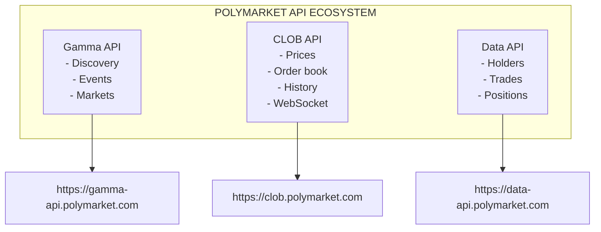
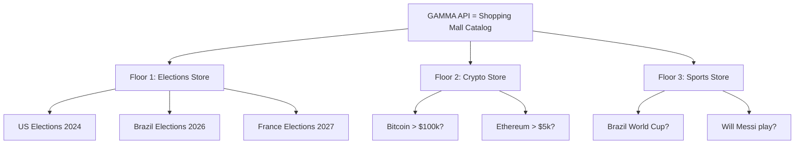
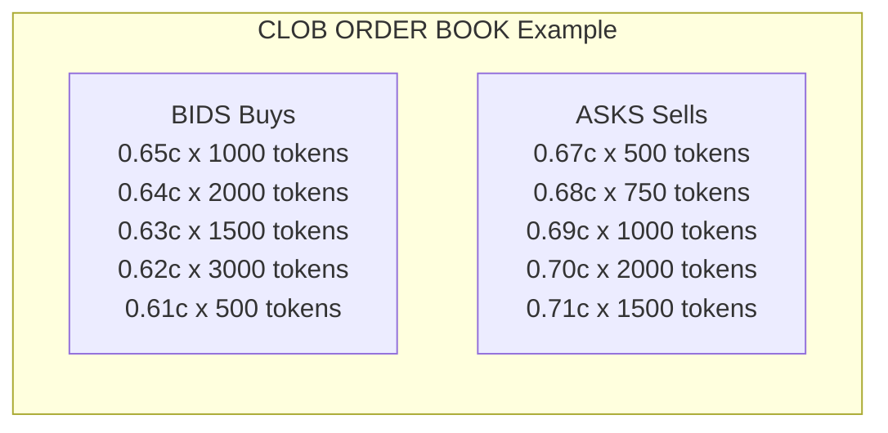
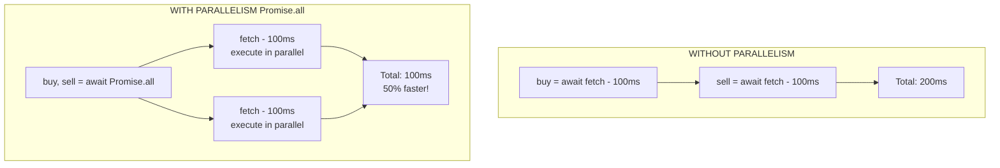
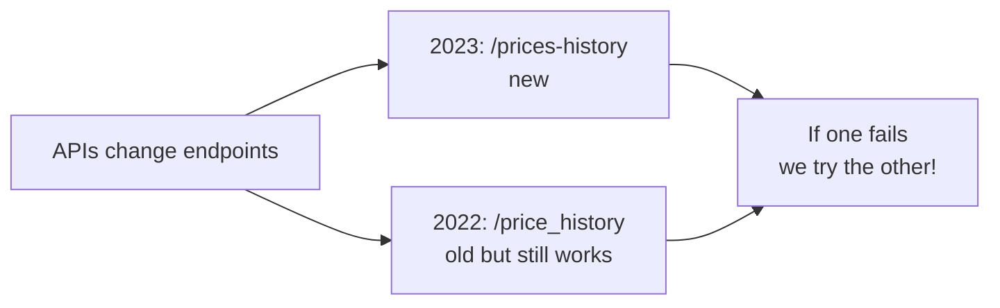

# Chapter 03: Polymarket API Integration

> **"APIs are like LEGO: you grab pieces from different services and build something new."**
> -- Anonymous

---

## 1. Introduction to Polymarket APIs

### 1.1 What is Polymarket?

[Polymarket](https://polymarket.com) is a decentralized prediction market platform based on blockchain. It allows people to bet on real-world events, from elections to sports outcomes.

**Polymarket APIs:**



### 1.2 API Overview

| API | Purpose | Primary Use | Rate Limit |
|-----|---------|-------------|------------|
| **Gamma API** | Market and event discovery | List markets, search by slug | 300-500 req/10s |
| **CLOB REST** | Market data (prices, order book) | Order book, history | 500-1500 req/10s |
| **CLOB WebSocket** | Real-time data | Live price updates | N/A (stream) |
| **Data API** | Aggregated user data | Top holders, trades | 150-200 req/10s |

---

## 2. Gamma API - Market Discovery

### 2.1 What is the Gamma API?

The **Gamma API** is Polymarket's **discovery** API. It serves as a "catalog" of all available markets and events.

**Analogy:**

Imagine Polymarket as a giant shopping mall:



### 2.2 Gamma Data Structure

```typescript
// Event (e.g., "US Elections 2024")
type GammaEvent = {
  id: string;              // "12345"
  slug: string;            // "us-elections-2024"
  title: string;           // "US Election 2024"
  description?: string;
  markets: GammaMarket[];  // Markets within the event
};

// Market (e.g., "Trump wins?")
type GammaMarket = {
  id: string;                      // "67890"
  conditionId: string;             // "0xabc123..."
  question: string;                // "Will Trump win?"
  outcomes: string[];              // ["Yes", "No"]
  clobTokenIds: string[];          // ["0x123...", "0x456..."]
  slug?: string;                   // "trump-wins-2024"
  volume24hr?: number;             // 1_500_000 (in cents)
  priceChange24hr?: number;        // 0.05 (5%)
  bestBid?: number;                // 0.65 (65c)
  bestAsk?: number;                // 0.67 (67c)
};
```

### 2.3 Gamma Endpoints

#### GET /events

Lists active events.

```typescript
// src/api.ts:22-36
export async function fetchEvents(limit = 50, offset = 0) {
  const url = withQuery(`${CONFIG.gammaBase}/events`, {
    limit,
    offset,
    closed: false,    // <- Only open events
    active: true,     // <- Only active events
    order: "id",
    ascending: false  // <- Most recent first
  });
  const res = await fetchJson<unknown>(url);
  // ...
}
```

**Request:**
```http
GET https://gamma-api.polymarket.com/events?limit=10&offset=0&closed=false&active=true
```

**Response:**
```json
[
  {
    "id": "12345",
    "slug": "us-elections-2024",
    "title": "US Election 2024",
    "markets": [
      {
        "id": "67890",
        "condition_id": "0xabc123...",
        "question": "Will Trump win?",
        "outcomes": ["Yes", "No"],
        "clob_token_ids": ["0x123...", "0x456..."],
        "volume_24hr": 1500000,
        "price_change_24hr": 0.05,
        "best_bid": 0.65,
        "best_ask": 0.67
      }
    ]
  }
]
```

#### GET /markets

Lists active markets.

```typescript
// src/api.ts:38-52
export async function fetchMarkets(limit = 50, offset = 0) {
  const url = withQuery(`${CONFIG.gammaBase}/markets`, {
    limit,
    offset,
    closed: false,
    active: true,
    order: "id",
    ascending: false
  });
  const res = await fetchJson<unknown>(url);
  // ...
}
```

#### GET /markets/slug/{slug}

Fetches a specific market by slug.

```typescript
// src/api.ts:54-60
export async function fetchMarketBySlug(slug: string) {
  const res = await fetchJson<unknown>(
    `${CONFIG.gammaBase}/markets/slug/${slug}`
  );
  // The API may return { market: {...} } or the object directly
  if (res && typeof res === "object" && "market" in res) {
    return (res as { market: GammaMarket }).market;
  }
  return res as GammaMarket;
}
```

**Usage example:**
```typescript
const market = await fetchMarketBySlug("trump-wins-2024");
// -> { id: "67890", question: "Will Trump win?", ... }
```

#### GET /events/slug/{slug}

Fetches an event by slug.

```typescript
// src/api.ts:62-68
export async function fetchEventBySlug(slug: string) {
  const res = await fetchJson<unknown>(
    `${CONFIG.gammaBase}/events/slug/${slug}`
  );
  if (res && typeof res === "object" && "event" in res) {
    return (res as { event: GammaEvent }).event;
  }
  return res as GammaEvent;
}
```

#### GET /markets?condition_ids={id}

Fetches market by condition ID.

```typescript
// src/api.ts:70-80
export async function fetchMarketByConditionId(conditionId: string) {
  const url = withQuery(`${CONFIG.gammaBase}/markets`, {
    condition_ids: conditionId,
    limit: 1
  });
  const res = await fetchJson<unknown>(url);
  // The API may return array or object with different properties
  if (Array.isArray(res)) return res[0] as GammaMarket | undefined;
  const record = res as Record<string, unknown>;
  const list = (record.markets as GammaMarket[] | undefined)
    || (record.data as GammaMarket[] | undefined)
    || [];
  return list[0];
}
```

### 2.4 Gamma Data Normalization

The Gamma API returns data in **inconsistent formats**. We need to normalize:

```typescript
// src/api.ts:82-124
export function normalizeMarket(
  market: GammaMarket,
  event?: GammaEvent
): MarketInfo | null {
  // --- 1. Extract condition ID (varying names) ---
  const conditionId =
    market.conditionId          // camelCase
    || market.condition_id      // snake_case
    || market.conditionID;      // PascalCase

  // --- 2. Extract market ID ---
  const marketId =
    market.id
    || market.marketId
    || market.market_id;

  // --- 3. Extract question (tries multiple fields) ---
  const question =
    market.question
    || market.title
    || event?.title;

  // --- 4. Extract outcomes (can be array or JSON string) ---
  const outcomes = extractOutcomes(market);

  // --- 5. Extract token IDs (multiple formats) ---
  const clobTokenIds = extractTokenIds(market);

  // --- 6. Extract volume (varying names) ---
  const volume24hr = asNumber(
    market.volume24hr      // camelCase
    || market.volume24h    // without "r"
    || market.volume24hrUsd
    || market.volumeUSD
  );

  // --- 7. Validate required data ---
  if (!conditionId || clobTokenIds.length === 0) return null;

  // --- 8. Return normalized format ---
  return {
    eventId: event?.id as string | undefined,
    eventTitle: event?.title as string | undefined,
    marketId,
    question,
    conditionId,
    slug: market.slug as string | undefined,
    outcomes,
    clobTokenIds,
    volume24hr: volume24hr ?? undefined,
    priceChange24hr: priceChange24hr ?? undefined,
    bestBid: bestBid ?? undefined,
    bestAsk: bestAsk ?? undefined
  };
}
```

**Why so many fallbacks?**

```
API inconsistent over time:
-------------------------------------------------
Version 2023: { condition_id: "0x123" }
Version 2024: { conditionId: "0x123" }
Version 2025: { conditionID: "0x123" }

Our normalization handles ALL formats!
```

### 2.5 Helper Extraction Functions

#### extractOutcomes

```typescript
// src/api.ts:126-142
function extractOutcomes(market: GammaMarket): string[] {
  // 1. Try "outcomes" or "outcome" field
  const raw = market.outcomes || market.outcome;

  // 2. Can be array or JSON string
  const parsed = parseMaybeJsonArray(raw);
  if (Array.isArray(parsed) && parsed.length > 0) {
    return parsed.map(String);
  }

  // 3. Can be nested in "tokens"
  const nested = market.tokens;
  if (Array.isArray(nested)) {
    const names = nested
      .map((token) => token.outcome)
      .filter(Boolean);
    if (names.length > 0) return names as string[];
  }

  return [];
}
```

**Format examples:**
```json
// Format 1: Direct array
{ "outcomes": ["Yes", "No"] }

// Format 2: JSON string
{ "outcomes": "[\"Yes\", \"No\"]" }

// Format 3: Nested
{
  "tokens": [
    { "outcome": "Yes" },
    { "outcome": "No" }
  ]
}
```

#### extractTokenIds

```typescript
// src/api.ts:155-172
function extractTokenIds(market: GammaMarket): string[] {
  // 1. Try direct field (varying names)
  const direct =
    market.clobTokenIds          // camelCase
    || market.clob_token_ids     // snake_case
    || market.clob_token_ids;    // snake_case alternative

  const parsed = parseMaybeJsonArray(direct);
  if (Array.isArray(parsed) && parsed.length > 0) {
    return parsed.map(String);
  }

  // 2. Try nested in "tokens"
  const nested = market.tokens;
  if (Array.isArray(nested)) {
    const ids = nested
      .map((token) => token.token_id || token.id)
      .filter(Boolean);
    if (ids.length > 0) return ids as string[];
  }

  return [];
}
```

#### parseMaybeJsonArray

```typescript
// src/api.ts:174-188
function parseMaybeJsonArray(
  value: string[] | string | undefined
): string[] | undefined {
  if (!value) return undefined;

  // Already an array
  if (Array.isArray(value)) return value;

  // Is string - try to parse
  if (typeof value === "string") {
    const trimmed = value.trim();

    // Does not look like JSON
    if (!trimmed.startsWith("[")) return undefined;

    // Try to parse
    try {
      const parsed = JSON.parse(trimmed);
      return Array.isArray(parsed) ? parsed : undefined;
    } catch {
      return undefined;  // Invalid JSON
    }
  }

  return undefined;
}
```

---

## 3. CLOB REST API - Market Data

### 3.1 What is CLOB?

**CLOB** stands for **Central Limit Order Book**.

It is where **buy and sell orders** are recorded.



### 3.2 CLOB REST Endpoints

#### GET /book

Returns the complete order book for a token.

```typescript
// src/api.ts:190-193
export async function getOrderbook(tokenId: string) {
  const url = withQuery(`${CONFIG.clobRestBase}/book`, {
    token_id: tokenId
  });
  return fetchJson<Record<string, unknown>>(url, {
    timeoutMs: CONFIG.restTimeoutMs
  });
}
```

**Request:**
```http
GET https://clob.polymarket.com/book?token_id=0x123...
```

**Response:**
```json
{
  "bids": [[0.65, 1000], [0.64, 2000], [0.63, 1500]],
  "asks": [[0.67, 500], [0.68, 750], [0.69, 1000]],
  "min_order_size": 1,
  "tick_size": 0.01,
  "neg_risk": false
}
```

**Normalization:**
```typescript
// src/parsers.ts:34-45
export function normalizeOrderbook(
  response: Record<string, unknown>
): OrderbookState {
  const bids = normalizeLevels(
    response.bids      // <- Can be array or object
    || response.buys   // <- Alternative name
    || []
  );
  const asks = normalizeLevels(
    response.asks
    || response.sells
    || []
  );

  return {
    bids,
    asks,
    minOrderSize: asNumber(response.min_order_size),
    tickSize: asNumber(response.tick_size),
    negRisk: Boolean(response.neg_risk)
  };
}
```

#### GET /price

Returns the best buy or sell price.

```typescript
// src/api.ts:195-203
export async function getPrices(tokenId: string) {
  // Makes TWO requests in parallel
  const buy = withQuery(`${CONFIG.clobRestBase}/price`, {
    token_id: tokenId,
    side: "BUY"
  });
  const sell = withQuery(`${CONFIG.clobRestBase}/price`, {
    token_id: tokenId,
    side: "SELL"
  });

  const [buyRes, sellRes] = await Promise.all([
    fetchJson<Record<string, unknown>>(buy),
    fetchJson<Record<string, unknown>>(sell)
  ]);

  return { buy: buyRes, sell: sellRes };
}
```

**Why Promise.all?**



#### GET /midpoint

Returns the average price between best bid and best ask.

```typescript
// src/api.ts:205-208
export async function getMidpoint(tokenId: string) {
  const url = withQuery(`${CONFIG.clobRestBase}/midpoint`, {
    token_id: tokenId
  });
  return fetchJson<Record<string, unknown>>(url);
}
```

**Response:**
```json
{
  "midpoint": 0.66
}
```

#### GET /prices-history

Returns price history.

```typescript
// src/api.ts:210-224
export async function getPriceHistory(tokenId: string) {
  const baseParams = {
    market: tokenId,
    interval: CONFIG.historyInterval,   // "1d" (daily)
    fidelity: CONFIG.historyFidelity    // 30 points
  };

  const url = withQuery(
    `${CONFIG.clobRestBase}/prices-history`,
    baseParams
  );

  try {
    return await fetchJson<Record<string, unknown>>(url);
  } catch (err) {
    // Fallback to alternative endpoint
    const fallback = withQuery(
      `${CONFIG.clobRestBase}/price_history`,
      baseParams
    );
    return fetchJson<Record<string, unknown>>(fallback);
  }
}
```

**Why fallback?**



**Extract history:**
```typescript
// src/parsers.ts:22-32
export function extractHistory(
  response: Record<string, unknown>
): number[] {
  const raw =
    response.history        // Common name
    || response.prices      // Alternative name
    || response.data        // Generic name
    || [];

  return raw
    .map((point) =>
      asNumber(
        point.p          // "p" for "price"
        || point.price
        || point.value
        || point.close   // Candle close
      )
    )
    .filter((value): value is number => value !== undefined);
}
```

---

## 4. Data API - User Data

### 4.1 GET /holders

Returns the largest token holders for a market.

```typescript
// src/api.ts:226-232
export async function getHolders(
  conditionId: string,
  limit = 10
) {
  const url = withQuery(`${CONFIG.dataApiBase}/holders`, {
    market: conditionId,
    limit
  });
  return fetchJson<Array<Record<string, unknown>>>(url);
}
```

**Response:**
```json
{
  "holders": [
    {
      "address": "0xabc...",
      "quantity": 10000,
      "percentage": 15.5
    },
    {
      "address": "0xdef...",
      "quantity": 8000,
      "percentage": 12.3
    }
  ]
}
```

### 4.2 GET /trades

Returns the most recent trades.

```typescript
// src/api.ts:234-240
export async function getTrades(
  conditionId: string,
  limit = 10
) {
  const url = withQuery(`${CONFIG.dataApiBase}/trades`, {
    market: conditionId,
    limit
  });
  return fetchJson<Record<string, unknown>>(url);
}
```

---

## 5. Composing Data from Multiple APIs

### 5.1 Complete Data Collection Flow

```typescript
// Simplified example from tui.ts flow

async function loadCompleteData(market: MarketInfo) {
  // 1. Fetch order book
  const orderbookRaw = await getOrderbook(market.clobTokenIds[0]);
  const orderbook = normalizeOrderbook(orderbookRaw);

  // 2. Fetch prices (bid/ask in parallel)
  const prices = await getPrices(market.clobTokenIds[0]);

  // 3. Fetch midpoint
  const midpointRaw = await getMidpoint(market.clobTokenIds[0]);
  const midpoint = extractMidpoint(midpointRaw);

  // 4. Fetch history
  const historyRaw = await getPriceHistory(market.clobTokenIds[0]);
  const history = extractHistory(historyRaw);

  // 5. Fetch holders
  const holdersRaw = await getHolders(market.conditionId!);
  const holders = normalizeHolders(holdersRaw);

  // 6. Compose everything
  return {
    orderbook,
    prices: {
      bestBid: extractPrice(prices.buy),
      bestAsk: extractPrice(prices.sell),
      midpoint
    },
    priceHistory: history,
    holders
  };
}
```

### 5.2 Optimizing with Parallelism

```typescript
// BAD - Sequential (slow)
async function loadDataSequential(tokenId: string) {
  const a = await getOrderbook(tokenId);    // 100ms
  const b = await getPrices(tokenId);       // 100ms
  const c = await getMidpoint(tokenId);     // 100ms
  const d = await getPriceHistory(tokenId); // 100ms
  const e = await getHolders(conditionId);  // 100ms
  // Total: 500ms
}

// GOOD - Parallel (fast)
async function loadDataParallel(
  tokenId: string,
  conditionId: string
) {
  const [
    orderbook,
    prices,
    midpoint,
    history,
    holders
  ] = await Promise.all([
    getOrderbook(tokenId),       // 100ms
    getPrices(tokenId),          // 100ms
    getMidpoint(tokenId),        // 100ms
    getPriceHistory(tokenId),    // 100ms
    getHolders(conditionId)      // 100ms
  ]);
  // Total: 100ms (5x faster!)
}
```

---

## 6. API Integration Best Practices

### 6.1 Always Respect Rate Limits

```typescript
// http.ts - Automatic rate limiting
const RATE_LIMITS = [
  { host: "clob.polymarket.com", path: "/book", limit: 1500 },
  { host: "clob.polymarket.com", path: "/price", limit: 1500 },
  // ...
];

export async function fetchJson<T>(url: string, options = {}) {
  const limitRule = matchRateLimit(url);
  if (limitRule) {
    await limiter.take(limitRule);  // <- Waits if necessary
  }
  // ...
}
```

### 6.2 Always Use Timeout

```typescript
// BAD - Can hang forever
const res = await fetch(url);

// GOOD - Timeout protects against hangs
const controller = new AbortController();
const timeout = setTimeout(() => controller.abort(), 10000);

try {
  const res = await fetch(url, { signal: controller.signal });
} finally {
  clearTimeout(timeout);
}
```

### 6.3 Always Handle Errors

```typescript
// BAD - Unhandled errors
const data = await fetchJson(url);
process(data);

// GOOD - Error handling
try {
  const data = await fetchJson(url);
  process(data);
} catch (err) {
  if (err instanceof Error) {
    console.error(`Failed to fetch ${url}:`, err.message);
    // Implement fallback or retry
  }
}
```

### 6.4 Use Fallbacks for Unstable Endpoints

```typescript
// Example: getPriceHistory with fallback
export async function getPriceHistory(tokenId: string) {
  const url = withQuery(
    `${CONFIG.clobRestBase}/prices-history`,
    { market: tokenId, interval: "1d", fidelity: 30 }
  );

  try {
    return await fetchJson(url);
  } catch (err) {
    // Primary endpoint failed, try fallback
    const fallback = withQuery(
      `${CONFIG.clobRestBase}/price_history`,
      { market: tokenId, interval: "1d", fidelity: 30 }
    );
    return fetchJson(fallback);
  }
}
```

### 6.5 Cache When Possible

```typescript
// Simple in-memory cache
const cache = new Map<string, { data: unknown; expiresAt: number }>();

export async function fetchWithCache<T>(
  key: string,
  fn: () => Promise<T>,
  ttlMs: number
): Promise<T> {
  const cached = cache.get(key);
  if (cached && Date.now() < cached.expiresAt) {
    return cached.data as T;
  }

  const data = await fn();
  cache.set(key, { data, expiresAt: Date.now() + ttlMs });
  return data;
}

// Usage
const markets = await fetchWithCache(
  "markets:latest",
  () => fetchMarkets(10),
  60_000  // Cache for 1 minute
);
```

---

## 7. Testing APIs Manually

### 7.1 Using curl

```bash
# List events
curl "https://gamma-api.polymarket.com/events?limit=5&closed=false&active=true"

# Fetch market by slug
curl "https://gamma-api.polymarket.com/markets/slug/trump-wins-2024"

# Order book
curl "https://clob.polymarket.com/book?token_id=0x123..."

# Prices
curl "https://clob.polymarket.com/price?token_id=0x123...&side=BUY"
```

### 7.2 Using Bun

```typescript
// test-api.ts
import { fetchEvents } from "./src/api";

const events = await fetchEvents(5);
console.log(JSON.stringify(events, null, 2));
```

```bash
bun --bun run test-api.ts
```

---

## 8. Practical Exercises

### Exercise 1: Fetch Market

Implement a function that fetches a market by slug and returns normalized data:

```typescript
async function fetchMarket(slug: string): Promise<MarketInfo | null> {
  // 1. Try fetchMarketBySlug
  // 2. If it fails, try fetchEventBySlug + first market
  // 3. Return normalizeMarket()
}
```

### Exercise 2: Calculate Spread

Implement a function that calculates the percentage spread:

```typescript
function calculateSpread(bestBid: number, bestAsk: number): number {
  // Spread = ((ask - bid) / ask) * 100
  // Return as percentage
}

// Example:
// bestBid = 0.64, bestAsk = 0.66
// spread = ((0.66 - 0.64) / 0.66) * 100 = 3.03%
```

### Exercise 3: Detect Arbitrage

Implement a function that detects arbitrage opportunities:

```typescript
function detectArbitrage(bidA: number, askA: number, bidB: number, askB: number): boolean {
  // Arbitrage exists if:
  // bidA > askB (buy on B, sell on A)
  // OR bidB > askA (buy on A, sell on B)
  // Return true if opportunity exists
}
```

### Exercise 4: Data Aggregator

Create a function that aggregates data from multiple markets:

```typescript
async function aggregateResults(
  conditionIds: string[]
): Promise<Array<{ conditionId: string; stats: Statistics }>> {
  // For each condition ID:
  // 1. Fetch order book
  // 2. Calculate statistics (spread, depth, etc.)
  // 3. Return array with results
  //
  // Hint: Use Promise.all() for parallelism
}
```

---

## 9. Chapter Summary

- **Gamma API**: Market and event discovery
- **CLOB REST**: Market data (prices, order book, history)
- **Data API**: User data (holders, trades)
- **Normalization**: Handle inconsistent formats
- **Parallelism**: Promise.all() for multiple requests
- **Rate limiting**: Token bucket to respect limits
- **Timeout**: Always set timeout on requests
- **Fallbacks**: Alternative endpoints for resilience

---

## Check Your Understanding

### Question 1: Polymarket APIs

**Which API to use for each purpose?**

Match the left column with the right:

| Purpose | API | Base URL |
|---------|-----|----------|
| Discover markets | [?] | [?] |
| Real-time prices | [?] | [?] |
| Complete order book | [?] | [?] |
| Price history | [?] | [?] |
| Largest holders | [?] | [?] |

<details>
<summary>Answer</summary>

| Purpose | API | Base URL |
|---------|-----|----------|
| Discover markets | Gamma API | gamma-api.polymarket.com |
| Real-time prices | CLOB WebSocket | ws-subscriptions-clob.polymarket.com |
| Complete order book | CLOB REST | clob.polymarket.com |
| Price history | CLOB REST | clob.polymarket.com |
| Largest holders | Data API | data-api.polymarket.com |
</details>

---

### Question 2: Normalization

**Why do we need to normalize API data?**

<details>
<summary>Answer</summary>

**Because:**
1. **Inconsistent formats:** The API returns data in different formats
   - Sometimes: `{ conditionId: "0x123" }`
   - Sometimes: `{ condition_id: "0x123" }`
   - Sometimes: `{ conditionID: "0x123" }`

2. **Arrays vs Strings:**
   - Sometimes: `outcomes: ["Yes", "No"]`
   - Sometimes: `outcomes: "[\"Yes\", \"No\"]"` (JSON string!)

3. **Uncertain types:**
   - APIs return numbers as strings: `"0.65"` instead of `0.65`
   - We need to convert to number before using

**Without normalization:**
```typescript
// BAD Code would break if format changes
const id = market.conditionId;  // Could be undefined!
const price = market.price;    // Could be string "0.65"!
```

**With normalization:**
```typescript
// GOOD Robust code
function normalize(market: unknown) {
  const id = market.conditionId ?? market.condition_id ?? market.conditionID;
  const price = typeof market.price === "string" ? parseFloat(market.price) : market.price;
  return { id, price };
}
```
</details>

---

### Question 3: Rate Limiting

**What happens if you make 100 requests in 1 second to CLOB's `/book`?**

<details>
<summary>Answer</summary>

**Limit:** 1500 requests per 10 seconds for `/book`

**100 req in 1 second = ~1000 req in 10 seconds**

Result: **Success!** (within the limit)

**But what if you make 2000 requests in 10 seconds?**

Result: **Blocked!** (HTTP 429 - Too Many Requests)

**Solution:**
```typescript
// GOOD With rate limiting
const limiter = new TokenBucket(1500, 10000); // 1500 tokens per 10s

for (let i = 0; i < 2000; i++) {
  await limiter.consume();  // Waits if necessary
  await fetch("/book");
}
```

**Total time:**
- First 1500: immediate
- Next 500: waits until reset (up to 10 seconds)
- Total: ~10-20 seconds (vs being blocked)
</details>

---

### Question 4: Parallelism

**Which version is faster?**

**Version A (Sequential):**
```typescript
const orderbook = await getOrderbook(tokenId);   // 100ms
const prices = await getPrices(tokenId);          // 100ms
const history = await getPriceHistory(tokenId);   // 100ms
// Total: 300ms
```

**Version B (Parallel):**
```typescript
const [orderbook, prices, history] = await Promise.all([
  getOrderbook(tokenId),     // 100ms (in parallel)
  getPrices(tokenId),        // 100ms (in parallel)
  getPriceHistory(tokenId)  // 100ms (in parallel)
]);
// Total: 100ms
```

<details>
<summary>Answer</summary>

**Version B (Parallel) is 3x faster!**

**Why?**
Promise.all executes all 3 requests simultaneously, instead of waiting for one to finish before starting the next.

**But be careful:** Parallelism only works when operations are **independent**.
</details>

---

## Common Pitfalls

### Pitfall: Not Handling Inconsistent Responses

**BAD:**
```typescript
const res = await fetch(url);
const markets = res.markets;  // BAD Could be res.data, res.data.markets, etc!
```

**Problem:**
Polymarket API has inconsistent responses.

**GOOD:**
```typescript
const res = await fetch(url);
const data = await res.json();

// Try multiple formats
const markets = data.markets ?? data.data ?? data;

// Or use project function
const markets = extractMarkets(data);  // src/api.ts:50
```

---

### Pitfall: Ignoring Timeout

**BAD:**
```typescript
await fetch(url);  // Can hang forever if API does not respond
```

**Problem:**
Without timeout, your application hangs if the API is slow.

**GOOD:**
```typescript
const controller = new AbortController();
const timeout = setTimeout(() => controller.abort(), 10000); // 10s

try {
  const res = await fetch(url, { signal: controller.signal });
  // ...
} finally {
  clearTimeout(timeout);
}
```

---

### Pitfall: Not Checking HTTP Errors

**BAD:**
```typescript
const res = await fetch(url);
const data = await res.json();  // BAD Could be 404, 500, etc!
```

**Problem:**
`fetch` only throws error on network failure. HTTP 404, 500 etc. are "successes".

**GOOD:**
```typescript
const res = await fetch(url);

if (!res.ok) {
  throw new Error(`HTTP ${res.status}: ${res.statusText}`);
}

const data = await res.json();
```

---

## Troubleshooting

### Problem: "HTTP 429: Too Many Requests"

**Symptom:**
```
Error: HTTP 429 Too Many Requests
```

**Cause:**
You exceeded the API rate limit.

**Immediate Solution:**
```bash
# Wait 10 seconds
sleep 10

# Try again
```

**Permanent Solution:**
```typescript
// Use project RateLimiter
import { fetchJson } from "./src/http";

// This already includes automatic rate limiting!
const markets = await fetchJson(url);
```

**Prevention:**
Always use the project's `http.fetchJson()` instead of `fetch()` directly.

---

### Problem: "Timeout after 10 seconds"

**Symptom:**
Requests take too long and timeout.

**Cause:**
Polymarket API is overloaded or your internet is slow.

**Solution:**
```typescript
// Increase timeout (config.ts:19)
// restTimeoutMs: 10000  // 10 seconds
restTimeoutMs: 20000      // 20 seconds
```

**But be careful:** Very high timeout can make the application hang.

---

## Milestone Completed

After completing this chapter, you should be able to:

- [ ] Differentiate the 3 Polymarket APIs
- [ ] Make requests to the Gamma API manually
- [ ] Understand data normalization
- [ ] Implement rate limiting correctly
- [ ] Use Promise.all() for parallelism
- [ ] Avoid timeouts and blocks
- [ ] Implement endpoint fallbacks

**Practical Exercise:**
Test the APIs manually:
```bash
# 1. Gamma API
curl "https://gamma-api.polymarket.com/markets?limit=1"

# 2. CLOB API (need token ID first)
# 3. Data API (need condition ID first)
```

---

## Design Decisions

### Decision 1: Why aggressive data normalization?

**Alternatives Considered:**
1. **Trust API format** - Assume consistent data
2. **Normalize everything** - Convert all formats **CHOSEN**

**Trade-offs:**

| Approach | Speed | Maintainability | Robustness |
|----------|-------|-----------------|------------|
| Trust API | Fast | Very low | Fragile |
| Normalize everything | Slow initially | Very high | Robust |

**Why aggressive normalization was chosen:**
- **APIs change**: Polymarket changed format 3+ times in 2023-2024
- **Defense in depth**: Multiple fallbacks for each field
- **Type safe**: Always returns correct TypeScript types
- **Predictable**: Same function for cache, WS data, etc.

**Example of API evolution:**
```json
// 2023: camelCase
{ "conditionId": "0x123", "clobTokenIds": [...] }

// 2024: snake_case
{ "condition_id": "0x123", "clob_token_ids": [...] }

// Our normalization handles BOTH:
const id = market.conditionId ?? market.condition_id ?? market.conditionID;
```

**Code reference:** `src/api.ts:82-124` - `normalizeMarket()`

---

### Decision 2: Why Promise.all for parallel requests?

**Alternatives Considered:**
1. **Sequential (await)** - One request at a time
2. **Parallel (Promise.all)** - All together **CHOSEN**

**Why Promise.all was chosen:**
- **3-5x faster**: Independent requests execute simultaneously
- **Respects rate limits**: Token bucket manages concurrency
- **Fail-fast**: One error stops everything immediately

**Performance gain example:**
```typescript
// BAD SEQUENTIAL (3 seconds)
const orderbook = await getOrderbook(id);    // 1000ms
const prices = await getPrices(id);           // 1000ms
const history = await getPriceHistory(id);    // 1000ms
// Total: 3000ms

// GOOD PARALLEL (1 second)
const [orderbook, prices, history] = await Promise.all([
  getOrderbook(id),      // 1000ms (in parallel)
  getPrices(id),         // 1000ms (in parallel)
  getPriceHistory(id)    // 1000ms (in parallel)
]);
// Total: 1000ms (3x faster!)
```

**When NOT to use:**
- Dependent requests (B needs A)
- Too many requests (will exceed rate limit)

**Code reference:** `src/api.ts:195-217` - `getPrices()` with Promise.all

---

### Decision 3: Why endpoint fallback?

**Alternatives Considered:**
1. **Single endpoint** - Trust one endpoint only
2. **Automatic fallback** - Try alternatives **CHOSEN**

**Why fallback was chosen:**
- **Resilience**: If endpoint changes, app keeps working
- **Zero downtime**: No emergency deploy needed
- **Backward compatibility**: Supports old API versions

**Real example:**
```typescript
// src/api.ts:210-224
async function getPriceHistory(tokenId) {
  const url = `${CONFIG.clobRestBase}/prices-history`;

  try {
    return await fetchJson(url);  // Try new endpoint
  } catch {
    // If it fails, try old endpoint
    const fallback = `${CONFIG.clobRestBase}/price_history`;
    return fetchJson(fallback);
  }
}
```

**Code reference:** `src/api.ts:210-224` - `getPriceHistory()` with fallback

---

## External Resources

### Learn More About:

**REST APIs:**
- [REST API Tutorial](https://restfulapi.net/) - Complete tutorial
- [HTTP Methods](https://developer.mozilla.org/en-US/docs/Web/HTTP/Methods) - MDN
- [Status Codes](https://developer.mozilla.org/en-US/docs/Web/HTTP/Status) - MDN

**Rate Limiting:**
- [Token Bucket](https://en.wikipedia.org/wiki/Token_bucket) - Wikipedia
- [Rate Limiting Patterns](https://cloud.google.com/architecture/rate-limiting-strategies-techniques) - Google Cloud
- [API Rate Limiting Best Practices](https://medium.com/@saisathishvik/exploring-rate-limiting-algorithms-and-implementation-strategies-2be2cd04d6f6) - Medium

**Promise.all & Async Patterns:**
- [Promise.all() MDN](https://developer.mozilla.org/en-US/docs/Web/JavaScript/Reference/Global_Objects/Promise/all) - MDN
- [JavaScript Async Patterns](https://javascript.info/async) - JavaScript Info
- [Concurrency in JS](https://www.youtube.com/watch?v=PoaXtW2EAh4) - YouTube (20 min)

**API Design:**
- [Google API Design Guide](https://cloud.google.com/apis/design) - Google
- [REST API Design Best Practices](https://restfulapi.net/) - RestfulAPI

### Recommended Videos:

- [Understanding REST APIs](https://www.youtube.com/watch?v=ls_MQR_8lx8) - YouTube (15 min)
- [Async/Await Tutorial](https://www.youtube.com/watch?v=V_Kr9OSfDeU) - YouTube (25 min)
- [Rate Limiting Explained](https://www.youtube.com/watch?v=M9A7oQHs8QI) - YouTube (20 min)

### Useful Tools:

- [Postman](https://www.postman.com/) - Test APIs visually
- [curl](https://curl.se/) - CLI for HTTP requests
- [HTTPie](https://httpie.io/) - User-friendly curl alternative

---

**Next Chapter:** WebSockets and Real-Time Data

[Continue to Chapter 4](./04-websockets-realtime.md)

---

**Version:** 1.0.0
**Last Updated:** January 2026
