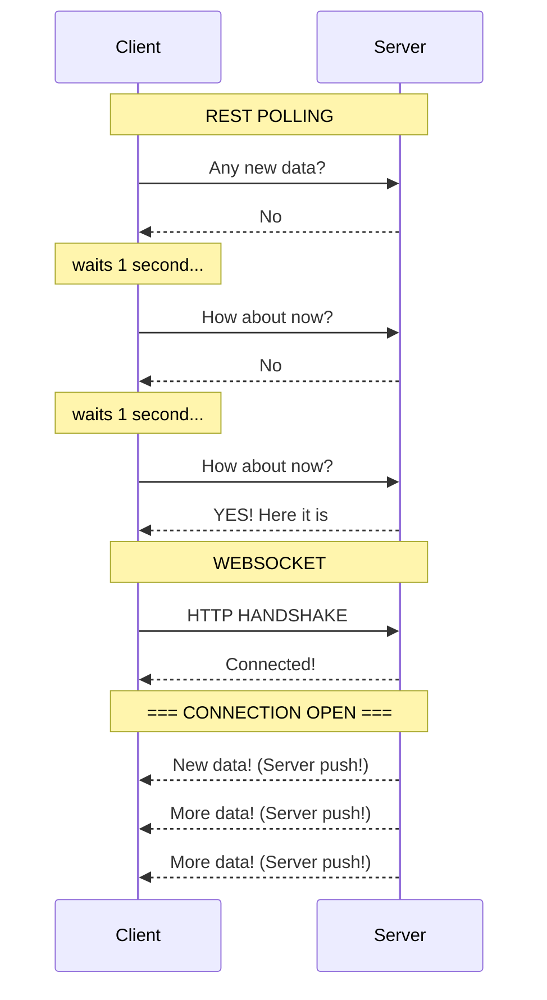
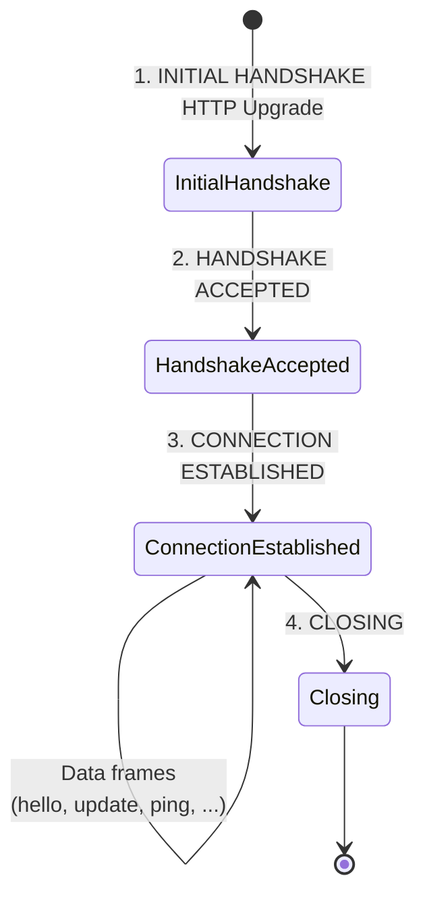
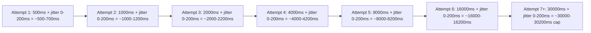
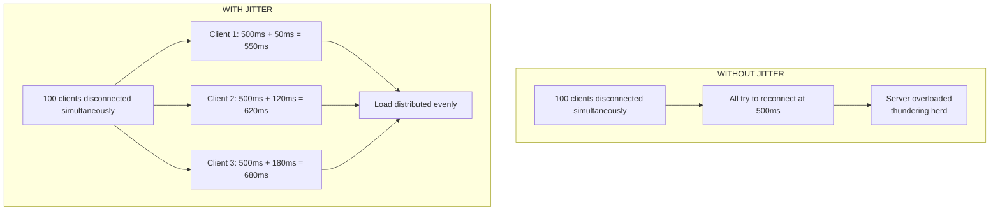
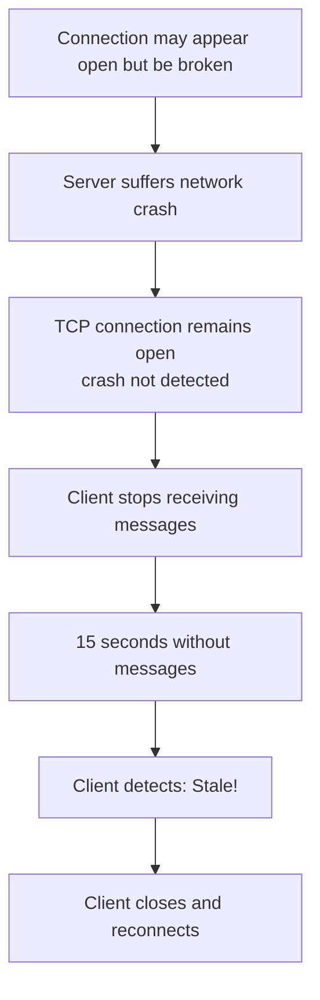
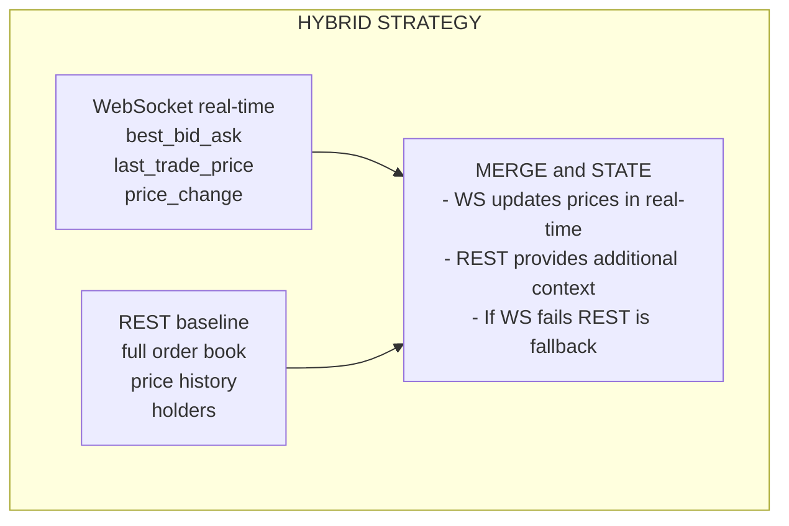

# Chapter 04: WebSockets and Real-Time Communication

> **"In information, time is money. The faster, the more valuable."**
> -- Wall Street Proverb

---

## 1. Introduction to WebSocket

### 1.1 What is WebSocket?

**WebSocket** is a communication protocol that enables **bidirectional real-time transmission** between client and server through a single TCP connection.

**Analogy: REST vs WebSocket**



### 1.2 WebSocket Connection Lifecycle



---

## 2. WebSocket in Polymarket

### 2.1 Polymarket WebSocket URL

```typescript
// src/config.ts:4
clobWsBase: "wss://ws-subscriptions-clob.polymarket.com/ws/"
```

**Why "wss"?**

- `ws://` = insecure WebSocket (like http://)
- `wss://` = secure WebSocket (like https://)
- Uses TLS/SSL to encrypt the connection

### 2.2 Connecting to WebSocket

See `src/ws.ts:129-256`:

```typescript
export function connectMarketWs(
  assetIds: string[],
  handlers: WsHandlers
) {
  let ws: WebSocket | null = null;
  let closed = false;
  let reconnectAttempts = 0;
  let lastMessageAt = 0;
  let heartbeatTimer: ReturnType<typeof setInterval> | null = null;

  // --- CONNECTION FUNCTION ---
  const connect = () => {
    if (closed) return;  // Don't reconnect if explicitly closed

    // Create new WebSocket connection
    ws = new WebSocket(CONFIG.clobWsBase);
    handlers.onStatus?.("connecting");

    // --- EVENT: OPEN ---
    ws.addEventListener("open", () => {
      reconnectAttempts = 0;
      handlers.onStatus?.("connected");
      lastMessageAt = Date.now();
      sendSubscribe(assetIds);  // Send subscription message
      startHeartbeat();         // Start heartbeat
    });

    // --- EVENT: MESSAGE ---
    ws.addEventListener("message", (event) => {
      lastMessageAt = Date.now();
      try {
        const data = JSON.parse(String(event.data));

        // Check if it's a ping/heartbeat
        if (isPingMessage(data)) {
          sendPong(data);
          return;
        }

        // Parse the message
        const parsed = parseMarketMessage(data);

        // Dispatch to handlers
        parsed.books.forEach((book) =>
          handlers.onBook?.(book.assetId, book.book)
        );
        parsed.updates.forEach((update) =>
          handlers.onUpdate(update)
        );
      } catch (err) {
        handlers.onStatus?.(
          `ws parse error: ${(err as Error).message}`
        );
      }
    });

    // --- EVENT: CLOSE ---
    ws.addEventListener("close", () => {
      handlers.onStatus?.("closed");
      stopHeartbeat();
      scheduleReconnect();  // Schedule reconnection
    });

    // --- EVENT: ERROR ---
    ws.addEventListener("error", () => {
      handlers.onStatus?.("error");
      ws?.close();
    });
  };

  connect();

  // --- PUBLIC API ---
  return {
    close() {
      closed = true;
      stopHeartbeat();
      ws?.close();
    },
    subscribe(ids: string[]) {
      sendOperation(ids, "subscribe");
    },
    unsubscribe(ids: string[]) {
      sendOperation(ids, "unsubscribe");
    }
  };
}
```

### 2.3 WebSocket Connection States

```typescript
// WebSocket.readyState
enum WebSocketReadyState {
  CONNECTING = 0,  // Connecting...
  OPEN = 1,        // Connected and ready
  CLOSING = 2,     // Closing...
  CLOSED = 3       // Closed
}

// Example usage
if (ws.readyState === WebSocket.OPEN) {
  ws.send(JSON.stringify({ type: "ping" }));
}
```

---

## 3. WebSocket Messages

### 3.1 Subscription

When connecting, you must **subscribe** to the assets you want to monitor:

```typescript
// src/ws.ts:177-185
const sendSubscribe = (ids: string[]) => {
  if (!ws || ws.readyState !== WebSocket.OPEN) return;

  const payload = {
    type: "MARKET",
    assets_ids: ids,  // Array of token IDs
    custom_feature_enabled: true
  };

  ws.send(JSON.stringify(payload));
};
```

**Message sent:**
```json
{
  "type": "MARKET",
  "assets_ids": ["0x123...", "0x456...", "0x789..."],
  "custom_feature_enabled": true
}
```

### 3.2 Types of Received Messages

#### best_bid_ask

Update of the best buy and sell prices.

```json
{
  "event_type": "best_bid_ask",
  "asset_id": "0x123...",
  "best_bid": 0.65,
  "best_ask": 0.67,
  "timestamp": 1234567890123
}
```

**Parsing:**
```typescript
// src/ws.ts:35-43
if (eventType === "best_bid_ask") {
  const assetId = String(data.asset_id || data.token_id || "");
  const bestBid = asNumber(data.best_bid);
  const bestAsk = asNumber(data.best_ask);
  if (assetId) {
    updates.push({
      assetId,
      eventType,
      bestBid,
      bestAsk,
      ts: Date.now()
    });
  }
}
```

#### last_trade_price

Last trade price.

```json
{
  "event_type": "last_trade_price",
  "asset_id": "0x123...",
  "price": 0.66,
  "timestamp": 1234567890123
}
```

#### price_change

Incremental change in the order book.

```json
{
  "event_type": "price_change",
  "asset_id": "0x123...",
  "best_bid": 0.65,
  "best_ask": 0.67,
  "price_changes": [
    {
      "asset_id": "0x123...",
      "side": "BUY",
      "price": 0.65,
      "size": 1000
    }
  ],
  "timestamp": 1234567890123
}
```

#### book

Complete order book snapshot.

```json
{
  "event_type": "book",
  "asset_id": "0x123...",
  "bids": [[0.65, 1000], [0.64, 2000]],
  "asks": [[0.67, 500], [0.68, 750]],
  "timestamp": 1234567890123
}
```

### 3.3 Ping/Pong (Heartbeat)

Messages to keep the connection alive:

```json
// Client -> Server
{"type": "ping"}

// Server -> Client
{"type": "ping", "id": 123}

// Client -> Server (response)
{"type": "pong", "id": 123}
```

**Implementation:**
```typescript
// src/ws.ts:224-239
const isPingMessage = (data: Record<string, unknown>) => {
  const type = String(data.type || data.event_type || "");
  return type === "ping" || type === "heartbeat";
};

const sendPong = (data: Record<string, unknown>) => {
  if (!ws || ws.readyState !== WebSocket.OPEN) return;
  const type = String(data.type || data.event_type || "");
  const payload: Record<string, unknown> = {};
  if (type === "ping") payload.type = "pong";
  if (type === "heartbeat") payload.type = "heartbeat";
  if ("id" in data) payload.id = data.id;
  if (Object.keys(payload).length > 0) {
    ws.send(JSON.stringify(payload));
  }
};
```

---

## 4. Automatic Reconnection

### 4.1 Exponential Backoff Strategy

```typescript
// src/ws.ts:197-204
const scheduleReconnect = () => {
  if (closed) return;  // Don't reconnect if explicitly closed

  reconnectAttempts += 1;

  // Exponential backoff with 30 second cap
  const backoff = Math.min(
    30_000,
    500 * Math.pow(2, reconnectAttempts - 1)
  );

  // Random jitter up to 200ms
  setTimeout(() => {
    if (!closed) connect();
  }, backoff + Math.floor(Math.random() * 200));
};
```

**Reconnection Timeline:**



**Why Jitter?**



### 4.2 Stale Connection Detection

```typescript
// src/ws.ts:206-217
const startHeartbeat = () => {
  stopHeartbeat();
  heartbeatTimer = setInterval(() => {
    if (!ws || ws.readyState !== WebSocket.OPEN) return;

    const now = Date.now();

    // If no message received for 15 seconds, consider stale
    if (now - lastMessageAt > CONFIG.wsStaleMs) {
      handlers.onStatus?.("stale");
      ws.close();  // Force reconnection
      return;
    }
  }, 2000);  // Check every 2 seconds
};
```

**Why detect stale?**



---

## 5. Integrating WebSocket with REST

### 5.1 Hybrid Strategy



### 5.2 Hybrid Implementation in Code

```typescript
// Simplified example from tui.ts

async function startMonitoring(market: MarketInfo) {
  // --- 1. Start WebSocket ---
  const wsClient = connectMarketWs(market.clobTokenIds, {
    onUpdate: (update) => {
      // Update prices in real-time
      if (update.bestBid !== undefined) {
        currentPrices.bestBid = update.bestBid;
      }
      if (update.bestAsk !== undefined) {
        currentPrices.bestAsk = update.bestAsk;
      }
      if (update.lastTrade !== undefined) {
        currentPrices.lastTrade = update.lastTrade;
      }
      renderInterface();  // Update TUI
    },
    onStatus: (status) => {
      wsStatus = status;
      renderInterface();
    }
  });

  // --- 2. REST Polling for additional data ---
  const restInterval = setInterval(async () => {
    // Data that WebSocket doesn't provide
    const orderbook = await getOrderbook(market.clobTokenIds[0]);
    const history = await getPriceHistory(market.clobTokenIds[0]);
    const holders = await getHolders(market.conditionId!);

    // Update state
    currentOrderbook = normalizeOrderbook(orderbook);
    currentHistory = extractHistory(history);
    currentHolders = normalizeHolders(holders);

    renderInterface();
  }, CONFIG.refreshMs);  // 3 seconds

  // --- 3. Cleanup ---
  return () => {
    clearInterval(restInterval);
    wsClient.close();
  };
}
```

---

## 6. WebSocket Best Practices

### 6.1 Always Implement Reconnection

```typescript
// BAD - No reconnection
const ws = new WebSocket(url);
ws.addEventListener("close", () => {
  console.log("Connection closed. Done.");
});

// GOOD - Automatic reconnection
const connect = () => {
  const ws = new WebSocket(url);
  ws.addEventListener("close", () => {
    setTimeout(() => connect(), 1000);
  });
};
connect();
```

### 6.2 Implement Heartbeat

```typescript
// GOOD - Detects "zombie" connections
let lastMessage = Date.now();
const HEARTBEAT_INTERVAL = 5000;  // 5 seconds
const STALE_TIMEOUT = 15000;      // 15 seconds

ws.addEventListener("message", () => {
  lastMessage = Date.now();
});

setInterval(() => {
  if (Date.now() - lastMessage > STALE_TIMEOUT) {
    console.log("Stale connection, reconnecting...");
    ws.close();
  }
}, HEARTBEAT_INTERVAL);
```

### 6.3 Use Jitter in Reconnections

```typescript
// BAD - Everyone reconnects at the same time
setTimeout(() => connect(), 1000);

// GOOD - Jitter distributes the load
const baseDelay = 1000;
const jitter = Math.random() * 500;
setTimeout(() => connect(), baseDelay + jitter);
```

### 6.4 Limit Buffer Size

```typescript
// GOOD - Prevents memory overload
const MAX_BUFFER_SIZE = 1000;
const messageBuffer: unknown[] = [];

ws.addEventListener("message", (event) => {
  messageBuffer.push(JSON.parse(event.data));

  if (messageBuffer.length > MAX_BUFFER_SIZE) {
    messageBuffer.shift();  // Remove old messages
  }
});
```

### 6.5 Implement Handshake Timeout

```typescript
// GOOD - Don't wait forever for handshake
const HANDSHAKE_TIMEOUT = 10000;  // 10 seconds

const ws = new WebSocket(url);
const timeout = setTimeout(() => {
  if (ws.readyState !== WebSocket.OPEN) {
    ws.close();
    console.log("Handshake timeout");
  }
}, HANDSHAKE_TIMEOUT);

ws.addEventListener("open", () => {
  clearTimeout(timeout);
  console.log("Connected!");
});
```

---

## 7. Debugging WebSockets

### 7.1 Chrome DevTools

```javascript
// In Chrome console
// 1. List all WebSocket connections
performance.getEntriesByType("resource")
  .filter(r => r.name.startsWith("ws"))

// 2. Monitor frames
// -> Network tab -> WS frame -> Messages
```

### 7.2 wireshark

```bash
# Capture WebSocket traffic
wireshark -i any -f "tcp port 443"

# Filter by WebSocket
# Filter: tcp.flags.push == 1 && http
```

### 7.3 Message Logging

```typescript
// Add detailed logging
ws.addEventListener("message", (event) => {
  console.log("[WS RX]", event.data);
  const data = JSON.parse(event.data);
  console.log("[WS PARSED]", data);
});

const originalSend = ws.send;
ws.send = function(...args) {
  console.log("[WS TX]", args[0]);
  return originalSend.apply(this, args);
};
```

---

## 8. Practical Exercises

### Exercise 1: Simple WebSocket Client

Implement a simple WebSocket client:

```typescript
async function connectWebSocket(url: string) {
  return new Promise((resolve, reject) => {
    const ws = new WebSocket(url);

    // 10 second timeout
    const timeout = setTimeout(() => {
      ws.close();
      reject(new Error("Handshake timeout"));
    }, 10000);

    ws.addEventListener("open", () => {
      clearTimeout(timeout);
      resolve(ws);
    });

    ws.addEventListener("error", (err) => {
      clearTimeout(timeout);
      reject(err);
    });
  });
}

// Usage
const ws = await connectWebSocket("wss://example.com/ws");
```

### Exercise 2: Message Buffer

Implement a circular buffer for WebSocket messages:

```typescript
class WebSocketMessageBuffer {
  private buffer: unknown[] = [];
  private maxSize: number;

  constructor(maxSize: number) {
    this.maxSize = maxSize;
  }

  add(message: unknown): void {
    // Add message
    // If buffer is full, remove oldest
  }

  getLast(n: number): unknown[] {
    // Return last N messages
  }

  clear(): void {
    // Clear buffer
  }
}

// Usage
const buffer = new WebSocketMessageBuffer(100);
ws.addEventListener("message", (e) => {
  buffer.add(JSON.parse(e.data));
});
```

### Exercise 3: Latency Statistics

Calculate WebSocket message latency:

```typescript
class WebSocketLatencyTracker {
  private latencies: number[] = [];

  recordLatency(serverTime: number): void {
    // Calculate difference between server and local time
    // Add to latencies array
  }

  getAverageLatency(): number {
    // Return average latency
  }

  getP95Latency(): number {
    // Return P95 latency
  }

  getP99Latency(): number {
    // Return P99 latency
  }
}

// Use to compare WebSocket vs REST latency
```

### Exercise 4: Adaptive Backoff Reconnection

Implement exponential backoff that adapts based on success rate:

```typescript
class AdaptiveReconnect {
  private baseDelay = 500;
  private maxDelay = 30000;
  private currentDelay = this.baseDelay;
  private successCount = 0;
  private failureCount = 0;

  getDelay(): number {
    return this.currentDelay;
  }

  reportSuccess(): void {
    this.successCount++;
    // If many consecutive successes, reduce delay
    this.updateDelay();
  }

  reportFailure(): void {
    this.failureCount++;
    // If many consecutive failures, increase delay
    this.updateDelay();
  }

  private updateDelay(): void {
    // Implement adaptive logic
    // - Continuous success -> reduce delay
    // - Continuous failure -> increase delay
  }
}
```

---

## 9. Chapter Summary

- **WebSocket** is bidirectional real-time communication
- **Initial HTTP handshake**, then binary/text frames
- **Message types**: best_bid_ask, last_trade_price, price_change, book
- **Exponential backoff** with jitter for reconnection
- **Heartbeat** to detect stale connections
- **Hybrid strategy**: WebSocket (real-time) + REST (context)
- **Always implement**: reconnection, heartbeat, timeout

---

## 10. Further Reading

- **RFC 6455** (WebSocket Protocol): https://datatracker.ietf.org/doc/html/rfc6455
- **WebSocket API**: https://developer.mozilla.org/en-US/docs/Web/API/WebSocket
- **Real-time Web**: Real-Time Web Apps with WebSockets (Jason Giangrande)

---

## Design Decisions

### Decision 1: Why hybrid strategy (WS + REST)?

**Alternatives Considered:**
1. **WebSocket Only** - Everything via real-time
2. **REST Only** - Continuous polling
3. **Hybrid** - WS for real-time + REST for context [CHOSEN]

**Trade-offs:**

| Criterion | WS Only | REST Only | Hybrid |
|-----------|---------|-----------|--------|
| Latency | [5/5] Minimal | [2/5] High | [5/5] Minimal (WS) |
| Available data | [3/5] Limited | [5/5] Complete | [5/5] Complete (REST) |
| Resilience | [2/5] Fragile (drop = nothing) | [3/5] Robust | [5/5] Very robust |
| Complexity | [2/5] Low | [3/5] Medium | [4/5] High |
| Network usage | [3/5] Medium | [2/5] High (polling) | [4/5] Optimized |

**Why hybrid was chosen:**
- GOOD: **Best of both worlds**: WS latency + REST completeness
- GOOD: **Graceful degradation**: If WS fails, REST maintains baseline
- GOOD: **Complementary data**: History, holders don't come via WS
- GOOD: **Redundancy**: Critical data (prices) arrive through both channels

**Example of complementarity:**
```typescript
// WebSocket provides:
- best_bid_ask (real-time prices)
- last_trade_price (last trade)
- price_change (order book changes)

// REST provides:
- complete order book (all levels)
- price history (30+ days)
- holders (top holders)
```

**Code reference:** `src/tui.ts` - Simultaneous use of WS and REST

---

### Decision 2: Why exponential backoff with jitter?

**Alternatives Considered:**
1. **Fixed backoff** - Always wait 1 second
2. **Exponential backoff** - Wait progressively longer
3. **Exponential + jitter** - Progressive + random [CHOSEN]

**Why exponential + jitter was chosen:**
- GOOD: **Prevents thundering herd**: If 1000 clients drop, they don't all reconnect at the same time
- GOOD: **Balanced**: Tries quickly first (transient failures), waits longer if persistent
- GOOD: **30s cap**: Doesn't wait forever

**Example without jitter (bad):**
```
1000 clients disconnect simultaneously
|
All try to reconnect at 500ms
|
Server overloaded (thundering herd)
```

**Example with jitter (good):**
```
1000 clients disconnect simultaneously
|
Client 1: 500ms + 50ms = 550ms
Client 2: 500ms + 120ms = 620ms
Client 3: 500ms + 180ms = 680ms
...
|
Load distributed evenly over time
```

**Code reference:** `src/ws.ts:197-204` - `scheduleReconnect()`

---

### Decision 3: Why 15 second heartbeat?

**Alternatives Considered:**
1. **No heartbeat** - Trust connection is alive
2. **5s heartbeat** - Detects quickly, but uses network
3. **15s heartbeat** - Balanced [CHOSEN]
4. **60s heartbeat** - Economical, but slow

**Why 15 seconds was chosen:**
- GOOD: **Detects stale**: Server can "die" silently
- GOOD: **Not spammy**: 5s would be aggressive for network
- GOOD: **Tolerable window**: 15s without data is acceptable for this use case

**Example of stale detection:**
```typescript
// TCP connection can appear "open" but be dead:
// 1. Server network crash
// 2. Router dies
// 3. Silent firewall
// -> TCP doesn't detect!
// -> We detect: 15s without messages = stale
```

**Code reference:** `src/config.ts:17` - `wsStaleMs: 15000`

---

## External Resources

### Learn More About:

**WebSocket Protocol:**
- [RFC 6455](https://datatracker.ietf.org/doc/html/rfc6455) - Official specification
- [WebSocket MDN](https://developer.mozilla.org/en-US/docs/Web/API/WebSocket) - MDN Web Docs
- [Deep Dive: WS](https://www.youtube.com/watch?v=1BfC6rIVxSg) - YouTube (30 min)

**Real-time Communication:**
- [Polling vs SSE vs WebSocket](https://ably.com/topic/websocket-vs-sse-vs-polling) - Ably
- [Real-time Architecture](https://www.youtube.com/watch?v=M7bYnJg9zXk) - YouTube (45 min)
- [WebSocket Security](https://www.youtube.com/watch?v=xMzgCQ5it1U) - YouTube (20 min)

**Exponential Backoff:**
- [Backoff Strategies](https://cloud.google.com/architecture/rate-limiting-strategies-techniques) - Google Cloud
- [Jitter Explained](https://www.awsarchitectureblog.com/2015/03/backoff.html) - AWS Blog
- [Exponential Backoff Algorithm](https://en.wikipedia.org/wiki/Exponential_backoff) - Wikipedia

### Recommended Videos:

- [WebSocket Explained in 5 Minutes](https://www.youtube.com/watch?v=MO8qGzJYXqk) - YouTube (5 min)
- [Building Real-time Apps](https://www.youtube.com/watch?v=2ZadWq5RqF4) - YouTube (1 hour)
- [Understanding Exponential Backoff](https://www.youtube.com/watch?v=h9JHSugV2gU) - YouTube (10 min)

### Useful Tools:

- [wscat](https://github.com/websockets/wscat) - CLI for testing WebSockets
- [WebSocket King](https://www.websocketking.com/) - Test WS in browser
- [Postman](https://www.postman.com/) - Supports WebSocket

### Recommended Articles:

- [When to Use WebSockets](https://ably.com/blog/when-to-use-websockets) - Ably Blog
- [WebSocket vs REST](https://www.diffen.com/difference/WebSocket_vs_REST) - Diffen
- [Real-time Best Practices](https://www.ably.io/blog/7-best-practices-realtime-event-delivery) - Ably

---

**Next Chapter:** Terminal Interface (TUI)

[Continue to Chapter 5](./05-terminal-interface.md)

---

**Version:** 1.0.0
**Last Updated:** January 2026
