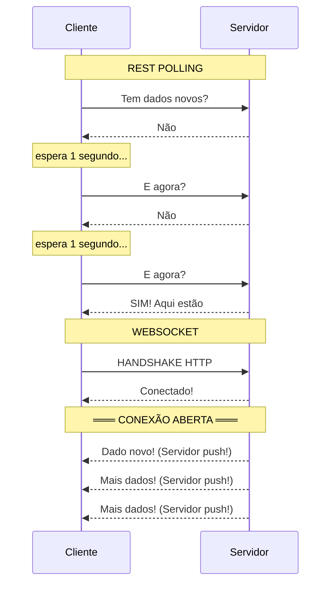
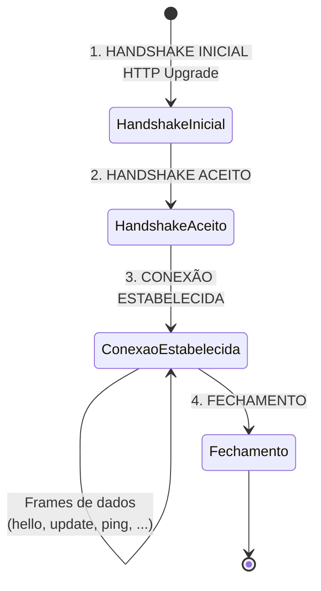
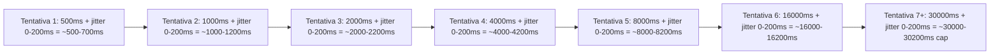
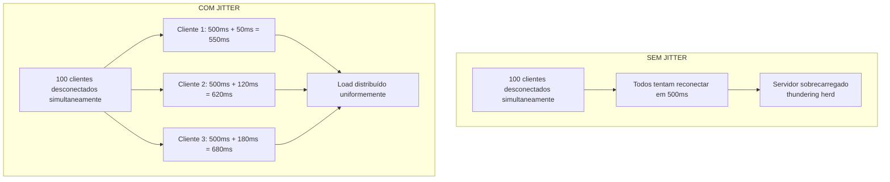
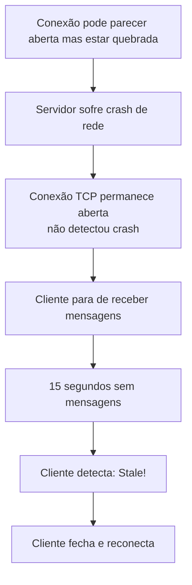
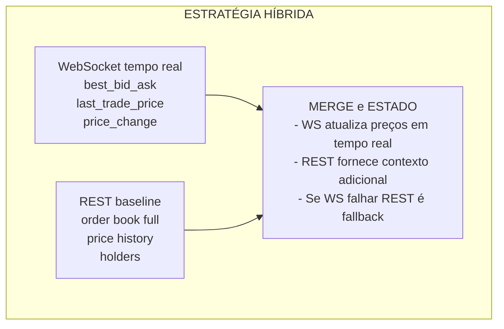

# Capítulo 04: WebSockets e Tempo Real

> **"Na informação, tempo é dinheiro. Quanto mais rápido, mais valioso."**
> — Provérbio de Wall Street

---

## 1. Introdução ao WebSocket

### 1.1 O Que é WebSocket?

**WebSocket** é um protocolo de comunicação que permite **transmissão bidirecional em tempo real** entre cliente e servidor através de uma única conexão TCP.

**Analogia: REST vs WebSocket**



### 1.2 Ciclo de Vida de uma Conexão WebSocket



---

## 2. WebSocket na Polymarket

### 2.1 URL do WebSocket Polymarket

```typescript
// src/config.ts:4
clobWsBase: "wss://ws-subscriptions-clob.polymarket.com/ws/"
```

**Por que "wss"?**

- `ws://` = WebSocket inseguro (como http://)
- `wss://` = WebSocket seguro (como https://)
- Usa TLS/SSL para criptografar a conexão

### 2.2 Conectando ao WebSocket

Veja `src/ws.ts:129-256`:

```typescript
export function connectMarketWs(
  assetIds: string[],
  handlers: WsHandlers
) {
  let ws: WebSocket | null = null;
  let closed = false;
  let reconnectAttempts = 0;
  let lastMessageAt = 0;
  let heartbeatTimer: ReturnType<typeof setInterval> | null = null;

  // ─── FUNÇÃO DE CONEXÃO ───
  const connect = () => {
    if (closed) return;  // Não reconecta se foi fechado explicitamente

    // Cria nova conexão WebSocket
    ws = new WebSocket(CONFIG.clobWsBase);
    handlers.onStatus?.("connecting");

    // ─── EVENTO: OPEN ───
    ws.addEventListener("open", () => {
      reconnectAttempts = 0;
      handlers.onStatus?.("connected");
      lastMessageAt = Date.now();
      sendSubscribe(assetIds);  // Envia mensagem de subscrição
      startHeartbeat();         // Inicia heartbeat
    });

    // ─── EVENTO: MESSAGE ───
    ws.addEventListener("message", (event) => {
      lastMessageAt = Date.now();
      try {
        const data = JSON.parse(String(event.data));

        // Verifica se é ping/heartbeat
        if (isPingMessage(data)) {
          sendPong(data);
          return;
        }

        // Parse da mensagem
        const parsed = parseMarketMessage(data);

        // Dispatch para handlers
        parsed.books.forEach((book) =>
          handlers.onBook?.(book.assetId, book.book)
        );
        parsed.updates.forEach((update) =>
          handlers.onUpdate(update)
        );
      } catch (err) {
        handlers.onStatus?.(
          `ws parse error: ${(err as Error).message}`
        );
      }
    });

    // ─── EVENTO: CLOSE ───
    ws.addEventListener("close", () => {
      handlers.onStatus?.("closed");
      stopHeartbeat();
      scheduleReconnect();  // Agenda reconexão
    });

    // ─── EVENTO: ERROR ───
    ws.addEventListener("error", () => {
      handlers.onStatus?.("error");
      ws?.close();
    });
  };

  connect();

  // ─── API PÚBLICA ───
  return {
    close() {
      closed = true;
      stopHeartbeat();
      ws?.close();
    },
    subscribe(ids: string[]) {
      sendOperation(ids, "subscribe");
    },
    unsubscribe(ids: string[]) {
      sendOperation(ids, "unsubscribe");
    }
  };
}
```

### 2.3 Estados de Conexão WebSocket

```typescript
// WebSocket.readyState
enum WebSocketReadyState {
  CONNECTING = 0,  // Conectando...
  OPEN = 1,        // Conectado e pronto
  CLOSING = 2,     // Fechando...
  CLOSED = 3       // Fechado
}

// Exemplo de uso
if (ws.readyState === WebSocket.OPEN) {
  ws.send(JSON.stringify({ type: "ping" }));
}
```

---

## 3. Mensagens WebSocket

### 3.1 Subscrição

Ao conectar, você deve **subscrever** aos ativos que deseja monitorar:

```typescript
// src/ws.ts:177-185
const sendSubscribe = (ids: string[]) => {
  if (!ws || ws.readyState !== WebSocket.OPEN) return;

  const payload = {
    type: "MARKET",
    assets_ids: ids,  // Array de token IDs
    custom_feature_enabled: true
  };

  ws.send(JSON.stringify(payload));
};
```

**Mensagem enviada:**
```json
{
  "type": "MARKET",
  "assets_ids": ["0x123...", "0x456...", "0x789..."],
  "custom_feature_enabled": true
}
```

### 3.2 Tipos de Mensagens Recebidas

#### best_bid_ask

Atualização dos melhores preços de compra e venda.

```json
{
  "event_type": "best_bid_ask",
  "asset_id": "0x123...",
  "best_bid": 0.65,
  "best_ask": 0.67,
  "timestamp": 1234567890123
}
```

**Parsing:**
```typescript
// src/ws.ts:35-43
if (eventType === "best_bid_ask") {
  const assetId = String(data.asset_id || data.token_id || "");
  const bestBid = asNumber(data.best_bid);
  const bestAsk = asNumber(data.best_ask);
  if (assetId) {
    updates.push({
      assetId,
      eventType,
      bestBid,
      bestAsk,
      ts: Date.now()
    });
  }
}
```

#### last_trade_price

Último preço de negociação.

```json
{
  "event_type": "last_trade_price",
  "asset_id": "0x123...",
  "price": 0.66,
  "timestamp": 1234567890123
}
```

#### price_change

Mudança incremental no order book.

```json
{
  "event_type": "price_change",
  "asset_id": "0x123...",
  "best_bid": 0.65,
  "best_ask": 0.67,
  "price_changes": [
    {
      "asset_id": "0x123...",
      "side": "BUY",
      "price": 0.65,
      "size": 1000
    }
  ],
  "timestamp": 1234567890123
}
```

#### book

Snapshot completo do order book.

```json
{
  "event_type": "book",
  "asset_id": "0x123...",
  "bids": [[0.65, 1000], [0.64, 2000]],
  "asks": [[0.67, 500], [0.68, 750]],
  "timestamp": 1234567890123
}
```

### 3.3 Ping/Pong (Heartbeat)

Mensagens para manter a conexão viva:

```json
// Cliente → Servidor
{"type": "ping"}

// Servidor → Cliente
{"type": "ping", "id": 123}

// Cliente → Servidor (resposta)
{"type": "pong", "id": 123}
```

**Implementação:**
```typescript
// src/ws.ts:224-239
const isPingMessage = (data: Record<string, unknown>) => {
  const type = String(data.type || data.event_type || "");
  return type === "ping" || type === "heartbeat";
};

const sendPong = (data: Record<string, unknown>) => {
  if (!ws || ws.readyState !== WebSocket.OPEN) return;
  const type = String(data.type || data.event_type || "");
  const payload: Record<string, unknown> = {};
  if (type === "ping") payload.type = "pong";
  if (type === "heartbeat") payload.type = "heartbeat";
  if ("id" in data) payload.id = data.id;
  if (Object.keys(payload).length > 0) {
    ws.send(JSON.stringify(payload));
  }
};
```

---

## 4. Reconexão Automática

### 4.1 Estratégia de Exponential Backoff

```typescript
// src/ws.ts:197-204
const scheduleReconnect = () => {
  if (closed) return;  // Não reconecta se fechado explicitamente

  reconnectAttempts += 1;

  // Exponential backoff com cap de 30 segundos
  const backoff = Math.min(
    30_000,
    500 * Math.pow(2, reconnectAttempts - 1)
  );

  // Jitter aleatório de até 200ms
  setTimeout(() => {
    if (!closed) connect();
  }, backoff + Math.floor(Math.random() * 200));
};
```

**Timeline de Reconexão:**



**Por que Jitter?**



### 4.2 Detecção de Conexão Stale

```typescript
// src/ws.ts:206-217
const startHeartbeat = () => {
  stopHeartbeat();
  heartbeatTimer = setInterval(() => {
    if (!ws || ws.readyState !== WebSocket.OPEN) return;

    const now = Date.now();

    // Se não recebe mensagem há 15 segundos, considera stale
    if (now - lastMessageAt > CONFIG.wsStaleMs) {
      handlers.onStatus?.("stale");
      ws.close();  // Força reconexão
      return;
    }
  }, 2000);  // Verifica a cada 2 segundos
};
```

**Por que detectar stale?**



---

## 5. Integrando WebSocket com REST

### 5.1 Estratégia Híbrida



### 5.2 Implementação Híbrida no Código

```typescript
// Exemplo simplificado de tui.ts

async function iniciarMonitoramento(market: MarketInfo) {
  // ─── 1. Inicia WebSocket ───
  const wsClient = connectMarketWs(market.clobTokenIds, {
    onUpdate: (update) => {
      // Atualiza preços em tempo real
      if (update.bestBid !== undefined) {
        currentPrices.bestBid = update.bestBid;
      }
      if (update.bestAsk !== undefined) {
        currentPrices.bestAsk = update.bestAsk;
      }
      if (update.lastTrade !== undefined) {
        currentPrices.lastTrade = update.lastTrade;
      }
      renderizaInterface();  // Atualiza TUI
    },
    onStatus: (status) => {
      wsStatus = status;
      renderizaInterface();
    }
  });

  // ─── 2. Polling REST para dados adicionais ───
  const restInterval = setInterval(async () => {
    // Dados que WebSocket não fornece
    const orderbook = await getOrderbook(market.clobTokenIds[0]);
    const history = await getPriceHistory(market.clobTokenIds[0]);
    const holders = await getHolders(market.conditionId!);

    // Atualiza estado
    currentOrderbook = normalizeOrderbook(orderbook);
    currentHistory = extractHistory(history);
    currentHolders = normalizeHolders(holders);

    renderizaInterface();
  }, CONFIG.refreshMs);  // 3 segundos

  // ─── 3. Cleanup ───
  return () => {
    clearInterval(restInterval);
    wsClient.close();
  };
}
```

---

## 6. Boas Práticas WebSocket

### 6.1 Sempre Implemente Reconexão

```typescript
// ❌ RUIM - Sem reconexão
const ws = new WebSocket(url);
ws.addEventListener("close", () => {
  console.log("Conexão fechada. Fim.");
});

// ✅ BOM - Reconexão automática
const connect = () => {
  const ws = new WebSocket(url);
  ws.addEventListener("close", () => {
    setTimeout(() => connect(), 1000);
  });
};
connect();
```

### 6.2 Implemente Heartbeat

```typescript
// ✅ Detecta conexões "zumbis"
let lastMessage = Date.now();
const HEARTBEAT_INTERVAL = 5000;  // 5 segundos
const STALE_TIMEOUT = 15000;      // 15 segundos

ws.addEventListener("message", () => {
  lastMessage = Date.now();
});

setInterval(() => {
  if (Date.now() - lastMessage > STALE_TIMEOUT) {
    console.log("Conexão stale, reconectando...");
    ws.close();
  }
}, HEARTBEAT_INTERVAL);
```

### 6.3 Use Jitter em Reconexões

```typescript
// ❌ RUIM - Todos reconectam no mesmo momento
setTimeout(() => connect(), 1000);

// ✅ BOM - Jitter distribui o load
const baseDelay = 1000;
const jitter = Math.random() * 500;
setTimeout(() => connect(), baseDelay + jitter);
```

### 6.4 Limite Tamanho de Buffer

```typescript
// ✅ Evita sobrecarga de memória
const MAX_BUFFER_SIZE = 1000;
const messageBuffer: unknown[] = [];

ws.addEventListener("message", (event) => {
  messageBuffer.push(JSON.parse(event.data));

  if (messageBuffer.length > MAX_BUFFER_SIZE) {
    messageBuffer.shift();  // Remove mensagens antigas
  }
});
```

### 6.5 Implemente Timeout de Handshake

```typescript
// ✅ Não espera para sempre pelo handshake
const HANDSHAKE_TIMEOUT = 10000;  // 10 segundos

const ws = new WebSocket(url);
const timeout = setTimeout(() => {
  if (ws.readyState !== WebSocket.OPEN) {
    ws.close();
    console.log("Handshake timeout");
  }
}, HANDSHAKE_TIMEOUT);

ws.addEventListener("open", () => {
  clearTimeout(timeout);
  console.log("Conectado!");
});
```

---

## 7. Debugando WebSockets

### 7.1 Chrome DevTools

```javascript
// No console do Chrome
// 1. Listar todas as conexões WebSocket
performance.getEntriesByType("resource")
  .filter(r => r.name.startsWith("ws"))

// 2. Monitorar frames
// → Network tab → WS frame → Messages
```

### 7.2 wireshark

```bash
# Captura tráfego WebSocket
wireshark -i any -f "tcp port 443"

# Filtrar por WebSocket
# Filter: tcp.flags.push == 1 && http
```

### 7.3 Log de Mensagens

```typescript
// Adicione logging detalhado
ws.addEventListener("message", (event) => {
  console.log("[WS RX]", event.data);
  const data = JSON.parse(event.data);
  console.log("[WS PARSED]", data);
});

const originalSend = ws.send;
ws.send = function(...args) {
  console.log("[WS TX]", args[0]);
  return originalSend.apply(this, args);
};
```

---

## 8. Exercícios Práticos

### Exercício 1: Cliente WebSocket Simples

Implemente um cliente WebSocket simples:

```typescript
async function conectarWebSocket(url: string) {
  return new Promise((resolve, reject) => {
    const ws = new WebSocket(url);

    // Timeout de 10 segundos
    const timeout = setTimeout(() => {
      ws.close();
      reject(new Error("Handshake timeout"));
    }, 10000);

    ws.addEventListener("open", () => {
      clearTimeout(timeout);
      resolve(ws);
    });

    ws.addEventListener("error", (err) => {
      clearTimeout(timeout);
      reject(err);
    });
  });
}

// Uso
const ws = await conectarWebSocket("wss://example.com/ws");
```

### Exercício 2: Buffer de Mensagens

Implemente um buffer circular para mensagens WebSocket:

```typescript
class WebSocketMessageBuffer {
  private buffer: unknown[] = [];
  private maxSize: number;

  constructor(maxSize: number) {
    this.maxSize = maxSize;
  }

  add(message: unknown): void {
    // Adiciona mensagem
    // Se buffer cheio, remove mais antiga
  }

  getLast(n: number): unknown[] {
    // Retorna últimas N mensagens
  }

  clear(): void {
    // Limpa buffer
  }
}

// Uso
const buffer = new WebSocketMessageBuffer(100);
ws.addEventListener("message", (e) => {
  buffer.add(JSON.parse(e.data));
});
```

### Exercício 3: Estatísticas de Latência

Calcule latência das mensagens WebSocket:

```typescript
class WebSocketLatencyTracker {
  private latencies: number[] = [];

  recordLatency(serverTime: number): void {
    // Calcula diferença entre hora do servidor e local
    // Adiciona ao array de latências
  }

  getAverageLatency(): number {
    // Retorna latência média
  }

  getP95Latency(): number {
    // Retorna latência P95
  }

  getP99Latency(): number {
    // Retorna latência P99
  }
}

// Use para comparar latência WebSocket vs REST
```

### Exercício 4: Reconexão com Backoff Adaptativo

Implemente exponential backoff que se adapta baseado em taxa de sucesso:

```typescript
class AdaptiveReconnect {
  private baseDelay = 500;
  private maxDelay = 30000;
  private currentDelay = this.baseDelay;
  private successCount = 0;
  private failureCount = 0;

  getDelay(): number {
    return this.currentDelay;
  }

  reportSuccess(): void {
    this.successCount++;
    // Se muitas sucessos consecutivos, reduz delay
    this.updateDelay();
  }

  reportFailure(): void {
    this.failureCount++;
    // Se muitas falhas consecutivas, aumenta delay
    this.updateDelay();
  }

  private updateDelay(): void {
    // Implementa lógica adaptativa
    // - Sucesso contínuo → reduz delay
    // - Falha contínua → aumenta delay
  }
}
```

---

## 9. Resumo do Capítulo

- **WebSocket** é comunicação bidirecional em tempo real
- **Handshake HTTP** inicial, depois frames binários/texto
- **Tipos de mensagens**: best_bid_ask, last_trade_price, price_change, book
- **Exponential backoff** com jitter para reconexão
- **Heartbeat** para detectar conexões stale
- **Estratégia híbrida**: WebSocket (tempo real) + REST (contexto)
- **Sempre implementar**: reconexão, heartbeat, timeout

---

## 10. Para Saber Mais

- **RFC 6455** (WebSocket Protocol): https://datatracker.ietf.org/doc/html/rfc6455
- **WebSocket API**: https://developer.mozilla.org/en-US/docs/Web/API/WebSocket
- **Real-time Web**: Real-Time Web Apps with WebSockets (Jason Giangrande)

---

## 🎓 Design Decisions

### Decisão 1: Por que estratégia híbrida (WS + REST)?

**Alternativas Consideradas:**
1. **Apenas WebSocket** - Tudo via tempo real
2. **Apenas REST** - Polling contínuo
3. **Híbrido** - WS para tempo real + REST para contexto ✅ **ESCOLHIDO**

**Trade-offs:**

| Critério | Apenas WS | Apenas REST | Híbrido |
|----------|-----------|-------------|---------|
| Latência | ⭐⭐⭐⭐⭐ Mínima | ⭐⭐ Alta | ⭐⭐⭐⭐⭐ Mínima (WS) |
| Dados disponíveis | ⭐⭐⭐ Limitados | ⭐⭐⭐⭐⭐ Completos | ⭐⭐⭐⭐⭐ Completos (REST) |
| Resiliência | ⭐⭐ Frágil (queda = nada) | ⭐⭐⭐ Robusto | ⭐⭐⭐⭐⭐ Muito robusto |
| Complexidade | ⭐⭐ Baixa | ⭐⭐⭐ Média | ⭐⭐⭐⭐ Alta |
| Uso de rede | ⭐⭐⭐ Médio | ⭐⭐ Alto (polling) | ⭐⭐⭐⭐ Otimizado |

**Por que híbrido foi escolhido:**
- ✅ **Melhor dos dois mundos**: Latência WS + completude REST
- ✅ **Graceful degradation**: Se WS cai, REST mantém baseline
- ✅ **Dados complementares**: Historico, holders não vem no WS
- ✅ **Redundância**: Dados críticos (preços) chegam por ambos canais

**Exemplo de complementaridade:**
```typescript
// WebSocket fornece:
- best_bid_ask (preços em tempo real)
- last_trade_price (última negociação)
- price_change (mudanças no order book)

// REST fornece:
- order book completo (todos os níveis)
- price history (30+ dias)
- holders (top detentores)
```

**Referência no código:** `src/tui.ts` - Uso simultâneo de WS e REST

---

### Decisão 2: Por que exponential backoff com jitter?

**Alternativas Consideradas:**
1. **Backoff fixo** - Espera sempre 1 segundo
2. **Exponential backoff** - Espera progressivamente mais
3. **Exponential + jitter** - Progressivo + aleatório ✅ **ESCOLHIDO**

**Por que exponential + jitter foi escolhido:**
- ✅ **Evita thundering herd**: Se 1000 clientes caem, não reconectam todos ao mesmo tempo
- ✅ **Balanceado**: Tenta rápido primeiro (falhas transitórias), espera mais se persiste
- ✅ **Cap de 30s**: Não espera para sempre

**Exemplo sem jitter (ruim):**
```
1000 clientes desconectam simultaneamente
↓
Todos tentam reconectar em 500ms
↓
Servidor sobrecarregado (thundering herd)
```

**Exemplo com jitter (bom):**
```
1000 clientes desconectam simultaneamente
↓
Cliente 1: 500ms + 50ms = 550ms
Cliente 2: 500ms + 120ms = 620ms
Cliente 3: 500ms + 180ms = 680ms
...
↓
Load distribuído uniformemente no tempo
```

**Referência no código:** `src/ws.ts:197-204` - `scheduleReconnect()`

---

### Decisão 3: Por que heartbeat de 15 segundos?

**Alternativas Consideradas:**
1. **Sem heartbeat** - Confia que conexão está viva
2. **Heartbeat 5s** - Detecta rápido, mas usa rede
3. **Heartbeat 15s** - Balanceado ✅ **ESCOLHIDO**
4. **Heartbeat 60s** - Econômico, mas lento

**Por que 15 segundos foi escolhido:**
- ✅ **Detecta stale**: Servidor pode "morrer" silenciosamente
- ✅ **Não spam**: 5s seria agressivo para rede
- ✅ **Janela tolerável**: 15s sem dados é aceitável para este caso de uso

**Exemplo de detecção de stale:**
```typescript
// Conexão TCP pode parecer "aberta" mas estar morta:
// 1. Servidor crash de rede
// 2. Roteador morre
// 3. Firewall silencioso
// → TCP não detecta!
// → Nós detectamos: 15s sem mensagens = stale
```

**Referência no código:** `src/config.ts:17` - `wsStaleMs: 15000`

---

## 📚 Recursos Externos

### Aprender Mais Sobre:

**WebSocket Protocol:**
- [RFC 6455](https://datatracker.ietf.org/doc/html/rfc6455) - Especificação oficial
- [WebSocket MDN](https://developer.mozilla.org/en-US/docs/Web/API/WebSocket) - MDN Web Docs
- [Deep Dive: WS](https://www.youtube.com/watch?v=1BfC6rIVxSg) - YouTube (30 min)

**Real-time Communication:**
- [Polling vs SSE vs WebSocket](https://ably.com/topic/websocket-vs-sse-vs-polling) - Ably
- [Real-time Architecture](https://www.youtube.com/watch?v=M7bYnJg9zXk) - YouTube (45 min)
- [WebSocket Security](https://www.youtube.com/watch?v=xMzgCQ5it1U) - YouTube (20 min)

**Exponential Backoff:**
- [Backoff Strategies](https://cloud.google.com/architecture/rate-limiting-strategies-techniques) - Google Cloud
- [Jitter Explained](https://www.awsarchitectureblog.com/2015/03/backoff.html) - AWS Blog
- [Exponential Backoff Algorithm](https://en.wikipedia.org/wiki/Exponential_backoff) - Wikipedia

### Vídeos Recomendados:

- [WebSocket Explained in 5 Minutes](https://www.youtube.com/watch?v=MO8qGzJYXqk) - YouTube (5 min)
- [Building Real-time Apps](https://www.youtube.com/watch?v=2ZadWq5RqF4) - YouTube (1 hora)
- [Understanding Exponential Backoff](https://www.youtube.com/watch?v=h9JHSugV2gU) - YouTube (10 min)

### Ferramentas Úteis:

- [wscat](https://github.com/websockets/wscat) - CLI para testar WebSockets
- [WebSocket King](https://www.websocketking.com/) - Teste WS no browser
- [Postman](https://www.postman.com/) - Suporta WebSocket

### Artigos Recomendados:

- [When to Use WebSockets](https://ably.com/blog/when-to-use-websockets) - Ably Blog
- [WebSocket vs REST](https://www.diffen.com/difference/WebSocket_vs_REST) - Diffen
- [Real-time Best Practices](https://www.ably.io/blog/7-best-practices-realtime-event-delivery) - Ably

---

**Próximo Capítulo:** Interface de Terminal (TUI)

[Continue para o Capítulo 5](./05-interface-terminal.md)
